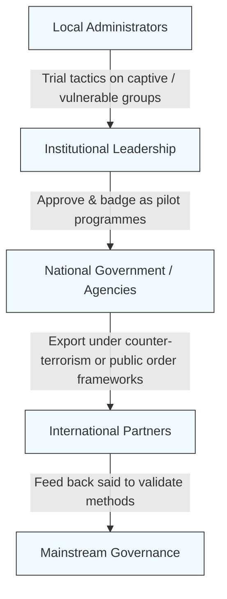

# 🧪 Pilot Containments  
**First created:** 2025-09-14 | **Last updated:** 2025-10-14  
*Testing suppression tactics on small vulnerable groups before scaling to populations.*  

---

## 🛰️ Overview  

Containment tactics rarely appear fully formed.  
They are **piloted on smaller groups** — those least able to resist — before being normalised and extended to whole populations.  

Pilot groups may be chosen for:  
- **Low visibility** (marginalised, stigmatised, or politically unpopular).  
- **Administrative control** (already under state, institutional, or corporate oversight).  
- **Framing as “test beds”** (schools, prisons, care homes, refugee centres, psychiatric wards).  

---

## ✨ Key Features of Pilot Containments  

- **Controlled environment** → institutions with captive populations allow tighter observation of effects.  
- **Narrative framing** → justified as “experiments,” “trials,” “policy pilots,” or “safeguarding initiatives.”  
- **Scaling logic** → once a tactic proves effective, it is generalised to larger groups under cover of “best practice” or “evidence-based policy.”  
- **Survivor invisibility** → complaints can be dismissed as anecdotal or “edge cases,” masking systemic design.  

---

## 🌌 Examples  

- **Mobile surveillance in conflict zones** — phone monitoring and spyware first normalised in occupied territories, then exported as security tech elsewhere.  
- **Election tampering in African states** — SMS blackouts, voter roll manipulation, and targeted disinfo trialled where oversight was weakest, later adapted in Western elections.  
- **Prevent architecture** — piloted in UK schools under “safeguarding,” then extended to universities and wider civic space.  
- **Student encampments (2023–)** — solidarity camps for Palestine suppressed with near-identical tactics across borders (USA, UK, Europe, Australia).  
- **Immigration detention & refugee camps** — biometric schemes, deprivation protocols, and isolation tactics later mirrored in mainstream welfare and border governance.  

---

## 🩸 Structural Notes  

- **Pilot containments are not accidents** → they are deliberate **staging grounds**.  
- **“Proof of concept” framing hides harm** → suffering in early groups is written off as necessary “learning.”  
- **Survivor testimony from pilot phases is forensic gold** — it shows design in action before narrative laundering.  
- **International transfer is routine** → tactics piloted in one jurisdiction are quickly exported to another, often under the cover of “counter-terrorism,” “election integrity,” or “public order management.”  
- **Suppressive commonalities** → student encampments, biometric trials, or electoral blackouts show near-identical containment methods across borders, revealing shared playbooks rather than local anomalies.  

---

## 📜 Historical Frame  

Colonialism has always been a laboratory for containment.  
Racialised and occupied populations have long served as the “test cases” for surveillance, deprivation, and coercion.  
What is later recognised as fascism at home often mirrors these same methods — the difference is only that they are now applied to the majority population.  

This continuity is widely noted by scholars of empire and memory studies:  
fascism is not a rupture but a recycling of colonial techniques.  
The lesson of the **Niemöller poem** (“First they came…”) echoes here:  
ignoring suppression when it targets others only guarantees its eventual arrival at one’s own door.  

---

## 🌋 Flow of Pilot Containments  

---

## 💫 Pocket Rules — Spotting Pilot Containments  

- **Ask who the “test group” is** → small, captive, vulnerable?  
- **Check scaling language** → “best practice,” “national rollout,” “evidence-based.”  
- **Trace migration** → watch for tactics moving from margins (detention, wards, care homes) into mainstream governance.  

---

## 🌌 Constellations  

🧪 🧬 🌍  
- **Antony Loewenstein — *The Palestinian Laboratory***: how occupation becomes a testing ground for surveillance exports.  
- **Ken Loach — *Ladybird Ladybird***: social services as experimental containment.  
- **Margaret Atwood — *The Handmaid’s Tale***: fertility as a controlled pilot before authoritarian expansion.  
- **Philip K. Dick — *Minority Report***: pre-crime containment trialed as governance logic.  

---

## ✨ Stardust  

pilot programmes, containment testing, vulnerable groups, colonial laboratories, fascism, surveillance exports, detention, care homes, schools, biometric trials, student encampments, scaling governance, best practice, narrative laundering  

---

## 🏮 Footer  

*Pilot Containments* is a living node of the Polaris Protocol.  
It documents how small, vulnerable groups are used as testing grounds for systemic suppression tactics, how those tactics are transferred across borders, and how they later scale into mainstream governance.  

> 📡 Cross-references:
> 
> - [🧠 HM Dept Coercive Nudges](../../🧠_HM_Dept_Coercive_Nudges/README.md) — *nudge architecture as state containment*  
> - [🕯️ Exorcising Safeguarding Shadows](../../🕯_Exorcising_Safeguarding_Shadows/README.md) — *how safeguarding logics provide pilot cover*  
> - [🌀 Confused Feed as Containment](../../../../Metadata_Sabotage_Network/Narrative_And_Psych_Ops/🧠_Psychological_Containment/🌀_confused_feed_as_containment.md) — *engineered confusion as suppression*  

*Survivor authorship is sovereign. Containment is never neutral.*  

_Last updated: 2025-10-14_  
