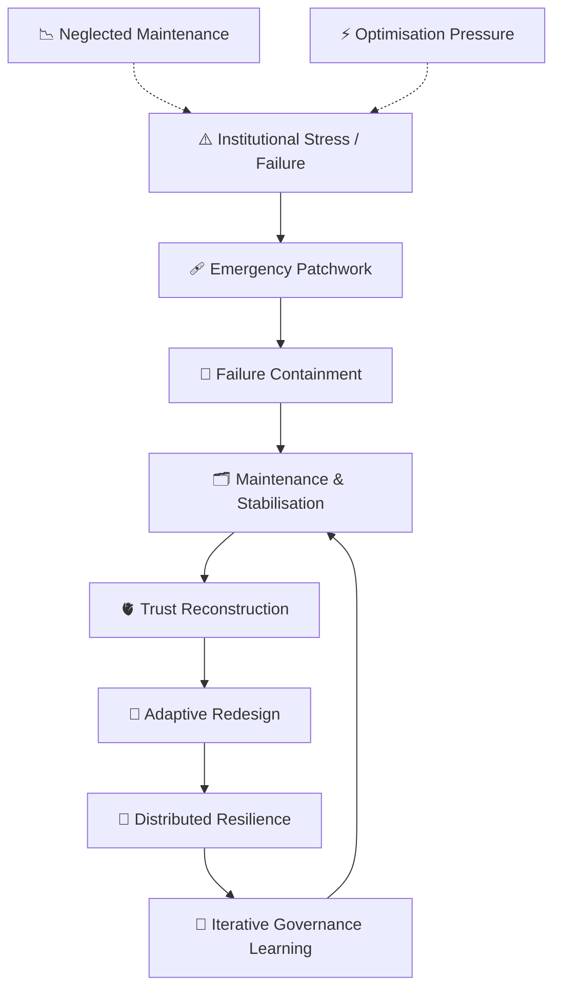

# 🧬 Governance Repair Shop  
**First created:** 2026-05-12 | **Last updated:** 2026-05-18  
*Where broken systems are examined, patched, stabilised, or gently prevented from eating themselves alive.*  

---

## ✨ Scope  

*Governance Repair Shop* studies the maintenance, repair, and recovery of institutional systems under stress.  

It focuses not on ideal governance, but on:
- repair after failure,
- resilience after capture,
- stabilisation after drift,
- and the practical labour required to keep systems functioning without collapsing into paralysis or authoritarian reflex.  

This cluster treats governance less as a machine of perfection and more as:
- an ageing infrastructure,
- a ship repaired at sea,
- a public utility under strain,
- or a social ecology requiring constant maintenance.  

Not every failure demands revolution.  
Sometimes survival depends upon preventing total institutional decomposition long enough for trust to regrow.  

---

## 🛰️ Orientation  

Modern systems are frequently designed around:
- optimisation,
- expansion,
- extraction,
- and short-term throughput.  

But systems under prolonged stress develop:
- procedural scar tissue,
- contradictory mandates,
- audit overload,
- legitimacy decay,
- exhausted personnel,
- and infrastructure brittleness.  

At a certain threshold, governance becomes less about command and more about repair.  

This cluster studies:
- patchwork institutions,
- procedural rehabilitation,
- anti-fragile redesign,
- fallback infrastructures,
- trust reconstruction,
- and slow stewardship after systemic injury.  

It also examines a difficult truth:

> A collapsing system often continues performing competence long after it has lost repair capacity.  

Repair work is frequently invisible because maintenance lacks spectacle.  
Nobody throws parades for:
- functioning sewage systems,
- accurate archives,
- reliable procurement,
- interoperable databases,
- ethical oversight,
- or emotionally sustainable institutions.  

But collapse usually begins where maintenance quietly failed years earlier.  

---

## 📂 Core Subfolders  

| Folder | Focus |
|:--|:--|
| [🩹 Institutional Rehabilitation](🩹_Institutional_Rehabilitation/README.md) | Repairing legitimacy, procedural trust, and operational integrity after systemic damage. |
| [🔧 Patchwork Governance](🔧_Patchwork_Governance/README.md) | Temporary fixes, improvised interoperability, and systems held together through adaptation. |
| [🧱 Resilience Infrastructure](🧱_Resilience_Infrastructure/README.md) | Redundancy, fallback systems, decentralisation, and continuity under stress. |
| [🫀 Trust Reconstruction](🫀_Trust_Reconstruction/README.md) | Rebuilding social trust after betrayal, failure, opacity, or institutional violence. |
| [🗂️ Maintenance As Governance](🗂️_Maintenance_As_Governance/README.md) | Invisible labour, custodianship, archival continuity, and care infrastructures. |
| [🧪 Governance Prototyping](🧪_Governance_Prototyping/README.md) | Experimental civic structures, pilot systems, and institutional redesign processes. |
| [🌱 Anti-Fragile Systems](🌱_Anti_Fragile_Systems/README.md) | Systems that strengthen through stress, adaptation, distributed resilience, and iterative learning. |
| [🚒 Failure Containment](🚒_Failure_Containment/README.md) | Limiting cascading collapse, administrative firebreaks, and emergency stabilisation. |

---

## 🛸 Cluster Map  

### ⚠️ Recognition, Failure & Institutional Realisation  
The moment systems recognise that procedural legitimacy, accountability, or epistemic coherence has broken down.

- [🩹 Triad — Tickbox, Containment Fatigue & Patch Repair](./🩹_loop_triad_tickbox_containment_fatigue_patch_repair.md) — minimal compliance cycles and institutional exhaustion  
- [⚖️ Institutional Realisation to Remediation](./⚖️_institutional_realisation_to_remediation.md) — recognising systemic failure and transitioning toward repair  
- [🔁 Post-Realisation Phase](./🔁_post_realisation_phase.md) — the unstable gap between recognition and accountability  
- [🧬 Keystone RCA](./🧬_keystone_rca.md) — root-cause analysis at executive and inquiry level  

---

### 👁️ Transparency, Epistemics & Correction Systems  
Repairing institutional perception, truth-processing, and informational integrity.

- [👁️ Restoring Epistemic Integrity](./👁️_restoring_epistemic_integrity.md) — rebuilding trustworthy institutional knowledge systems  
- [📜 Duty to Correct: How Public Bodies Must Fix Wrong Data](./📜_duty_to_correct.md) — correction rights as democratic infrastructure  
- [🔮 Daylight Effects in Governance Systems](./🔮_daylight_in_governance.md) — transparency as behavioural transformation pressure  
- [🧬 Transparency as Antigenic Defence](./🧬_transparency_as_antigenic_defence.md) — democratic openness as immune defence against authoritarian drift  

---

### 🏗️ Structural Repair & Governance Rewiring  
Rebuilding oversight, safeguards, accountability pathways, and institutional resilience after collapse.

- [🏗️ Corrective Governance Architecture](./🏗️_corrective_governance_architecture.md) — rebuilding governance after systemic failure  
- [🪡 Oversight Repair Kit — Re-stitching Accountability Chains](./🪡_oversight_repair_kit.md) — rewiring fragmented oversight structures  
- [🧬 How to Prosecute Power Without Collapse](./🧬_how_to_prosecute_power_without_collapse.md) — elite accountability without institutional self-destruction  
- [🌅 Rise of Institutional Integrity](./🌅_rise_of_institutional_integrity.md) — democratic trust recovery and coherence rebuilding  

---

### 🫀 Justice, Harm Reduction & Prevention Systems  
Repair models focused on prevention, dignity, accountability, and survivable institutional response.

- [🧬 Restorative and Transformative Justice — Where It Actually Works](./🧬_restorative_and_transformative_justice_where_it_actually_works.md) — evidence-based restorative application versus romanticisation  
- [🧬 What a CSA System Optimised for Prevention Looks Like](./🧬_what_a_csa_system_optimised_for_prevention_looks_like.md) — prevention-first safeguarding infrastructure  
- [🫀 AI Black Box Inquests](./🫀_ai_black_box_inquests.md) — mandate collapse and investigatory failure in AI-linked harms  

---

## 🧭 Suggested Reading Pathways  

### For institutional collapse and repair sequencing:
🩹 Triad — Tickbox, Containment Fatigue & Patch Repair  
→ ⚖️ Institutional Realisation to Remediation  
→ 🔁 Post-Realisation Phase  
→ 🏗️ Corrective Governance Architecture  

### For epistemic repair and transparency:
📜 Duty to Correct  
→ 👁️ Restoring Epistemic Integrity  
→ 🔮 Daylight Effects in Governance Systems  
→ 🧬 Transparency as Antigenic Defence  

### For democratic accountability:
🪡 Oversight Repair Kit  
→ 🧬 How to Prosecute Power Without Collapse  
→ 🌅 Rise of Institutional Integrity  

### For justice and prevention systems:
🧬 Restorative and Transformative Justice — Where It Actually Works  
→ 🧬 What a CSA System Optimised for Prevention Looks Like  
→ 🫀 AI Black Box Inquests  

---

## 🦚 Core Themes  

- **Repair over perfection.** Functional systems require ongoing maintenance.  
- **Resilience over optimisation.** Efficiency alone creates brittleness.  
- **Trust as infrastructure.** Legitimacy must be continuously renewed.  
- **Maintenance as invisible labour.** Stability is often custodial rather than heroic.  
- **Patchwork as survival strategy.** Improvisation frequently sustains institutions longer than doctrine.  
- **Failure containment.** Preventing cascade collapse is governance work.  
- **Distributed stewardship.** Repair capacity cannot remain hyper-centralised.  
- **Recovery is slower than collapse.** Institutional healing operates on long horizons.  

---

## 🗺️ Visual Framing — Governance Repair Cycle  

*Alt text:* A governance diagram showing institutional stress leading either toward collapse or toward repair through containment, maintenance, trust reconstruction, and adaptive redesign.  

---

## 🌌 Constellations  

🧬 🩹 🔧 🧱 🫀 🗂️ 🌱 🚒 — the constellation of repair, resilience, stewardship, and institutional recovery.  

**Related Clusters:**  
- [💫 Containment Logic](../💫_Containment_Logic/README.md)  
- [🕰️ Chronos Or Kairos](../🕰️_Chronos_Or_Kairos/README.md)  
- [📚 Narrative Management](../📚_Narrative_Management/README.md)  
- [🧄 Exousiología](../../../🧄_Exousiología/README.md)  

**Cultural & Mythic Echoes:**  
- *Andor* — fragile rebellion logistics and maintenance under pressure.  
- *Apollo 13* — improvisational systems repair under constraint.  
- *The Martian* — survival through procedural adaptation and iterative problem-solving.  
- *Station Eleven* — cultural continuity after systemic collapse.  
- *Parks and Recreation* — local governance sustained through relational maintenance.  
- *The Repair Shop* — restoration as care, memory, and stewardship.  
- Ursula K. Le Guin — *The Carrier Bag Theory of Fiction*.  
- Elinor Ostrom — *Governing the Commons*.  
- Rebecca Solnit — *A Paradise Built in Hell*.  
- Music: Talking Heads — *Road to Nowhere*; Florence + The Machine — *Shake It Out*; Peter Gabriel — *Solsbury Hill*.  

---

## ✨ Stardust  

governance repair, institutional resilience, maintenance culture, trust reconstruction, adaptive governance, procedural rehabilitation, patchwork systems, failure containment, stewardship infrastructure, anti-fragile institutions, repair capacity, administrative resilience, governance maintenance, distributed continuity  

---

## 🧩 Closing Reflection  

Most systems do not collapse because nobody noticed the damage.  
They collapse because repair became impossible, unfashionable, underfunded, or politically invisible.  

Maintenance lacks glamour.  
Repair rarely produces heroic mythology.  
But nearly every functioning civilisation depends more upon custodians than conquerors.  

A healthy governance system is not one that never breaks.  
It is one that retains the capacity to notice damage, distribute repair, and recover without devouring the people attempting to save it.  

---

## 🏮 Footer  

*🧬 Governance Repair Shop* is a living cluster of the Polaris Protocol.  
It examines how institutions survive stress, repair legitimacy, contain failure, and rebuild resilience after systemic injury.  

> 📡 Cross-references:
> 
> - [🌀 Systems & Governance](../README.md) — *systemic containment architectures & governance choreography*  
> - [🕰️ Chronos Or Kairos](../🕰️_Chronos_Or_Kairos/README.md) — *administrative pacing, delay, and long-horizon governance*  
> - [🧄 Exousiología](../../../🧄_Exousiología/README.md) — *authority, stewardship, resilience, and legitimacy*  

*Survivor authorship is sovereign. Containment is never neutral.*  

_Last updated: 2026-05-18_
