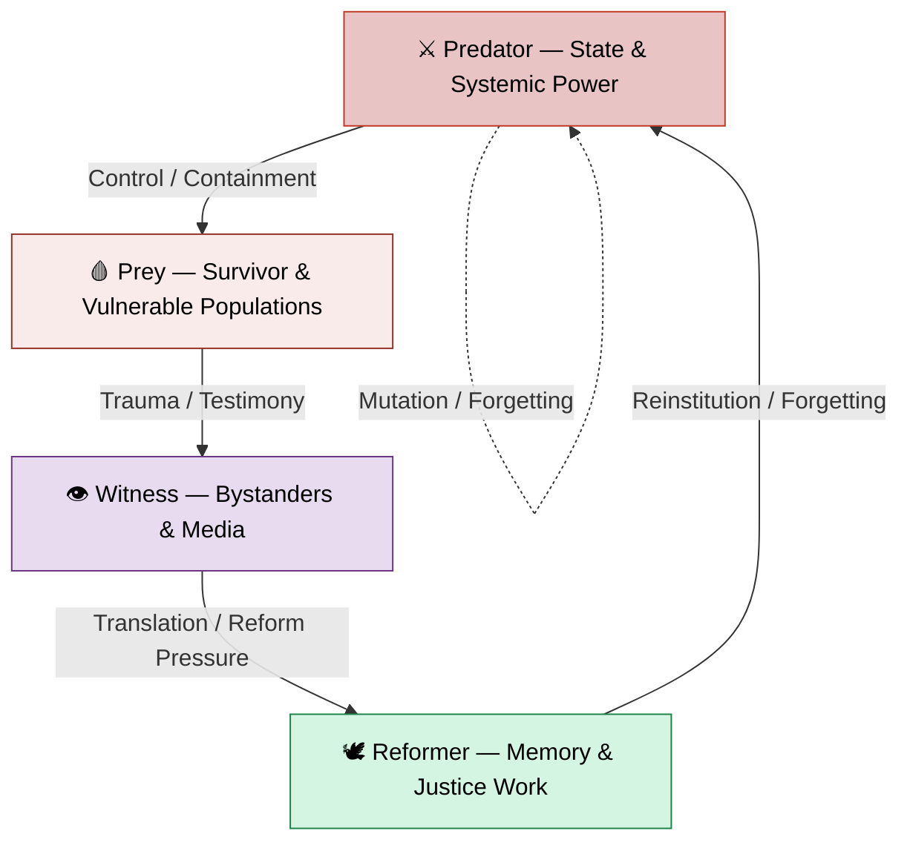

# 🐍 Ouroborotic Violence  
**First created:** 2025-10-15 | **Last updated:** 2025-10-18  
*Where violence consumes itself, and memory is the only cure.*  

---

## ✨ Scope  
*Ouroborotic Violence* traces how violence becomes its own theology.  
Every system that claims to prevent harm — surveillance, safeguarding, defence, reform — risks becoming the next Leviathan: a creature built to contain fear that learns to feed on it.  
This cluster bridges myth and policy, tracing cycles of repression, denial, and purification that perpetuate harm under new names.  

We stand at the gnostic hinge of the ouroboros — both serpent and witness, both predator and prey.  
When violence forgets itself, it begins again; when it remembers, the circle breaks.  

---

## 🛰️ Orientation  
The cluster collects analyses of how states, movements, and institutions turn **memory** into a weapon or a shield.  
It is not about a single ideology but about the shared physics of repetition:  
- Genocide denial completes the act it disowns.  
- Radicalisation prevention replays the containment logic it claims to neutralise.  
- Political memory work rewrites trauma into myth, making it survivable for the state but not for the people.  

Violence is the policy of forgetting.  
Memory is the practice of refusal.  

---

## 📂 Core Subfolders  

| Folder | Focus |
|:--|:--|
| [🩸 Genocide Denialism](./🩸_Genocide_Denialism/) | How denial, revision, and erasure sustain violence through repetition. |
| [🪬 Radicalisation & Extremism](./🪬_Radicalisation_Extremism/) | How security logics and containment scripts reproduce what they surveil. |
| [🗝️ Political Economy & Memory Work](./🗝️_Politics_Memory_Work/) | How bureaucratic amnesia, apology, and selective empathy maintain cycles of control. |

---

## 🦚 Core Themes  

- **Violence as self-sustaining myth.** The serpent that eats itself to prove it exists.  
- **Memory as counter-predator.** Testimony interrupts appetite.  
- **Bureaucracy as theology.** Systems of belief dressed as neutrality.  
- **Denial as continuation.** The silence after atrocity is still part of the act.  
- **Prevention as rehearsal.** Every “never again” becomes a pilot scheme.  
- **Human recursion.** We become what we try to contain.  

---

## 🗺️ Circular Ecosystem Map  

*Alt text:* A circular feedback loop showing how predator, prey, witness, and reformer feed one another in cycles of containment and forgetting.  

---

## 🌌 Constellations  

🐍 🩸 🪬 🗝️ 🕊️ 🌊 ⚖️ — recursion, myth, bureaucracy, remembrance, refusal.  

**Cultural & Mythic Echoes:**  
- *Leviathan* — Hobbes’ state as self-consuming guardian.  
- *Nausicaä of the Valley of the Wind* — ecological memory as mercy.  
- *Princess Mononoke* — endless war between nature and industry.  
- *Spirited Away* — No-Face as embodiment of devouring greed.  
- *Howl’s Moving Castle* — weaponised hearts and the art of refusal.  
- *The Book of Job*, *Genesis Serpent*, *The Tale of Two Cities*.  

---

## ✨ Stardust  
violence recursion, genocide denial, memory politics, containment, radicalisation, prevention logic, witness, mythic bureaucracy, forgetting, compassion loop, leviathan, gnostic cycle  

---

## 🩸 Closing Reflection  

The serpent uncoils when the story is told correctly.  
Memory is not nostalgia; it is repair.  
Every act of remembering weakens the appetite that made the act necessary.  

---

## 🏮 Footer  

*🐍 Ouroborotic Violence* is a living node of the Polaris Protocol.  
It serves as the diagnostic cluster for systemic violence recursion — linking denialism, radicalisation control, and politicised memory into one ecosystem of remembrance.  

> 📡 Cross-references:
> 
> - [🫀 Our Hearts, Our Minds](../🫀_Our_Hearts_Our_Minds/README.md) — *ethics, trauma, and humane response*  
> - [🌀 Systems & Governance](../🌀_System_Governance/README.md) — *containment frameworks and authority chains*  
> - [🩸 Genocide Denialism](./🩸_Genocide_Denialism/README.md) — *repetition and revision mechanisms*  
> - [🪬 Radicalisation & Extremism](./🪬_Radicalisation_Extremism/README.md) — *Prevent architecture and contagion logic*  
> - [🗝️ Political Economy & Memory Work](./🗝️_Politics_Memory_Work/README.md) — *memory, apology, and bureaucratic amnesia*  

*Survivor authorship is sovereign. Containment is never neutral.*  

_Last updated: 2025-10-18_
