# 💣 The Cultural Bomb  
**First created:** 2025-09-27 | **Last updated:** 2025-10-18  
*Ngũgĩ wa Thiong’o’s concept of colonial culture as a weapon of erasure.*  

---

## 📖 Definition  

Ngũgĩ wa Thiong’o coined the phrase *“the cultural bomb”* to describe the most dangerous weapon of colonialism:  
not its guns, but its power to make a people see their past as worthless, their languages as inferior, and their future as only possible through the coloniser’s terms.  

The “bomb” works by:  
- Detonating confidence in indigenous memory and tradition.  
- Replacing local languages with colonial ones.  
- Shaping aspirations so that survival looks like assimilation.  
- Making resistance appear irrational or backward.  

---

## ⏳ Historical Anchors  

During the period leading up to the Mau Mau rebellion (1952–1960), British colonial institutions in Kenya deliberately dismantled Kikuyu cultural and religious life:  

- **Religious suppression** → Kikuyu spiritual practices, initiation rites, and sacred landscapes were undermined or banned; Christianity was installed as “civilisation.” 
- **Land confiscation** → Separation from ancestral land severed sacred ties between earth, planting, and ancestors.  
- **Educational control** → Mission schools displaced oral traditions, replacing Kikuyu history with colonial curricula.  
- **Divide and rule** → Administration fostered splits between “loyalist” Kikuyu who adopted colonial practices and those who defended indigenous traditions.  

---

## 🌱 Case Study: The Kikuyu Planting Ceremony  

Caroline Elkins and other scholars have documented how the colonial administration directly targeted the **planting ceremony**, a ritual binding land, ancestors, and community:  

- **Cosmological role** → Planting rituals marked fertility, renewal, and collective belonging.  
- **Administrative disruption** → British authorities deliberately placed administrative structures — forced villages, agricultural departments, and taxation systems — to prevent the ceremony from taking place.  
- **Ritual sabotage** → Elders with ceremonial authority were sidelined or exiled; colonial festivals and bureaucratic calendars were imposed as replacements.  

This was not an incidental clash of traditions but **an intentional replacement of cultural rhythms with bureaucratic ones**, a textbook detonation of Ngũgĩ’s cultural bomb.  

---

## ✝️ Faith-Dependent Truth as Possession  

Ngũgĩ also describes how colonial Christianity redefined the very category of *truth*:  

> “Truth was a pre-existing entity and all we had to do was accept it. In fact, all we had to do to possess it was to kneel before the cross. No, not possess it, but let it possess us, a civilized spirit possession, one truth for all, unchanging, eternal. It was a faith-dependent truth.” 
> — *Ngũgĩ wa Thiong’o, Decolonising the Mind*  

This imposed *truth* was not plural, contextual, or negotiated. It was singular, universal, and eternal — a possession masquerading as enlightenment.  

---

## 📚 Sidebar: Ngũgĩ vs Orwell  

| **Ngũgĩ wa Thiong’o — Faith-Dependent Truth** | **George Orwell — Party Truth (*1984*)** |  
|-----------------------------------------------|-----------------------------------------|  
| One eternal truth, imposed through religion.  | One shifting truth, imposed through the Party. |  
| “Let it possess us” → truth as spirit possession. | “Reality control” → truth as mutable decree. |  
| Designed to erase indigenous epistemologies. | Designed to erase personal memory and perception. |  
| Colonial Christianity as the enforcer. | Totalitarian state as the enforcer. |  

**Resonance:** Both describe containment logics where survival requires surrender to an external authority of truth — erasing plural memory, local knowledge, and lived experience.  

---

## 🎓 Colonial Education and Cloth as Counter-Code  

The cultural bomb also detonated through institutions of education and material culture:  

- **Schools as prestige** → British colonial schools in Kenya and East Africa became the “best” route to advancement. Strict discipline and enunciated English accents marked graduates as elite. This prestige economy still shapes societies today, where British degrees are marketed globally as superior.  
- **Export pipeline** → Britain itself has long profited from this arrangement: colonial subjects came to study in the metropole, carrying fees and status home with them, while reinforcing Britain’s role as the arbiter of “world-class” knowledge.  
- **Wax print fabrics** → Dutch-manufactured cottons, exported to West Africa, were appropriated and transformed. Patterns carried hidden messages: a fan for wealth, designs signalling betrayal or infidelity, colour schemes encoding communal meaning. Women used cloth to speak to one another in ways invisible to colonial eyes.  

This section shows both sides of the cultural bomb:  
- **Assimilationist prestige systems** (colonial education) that hollow out self-sufficiency.  
- **Counter-codes** (wax prints as language) that turn imposed materials into sites of resistance.  

---

## 🛂 Present Migration and Border Control  

The prestige economy of British education did not end with empire — it was reshaped into a global export.  

- **Education as trade** → Britain depends heavily on international students, marketed as buying into a legacy of excellence that traces back to empire.  
- **Visa restrictions** → Migration controls, student visas, and electronic identity systems now police who can access this “exported prestige.” 
- **Industrial colonisation** → What once looked like extraction from the colonies now appears as self-colonisation: Britain isolates itself by tightening borders, even while relying on fees from the very students it restricts.  
- **Continuity of containment** → The logic is unchanged: cultural capital flows one way, while mobility and autonomy are controlled. The cultural bomb continues to detonate in bureaucratic form.

---

## 🌌 Timeline: The Cultural Bomb in Education  

```mermaid
flowchart LR
    A[📚 1900s–1930s<br>Mission schools overwrite oral traditions ✝️] --> 
    B[💣 1930s–1950s<br>Kikuyu ceremonies disrupted; English imposed] --> 
    C[💥 1952–1960<br>Cultural sabotage deepens during Mau Mau rebellion] --> 
    D[✍️ 1960s–1980s<br>Ngũgĩ theorises the cultural bomb] --> 
    E[🎓 1960s–2000s<br>British schools & degrees marketed as prestige] --> 
    F[🧵 Continuous<br>Wax print fabrics encode hidden messages] --> 
    G[📦 2000s–2020s<br>UK markets degrees globally as “world-class” export] --> 
    H[🛂 2010s–2020s<br>Migration controls, ID systems, and visas tighten] --> 
    I[🔒 2020s<br>Britain dependent yet isolated by its own prestige system]
```

---

## 🔗 Polaris Relevance  

- The cultural bomb shows how erasure is engineered, not accidental.  
- What was done to Kikuyu planting rituals, epistemologies, and education echoes in digital and migration systems today: algorithmic “truths” overwrite plural knowledges, while border regimes police who gets access to cultural capital.  
- Survivors of digital containment recognise the same logic: suppression is cultural before it is technical.  

---

## 🧭 Survivorship Insight  

For survivors, naming the cultural bomb matters because:  
- It reclaims buried cultural memory as evidence of sabotage.  
- It explains why ritual, story, and memory work are vital forms of resistance.  
- It connects colonial sabotage to today’s metadata violence, showing a continuous thread of containment by cultural substitution.  

---

## 🏮 Footer  

*The Cultural Bomb* is a living node of the Polaris Protocol.  
It situates Ngũgĩ’s insight within survivor memory work, tracing how colonial sabotage of Kikuyu rituals, epistemologies, and institutions prefigures digital and migration containment today.  

> 📡 Cross-references:
> 
> - [🗝️ Political Economy &_Memory_Work](./README.md) — *systemic suppression of memory and narrative*  
> - [🎶 Banned_Broadcasts_Cooperative](../🪄_Expression_Of_Norms/🎶_Banned_Broadcasts_Cooperative/README.md) — *cultural removals and broadcast bans*  

*Survivor authorship is sovereign. Containment is never neutral.*  

_Last updated: 2025-10-18_
