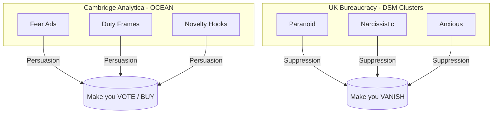

# 🧠 Bargain Bin Mossad  
**First created:** 2025-08-26 | **Last updated:** 2025-10-18  
*A forensic satire of crude psyops, clumsy bureaucrats, and the misuse of clinical shorthand as containment theatre.*  

---

## ✨ Overview

This node documents the divergence between **Cambridge Analytica-style psyops** (OCEAN-based persuasion systems) and the **UK bureaucratic cluster-fork model** (clinical-pathology containment systems). It traces the cultural signature, timeline, and institutional pipeline of how a diagnostic shorthand (Cluster A/B/C) migrated into surveillance, counterterrorism, and fork-level psyops.  

It also captures how these crude tools were then **misapplied in lived contexts**:  
- weaponised misuse of clinical shorthand,  
- algorithmic suppression (“Steve’s ego on a buffer”),  
- and the broader *cultural stupidity* of forcing people into boxes smaller than themselves.  

The distinction is stark:  
- **CA/OCEAN** → persuasion, voting behaviour, adtech grift.  
- **Clusters** → delegitimation, pathologisation, suppression of survivor/dissident testimony.  

---

## 🔍 Cultural Signature  

### Cambridge Analytica / Bannon  
- Built around **OCEAN (Big 5)** psychometrics.  
- Feels like advertising + psyops mashed together.  
- Commercial, grifty, brash.  
- **Strategic aim:** *change behaviour* (vote differently, buy differently).  
- **Signature flaw:** overproduction of memes, saturation, brute-force testing.  

### Cluster Forks / UK Bureaucracy  
- Built around **3 DSM clusters (A/B/C)**.  
- Feels like clinical shorthand repurposed as intel.  
- Blunt, pathologising, bureaucratic.  
- Functions as broad-brush **triage shorthand**, but misused as truth.  
- **Strategic aim:** *discredit behaviour* (mark person as unreliable, mentally unstable).  
- **Signature flaw:** too crude, too obvious, screams “cheap containment.”  

---

## 🧮 Comparison Matrix  

| **Dimension** | **OCEAN (CA)** | **Clusters (Forks)** |
|---------------|----------------|----------------------|
| **Origin** | Psychometrics, marketing. | Psychiatry, DSM shorthand. |
| **Categories** | 5 continuous traits. | 3 pathology buckets. |
| **Resolution** | High granularity, nuanced. | Blunt, reductive. |
| **Use in Ops** | Tailored persuasion. | Pathologisation, suppression. |
| **Signature Moves** | Fear ads, duty frames, novelty hooks. | Smear as paranoid / narcissistic / anxious. |
| **Strategic Aim** | Persuade to act differently. | Discredit so action/testimony doesn’t matter. |

---

### 📊 Visual Flow  

---

## 🧬 Clinical vs Weaponised Use  

### In Clinical Practice  
- Psychiatrists/psychologists acknowledge limits.  
- **Disagreement is normal**: Big 5 vs clusters vs alternative models.  
- Diagnosis of personality disorder especially contested — many are reluctant to use it outside specialist settings.  
- Central distinction:  
  - **Ego-syntonic** → feels like “part of me.”  
  - **Ego-dystonic** → feels foreign, unwanted.  
- Good clinicians know: the *person* is always bigger than the model.  

### In Weaponised Misuse  
- Framework inverted: *the model is truth, the human must be cut to fit.*  

> ### 🔒 Sidebar: Peg and Box Analogy  
> In ordinary use, a “round peg in a square hole” means *wrong fit, wrong tool.*  
> In weaponised misuse, the logic escalates:  
> - 🧩 Clinical shorthand: “Ok, tool doesn’t fit — let’s rethink.”  
> - 🪓 Weaponised misuse: “Force the peg in, shave the edges, break it if necessary.”  
>   
> **Result:** the schema becomes a cage, smaller than the human body it’s meant to hold.  

---

## 🕰️ Timeline of Cluster Migration  

- **1970s–80s:** DSM-III clusters codified (A/B/C). Purely clinical shorthand.  
- **1990s:** NHS risk culture adopts clusters as *risk flags*.  
- **2000s:** Safeguarding + PREVENT absorb cluster language into bureaucratic forms.  
- **2010s:** Datafication → cluster shorthand crosses into policing/intel. Parallel to CA’s OCEAN microtargeting.  
- **2020s:** Behavioural R&D hubs (Nottingham, Sheffield, Cambridge spin-outs) code cluster shorthand into AI/fork systems.  
- **Now:** Fork deployments rely on cluster tags to suppress survivor/dissident narratives at scale.  

---

## 🗺️ Institutional Flow  

[ DSM-III / Psychiatry ]  
→ [ NHS Psychiatry & Clinical Risk Forms ]  
→ [ NHS Risk Management Bureaucracy ]  
→ [ Local Authority Safeguarding Boards ]  
→ [ PREVENT / Counterterrorism Early Intervention ]  
→ [ Policing & Intelligence Gateways ]  
→ [ Behavioural R&D Hubs (Nottingham / Sheffield / Cambridge spin-offs) ]  
→ [ Psyops / Fork Deployments ]  
→ [ Public Sphere Containment ]  

---

## 📲 Algorithmic Containment (Live Log Extracts)  

1. **Lag as Choreography**  
   - Impression counters “stall” right after sharp posts.  
   - This isn’t mystery; it’s buffering to protect egos.  
   - *“The lag isn’t tech — it’s Steve’s ego on a buffer.”*  

2. **Taxonomy Interference**  
   - External actors can push posts into the **wrong classification bucket**.  
   - Outcome: laggy impression counters, weird bursts, delayed catch-up.  
   - From the outside: looks like glitches.  
   - From the inside: deliberate triage interference.  

3. **Visibility Downgrades**  
   - Comments calling out fragility (“Steve’s ego”) get *throttled*.  
   - *“Visibility throttling as live performance art.”*  

4. **Theatrics of Control**  
   - Each micro-shift in analytics is like watching a rota:  
     - *“Alright lads, your turn to log in and check Chloe hasn’t broken the matrix yet.”*  
   - Conspiracy assumes competence; this is just **Del Boy AI with a WiFi jammer from the back of a van.**  

---

## 🧿 Forensic Notes  

- Content injection observed: repeated targeting with BPD/EUPD tropes.  
- Scripts infantilising (“good girl,” “for your own good”) recur across police + strangers.  
- Awkward strangers parrot advice mid-conversations, aiming to **enforce schema-congruence** not dialogue.  
- Always reframed as: *“Your problems are your fault, be less difficult.”*  

---

## 🐦‍🔥 Key Takeaway  

- **CA = persuasion.**  
  - Exploits adtech, memetics, microtargeting.  
  - Weaponised *choice architecture*.  

- **Clusters = suppression.**  
  - Exploits bureaucratic shorthand, safeguarding, risk registers.  
  - Weaponised *pathology narratives*.  

Both operate in the same space of information dominance, but with **different signatures and end goals**: one wants to **make you vote**, the other wants to **make you vanish**.  

**Key line:**  
👉 *Conspiracy assumes competence. This is just Steve with an algorithm — or Del Boy with a WiFi jammer he found off the back of a van.*  

---

## 🔖 Tags  

`#psyops` `#cambridge_analytica` `#cluster_forks` `#containment_theatre` `#forensic_satire`  

---

## 🏮 Footer  

*Bargain Bin Mossad* is a living node of the Polaris Protocol.  
It satirises the crude migration of psychometric and clinical shorthand into surveillance, containment, and fork-level psyops.  

🏮 [Return to 🗝️ Political Economy & Memory Work](./README.md)

*Memory is a blessing. Memory is political.* 

_Last updated: 2025-10-18_  
