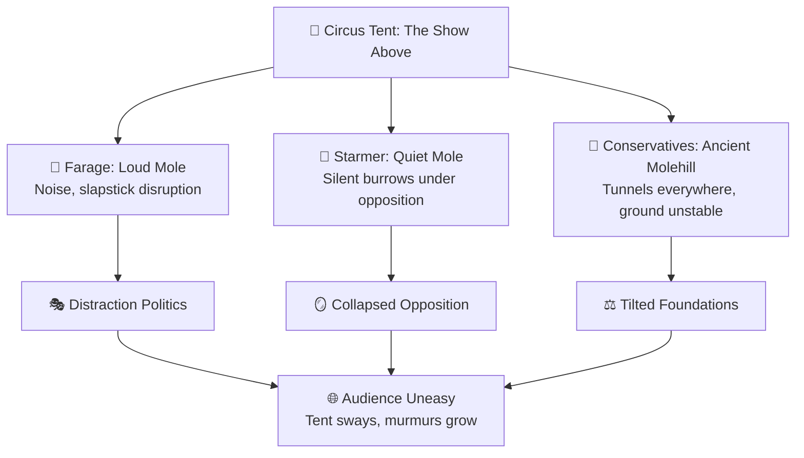

# 🧠 Le Carré Meets Alice in Wonderland  
**First created:** 2025-08-26 | **Last updated:** 2025-10-18  
*Allegorical forensics: when molehunts turn to fairy tales and the Circus collapses under nonsense logic.*  

---

## ✨ Preamble  

What happens when the molehunt becomes a fairy tale?  
When *Smiley’s People* stumble through the looking-glass, they find that the Circus tent is already hollowed out, the ground trembling with unseen burrows.  

---

## 🐀 The Three Moles  

- **Farage (The Loud Mole)**  
  Burrows noisily, earth flying everywhere. Distracts the crowd with slapstick disruption.  

- **Starmer (The Quiet Mole)**  
  Works in silence beneath the ringmaster’s chair. Collapses opposition from within, smiles politely while the beams give way.  

- **The Conservatives (The Ancient Molehill)**  
  Riddled with so many tunnels that no one remembers where the soil first shifted. The whole tent tilts on its foundations.  

---

## 🎪 The Circus Above  

The show goes on: lions leap, clowns tumble, acrobats swing. The ringmaster insists all is well.  
But the audience is unsettled: the tent sways, the ground hums, and the story has become nonsense logic.  

---

## 🪞 Wonderland Logic  

- **“Curiouser and curiouser”** = every party compromised, every choice a trap.  
- **“Off with their heads!”** = performative outrage with no structural change.  
- **The Cheshire Smile** = the illusion of opposition, grinning even as the body disappears.  

---

## 🧮 Forensic Allegory  

The tale is not literal.  
It is a survival map for recognising when all parliamentary vehicles have been bent into alignment with outside capture.  
What remains is the audience: awake, murmuring, ready to leave the tent.

---

## 🗺️ Diagram: The Moles Beneath the Tent  

---

## 🏮 Footer  

*Le Carré Meets Alice in Wonderland* is a living node of the Polaris Protocol.  
It uses allegory to map molehunts, compromised opposition, and Wonderland logic as signatures of captured governance.  

🏮 [Return to 🗝️ Political Economy & Memory Work](./README.md)

*Memory is a blessing. Memory is political.* 

_Last updated: 2025-10-18_  
