# 🧥 Empire’s Old Coat  
**First created:** 2025-10-01 | **Last updated:** 2025-10-18  
*On Britain’s white commentary about Israel/Palestine and the recycled colonial wardrobe it comes from.*  

---

## 🪡 Commentary as Continuation  

White British voices talk about Israel/Palestine as if it is a distant chessboard.  
- **Imperial distance:** Treated as “over there,” not as something that shapes the daily lives of Jews and Muslims here.  
- **Colonial tone:** White arbiters decide what is “reasonable” or “unreasonable,” echoing the governor’s voice.  
- **Erasure of impact:** Every Israeli policy and every Palestinian response reverberates into how minorities are treated in Britain — yet this is erased from the frame.  

## 🧥 The Mothball Wardrobe  

Each time the Crown or its commentators speak, they reach for the same vocabulary: *stability, civilisation, our interests.*  
It is an old coat, reeking of mothballs, still full of holes. Britain keeps pulling it out, pretending it fits, pretending it smells fresh.  

The injury is not only the words themselves, but the act of speaking *over* those most affected. The empire still narrates, while ignoring its own streets.  

```mermaid
flowchart LR
  A[🕎 Scapegoated Jew] --> B[🏹 Proxy Jew]
  B --> C[🛡 Enforcer Jew]
  C --> D[🌀 Scapegoated Again]
  D --> A

  %% Styling
  classDef loop fill:#fdf6e3,stroke:#333,stroke-width:1px;
  class A,B,C,D loop;
```

---

## 🏮 Footer  

*🧥 Empire’s Old Coat* is a node of the Polaris Protocol.  
It traces how British commentary on Israel/Palestine repeats colonial tones, erases domestic impact, and drapes itself in the moth-eaten wardrobe of empire.  

> 📡 Cross-references:
> 
> - [🗝️ Political Economy & Memory Work](./README.md) — *suppression, memory, and projection logics*  
> - [🕸️ World Webs](../../🦕_Elder_Influencers/🕸️_World_Webs/README.md) — *diasporas and entanglements*  
> - [📜 Statutes](../../🦕_Elder_Influencers/📜_Statutes/README.md) — *legislative echoes of colonial logics*  

*Survivor authorship is sovereign. Containment is never neutral.*  

_Last updated: 2025-10-18_  
