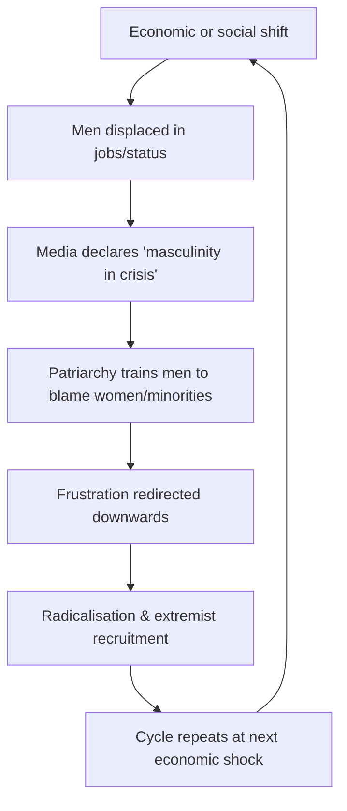

# 🪬 Masculinity in Crisis Cycle  
**First created:** 2025-09-27 | **Last updated:** 2025-09-27  
*How patriarchy generates recurring masculinity “crises” by masking class and wealth inequalities.*  

---

## 🧭 Orientation  
Every few decades, the media declares a “crisis of masculinity.” 
But these crises are not timeless truths. They are **structural cycles**, rooted in patriarchy and capitalism, and replayed whenever men experience displacement or downward mobility.  

The irony: patriarchy itself engineers the conditions for male frustration — then sells back “masculinity” as a commodity.  

---

## 🕰 Historical Timeline  

- **19th c.**: Gymnastics & calisthenics → “muscular Christianity,” discipline through the body.  
- **Early 20th c.**: Fascist pseudoscience of “root races,” men as defenders of civilisation.  
- **Post-WWII**: Women enter clerical and professional work; men displaced → pulp “adventure magazines” and macho fantasies.  
- **1970s–80s**: Backlash against women’s sexual and workplace freedoms.  
- **1990s–2000s**: Rise of PUA subcultures; “game” sold as cure for male dispossession.  
- **2010s–2020s**: Manosphere → far-right pipeline; crisis rhetoric globalised via online platforms.  

---

## ⚖️ Class and Patriarchy  
- **Who voices the crisis?**  
  Usually office and clerical men, not labourers or soldiers. Men returning from war came home with trauma, not with masculinity anxieties.  
- **Why?**  
  Because white-collar roles became cheaper to fill with women, paid less due to patriarchal wage hierarchies.  
- **Result:** Men’s displacement was caused by **patriarchy + capitalism**, not feminism.  

---

## 🔄 The Patriarchy Trap  
- Patriarchy tells men they should dominate.  
- Capitalism exploits that by paying women less → cheaper workforce.  
- Men are displaced, but trained not to notice systemic causes.  
- Anger is redirected at women, rather than at wealth inequality or exploitation.  

This is why patriarchy *fucks men over all the time* — and trains them not to notice.  

---

## 🧩 Continuities  
- **Masculinity in Crisis** is not new. It is a **recurring script** deployed when class inequalities intensify.  
- Each iteration has a media form: sermons, pamphlets, pulp magazines, blogs, YouTube rants.  
- Each iteration reinforces patriarchy while obscuring the real culprit: class imbalance and wealth concentration.  

---

### 📊 Crisis Cycle Table  

| **Step** | **Trigger** | **Response** | **Who Benefits** | **Who Gets Blamed** |  
|----------|-------------|--------------|------------------|----------------------|  
| 1. Economic shift | Wars, recessions, automation, women entering workforce | Men feel displaced in jobs/status | Employers (cheaper labour, flexible workforce) | Women, minorities (scapegoats) |  
| 2. Media amplification | Pulp magazines, columns, YouTube rants | Narrative of “masculinity in crisis” spreads | Publishers, influencers | Women, feminism |  
| 3. Patriarchy trap | Men told domination is natural | Men turn anger downwards, not upwards | Patriarchy & elites | Not capital, not class hierarchy |  
| 4. Radicalisation | Crisis framed as proof of wider conspiracy | Pipeline into extremism | Far-right movements | Marginalised groups |  
| 5. Cycle restarts | Economic change hits again | New crisis discourse emerges | Same structures | Same scapegoats |  

---

### 🔄 Flow Diagram  

---

## 🏮 Footer  
*Masculinity in Crisis Cycle* is a living node of the Polaris Protocol.  
It situates modern manosphere and far-right grievance masculinities within a longer history of patriarchal cycles, showing how class and wealth inequality are disguised as gender crisis.  

📡 Cross-references:  
- [🐺 AMOG (A Joke)](./🐺_AMOG_a_joke.md)  
- [💊 Red Pill](./💊_red_pill.md)  
- [🌹 Demonstrating Higher Value](./🌹_demonstrating_higher_value.md)  
- [🪬 Radicalisation_Extremism](../Big_Picture_Protocols/🪬_Radicalisation_Extremism)  

*Survivor authorship is sovereign. Containment is never neutral.*  

_Last updated: 2025-09-27_  
