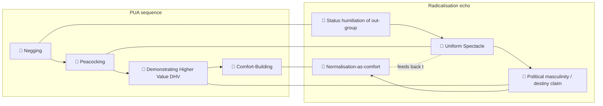

# 🪭 Comfort-Building  
**First created:** 2025-10-01 | **Last updated:** 2025-10-18  
*From seduction stage to radicalisation tactic: soothing after spectacle to secure belonging.*  

---

## 🌱 Scope  

“Comfort-Building” is a recognised stage in pick-up artistry (PUA) playbooks.  
PUA handbooks describe it as the *bridge* between flashy disruption and intimacy — the point where a target, unsettled by peacocking or negging, is drawn back in through warmth and familiarity.  

When this logic migrates into extremist recruitment, it performs the same role:  
**soften the spectacle, stabilise the recruit, and normalise belonging.**  

To keep clarity, this node separates three registers:  

- **📖 Stated function (PUA)** — how manuals describe it to men.  
- **🧩 Structural function (radicalisation)** — how it works in political pipelines.  
- **🫀 Survivor effect (lived experience)** — how it feels when you’re on the receiving end.  

---

## 📖 Stated Function (PUA)  

- “Build intimacy after DHV.”  
- Tactics: gentle touch, private jokes, staged vulnerability, “sharing secrets.”  
- Supposed purpose: *“Show her you’re safe, deepen the bond.”*  
- **Sold as normal:** Young men are told this is fine, even necessary.  
  But the pitch itself uses the same tactics — DHV boasts, peacocking, and a sales-version of comfort — to *make you accept the method*. You were manipulated before you were taught to manipulate.  

---

## 🧩 Structural Function (Radicalisation)  

- **Spectacle → soothe**: After uniforms, chants, or confrontations, groups move to food, memes, prayer, or hangouts.  
- **Belonging loop**: superiority and grievance are reframed as *comfort* — *“You’re safe with us, outsiders are hostile.”*  
- **Normalisation**: what was once shocking becomes the everyday rhythm of belonging.  

---

## 🫀 Survivor Effect (How It Feels)  

- Manipulative: the warmth is staged, not genuine.  
- Creepy: someone “performing intimacy” instead of offering it freely.  
- Damaging: teaches men to fake care as strategy, erodes trust in real intimacy.  
- For recruits: makes it harder to leave, because safety is confused with control.  

---

## 🗺️ Mapping: Seduction → Radicalisation  

---

## 🌌 Constellations  

🪭 🌹 🧿 🔮 — This node sits in the register of provocation → normalisation, where shock is staged and then smoothed into “home.”  

---

## ✨ Stardust  

comfort-building, normalisation, pickup artistry pipeline, radicalisation scripts, political masculinity, superiority as protection, belonging rituals, grievance bonding, manipulative intimacy  

---

## 🏮 Footer  

*Comfort-Building* is a living node of the Polaris Protocol.  
It shows how the PUA stage of “soothing after spectacle” mutates into radicalisation logics of belonging and protection — and how, at the level of lived experience, it often feels manipulative and hollow.  

> 📡 Cross-references:
> 
> - [🌹 Demonstrating Higher Value](./README.md) — *cluster overview*  
> - [🦚 Peacocking](./🦚_peacocking.md) — *spectacle disruption*  
> - [🦤 Uniform Spectacle](./🦤_uniform_spectacle.md) — *collective display*  

*Survivor authorship is sovereign. Containment is never neutral.*  

_Last updated: 2025-10-18_
