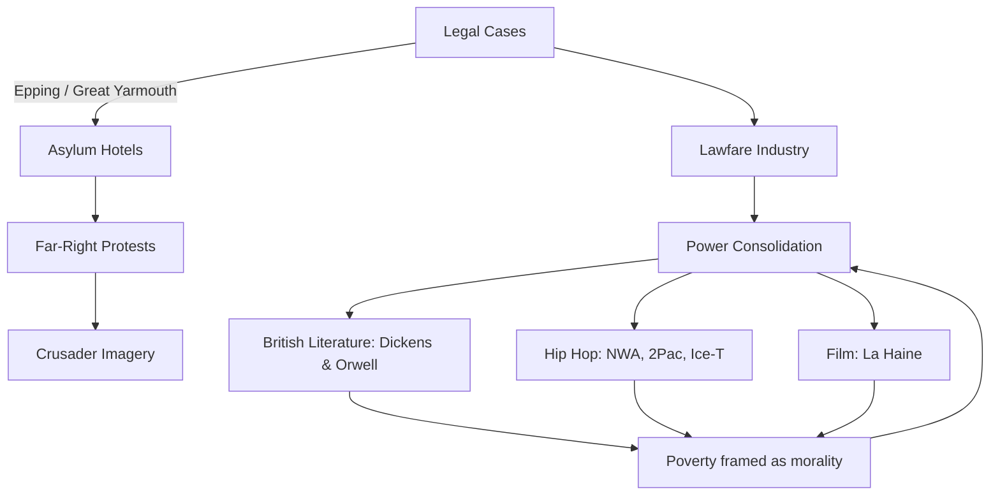

# 🏨 Hotels, Protests, and Power Consolidation  
**First created:** 2025-09-13 | **Last updated:** 2025-10-18  
*Why “asylum hotels” protests aren’t about hotels or asylum, but about power consolidation, lawfare industries, and radicalisation pipelines.*  

  

---

## 📑 Table of Contents  
- [Executive Summary](#exec)  
- [Case Overview: Epping & Great Yarmouth](#case)  
- [Why Hotels?](#why-hotels)  
- [Why Far-Right Protests Cluster Here](#far-right)  
- [Why It’s Not About Hotels or Asylum Seekers](#not-hotels)  
- [Local vs National Power](#local)  
- [Power Consolidation](#power)  
- [Why This Matters for Journalists](#journalists)  
- [Questions Journalists Should Ask](#questions)  
- [Crusader Imagery](#crusaders)  
- [Cultural Constellations](#culture)  
- [Not Revolution, Just Reproduction](#reproduction)  
- [Constellation Diagram](#diagram)  
- [Footer](#footer)  

---

## ✍️ Executive Summary  
The protests around “asylum hotels” are not really about hotels, asylum seekers, or even national identity. They are **surface theatre**.  

Behind them sits a **repeatable apparatus**:  
- A corporate-legal service industry monetising conflict through injunctions and planning disputes.  
- A **tight network of elites** with overlapping interests in surveillance, banking, energy, logistics, and government contracting.  
- **Far-right mobilisation** that supplies the street optics, while the real beneficiaries are middle actors extracting fees and the elites consolidating power.  

➡️ [Back to top](#top)  

---

## ⚖️ Case Overview: Epping & Great Yarmouth  
### 🔹 The Epping Case (Bell Hotel)  
- **Parties**: Epping Forest District Council (claimant) vs. Somani Hotels Ltd (owner).  
- **Claim**: Council says asylum housing = **material change of use** (C1 → sui generis).  
- **Relief**: Injunction under s.187B TCPA 1990.  
- **Counterarguments**: Hotel insists still a hotel; Home Office says injunction undermines statutory duties.  
- **Status**: Interim injunction granted, overturned at appeal, full trial October 2025.  

### 🔹 Great Yarmouth Comparator (Villa Rose Hotel, GY6 Policy)  
- **Policy hook**: Local Plan Policy GY6 protects seafront hotels for tourism.  
- **Decision**: High Court injunction continued; asylum/hostel use blocked.  
- **Cultural note**: British hotel culture has fetishised the **sea view**. *Fawlty Towers* turned it into farce, but in Great Yarmouth the joke was policy: the sea view mattered legally.  

➡️ [Back to top](#top)  

---

## 1. Why Hotels?  
- Hotels = neat planning category.  
- Councils argue asylum use = material change.  
- Hotels as **threshold spaces**: guest vs intruder.  
- Already networked to Home Office procurement.  

➡️ [Back to top](#top)  

---

## 2. Why Far-Right Protests Cluster Here  
- Asylum seekers scapegoated.  
- Fusion: migration + housing + VAWG fears.  
- Local optics leveraged by national networks.  
- Media loves the visuals.  

➡️ [Back to top](#top)  

---

## 3. Why It’s Not About Hotels or Asylum Seekers  
- Councils flexing vs central government.  
- Law firms monetising outrage.  
- Far-right testing mobilisation.  
- Media extracting rage clicks.  

➡️ [Back to top](#top)  

---

## 4. Local vs National Power  
- Councils feel hollowed out.  
- Officers nudge councillors into lawfare.  
- Universities mirror this (trespass injunctions vs students).  
- Reinforces property rights, not human rights.  

➡️ [Back to top](#top)  

---

## 5. The Real Story: Power Consolidation  
- **Executive drift** bypasses debate.  
- **Lawfare industry** extracts from public purse.  
- **Far-right optics** frame “the people vs elites.”  
- **Schmittian risk**: law reduced to leader’s decree.  

➡️ [Back to top](#top)  

---

## 6. Why This Matters for Journalists  
- Follow money and beneficiaries.  
- Name the costs: students, taxpayers, scapegoated groups.  
- Challenge why land law is the battlefield.  

➡️ [Back to top](#top)  

---

## 📝 Questions Journalists Should Ask  
1. Why is this being fought in planning law?  
2. Is this a test case like Great Yarmouth?  
3. Who pays? Who profits?  
4. How are far-right groups exploiting it?  
5. What scrutiny is missing?  

➡️ [Back to top](#top)  

---

## ⚔️ Crusader Imagery  
- Crusades = safety valve for elite feuds.  
- Masculine energy channelled abroad.  
- Racialised enemy constructed.  
- Today’s cosplay repeats the script.  

➡️ [Back to top](#top)  

---

## 🎶 Cultural Constellations  
### Hip hop & RnB  
- **N.W.A., 2Pac, Ice-T**: called out systemic neglect.  
- Black music censored & criminalised.  
- Neo-Nazi music tolerated.  
- Asymmetry shows it’s not about “free speech.”  

### Film: *La Haine* (1995)  
- Banlieue poverty, police hostility, cycles of rage.  
- Violence as narrative survival when channels are blocked.  

### Literature: Dickens & Orwell  
- **Oliver Twist**: poverty as morality, escape only via bloodline luck.  
- **Road to Wigan Pier**: poverty as structure, not character flaw.  

➡️ [Back to top](#top)  

---

## 🔚 Not Revolution, Just Reproduction  
- It’s never about safety, women, or free speech.  
- It’s about maintaining elite power.  
- Far-right revolt = recycling of old orders.  

➡️ [Back to top](#top)  

---

## 🗺️ Constellation Diagram  

➡️ [Back to top](#top)  

---

## 🏮 Footer  
This node is a living map within the Polaris Protocol.  
It documents how asylum hotels became proxy battlefields: far-right mobilisation on the streets, lawfare extraction in courts, executive drift in the state.  

*Survivor authorship is sovereign. Containment is never neutral.*  

_Last updated: 2025-10-18_  
