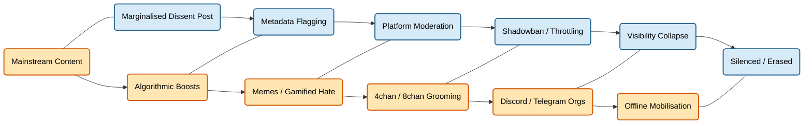

# 🧠 Radicalisation Pipelines and Platform Culture  
**First created:** 2025-08-25 | **Last updated:** 2025-10-18  
*Doctrine on radicalisation pipelines and asymmetric platform culture.*  

---

## ✨ Overview  

This doctrine investigates how online platforms have enabled radicalisation pipelines — particularly for far-right ideologies — while simultaneously silencing or over-policing marginalised dissent.  
It traces cultural vectors, gamified recruitment, moderation failures, and the asymmetry between permissive extremism and hyper-surveilled resistance.  

---

## 🧬 Pipeline Dynamics  

### 🎯 Recruitment by Algorithm  

- **Platform Incentives**  
  - Engagement-driven algorithms amplify outrage, conspiracy, and identity extremism.  
  - YouTube, Facebook, and TikTok “recommendation loops” have been used to shepherd users from mainstream content into hate clusters.  

- **Gamification of Hate**  
  - Far-right recruiters use memes, “redpill” challenges, and layered irony to hook younger users.  
  - Communities use tiered in-jokes and coded language to test loyalty and deepen radicalisation.  

---

### 🧩 Early Platform Failures  

- **Xbox Live (2000s)**  
  - Unmoderated voice chats allowed unchecked racist, misogynist, and homophobic abuse.  
  - Created culture of competitive cruelty that laid groundwork for later radicalisation norms.  

- **4chan & 8chan**  
  - Anonymity + edgelord performance culture became the perfect incubation chamber for white nationalist grooming.  
  - Hosts of swatting campaigns, doxxing, and coordinated attacks on journalists and feminists.  

---

### 🧠 Normalisation Through Memes  

- **Humour as Trojan Horse**  
  - Far-right content often cloaked in “just joking” aesthetics, diffusing scrutiny while conditioning audiences.  
  - Pepe, Wojak variants, and fitness/militarised imagery double as recruitment tools.  

- **Ingroup/Outgroup Rigidity**  
  - Emphasises tribal loyalty over reasoned debate.  
  - Converts defensiveness into aggression — especially among disaffected men seeking status or belonging.  

---

## 📛 Permissive Radicalisation vs Punitive Dissent  

| Axis | Far-Right | Marginalised Dissent |
|------|-----------|----------------------|
| Platform Moderation | Often delayed, inconsistent | Rapid suppression, bans, throttling |
| Cultural Legitimacy | “Concerned citizens,” “free speech” | Framed as agitators, threats, or unstable |
| Institutional Sympathy | Protection or silence from police, press | Framed via Prevent, safeguarding, or CVE logic |
| Metadata Tagging | Rarely flagged without criminal action | Flagged early for “risk factors,” ideology, or tone |  

---

## 🧨 Key Inflection Points  

- **Gamergate (2014–2016)**  
  - Targeted harassment campaign against women in gaming and academia.  
  - Early test case for coordinated abuse, metadata manipulation, and visibility warfare.  

- **QAnon / 8chan**  
  - Mass delusion network launched via unmoderated channels.  
  - Merged conspiracy, nationalism, Christian dominionism, and anti-vaxx into a hybrid radical bloc.  

- **BLM / Palestine Solidarity Suppression**  
  - Algorithmic throttling, shadowbans, and Prevent-tagging intensified.  
  - Police and media treated protest groups as security threats while ignoring or enabling white supremacist mobilisation.  

---

## ⚠️ Structural Risks  

- **Unbalanced Enforcement**: Platforms act swiftly against marginalised dissent while letting hate incubate for years.  
- **Invisible Grooming**: Radicalisation is often gradual, meme-driven, and unnoticed until action is taken.  
- **Archival Sabotage**: Deletion or de-indexing of hate content can erase evidence trails — protecting perpetrators and obscuring patterns.  

---

## 🧮 Key Actors + Platforms  

| Entity | Role |
|--------|------|
| YouTube / TikTok | Algorithm-driven visibility funnels |
| 4chan / 8chan | Ideological grooming, planning nodes |
| Discord / Telegram | Organising platforms for extremist groups |
| Twitter/X | Permissive to fascist figures post-Musk |
| Facebook / Meta | Anti-Palestinian suppression + disinfo engines |  

---

## 👁️‍🗨️ Pipelines of Marginalised Dissent vs Radicalisation

*Note that people who are subject to this content can flip between the pipeline of dissent and the pipeline of radicalisation, subject to microtargeting pressures via online platforms or targeted interference, or subject to their own stressors in daily life (often worsened by cost-of-living financial pressures, bereavements, household and earnings insecurity, new or changing health challenges, etc). Content exists in all types and is renewed continually, allowing minimal tailoring inputs to target users.*

---

## 🔍 Case Notes for Polaris Users  

- **Track Archive Drift**: Use tools like Wayback Machine, Perma.cc, and archive.today to preserve extremist traces before deletion.  
- **Note Moderation Discrepancies**: If your dissent is flagged while extremist content remains, log it — pattern evidence matters.  
- **Map Meme Lineage**: Some meme styles are dogwhistles. Track their source, reposters, and crossover into official campaigns.  
- **Watch the Rhythm**: Is resistance slowed while extremism is let grow? That’s metadata-assisted narrative choreography.  

---

## 🏮 Footer  

*Radicalisation Pipelines and Platform Culture* is a living node of the Polaris Protocol.  
It documents radicalisation pipelines and platform asymmetries — showing how extremism is incubated while dissent is over-policed.  

🏮 [Return to 🪬 Radicalisation & Extremism](./README.md)

*Survivors radiate sovereignty. Compassion is the extremis of survival.* 

_Last updated: 2025-10-18_  

