```mermaid

flowchart LR
  subgraph US_Evangelical_Ecosystem["US Evangelical / Christian Zionist Ecosystem 1970s→"]
    A[Televangelists and Prophecy Media]
    B[ICEJ and IFCJ Networks]
    C[CUFI Donor and Activist Base]
    D[Heritage and Conservative Policy Circles]
  end

  subgraph Comms_Toolkit["Comms Toolkit secularised theology"]
    M[Binary moral frames: good vs evil]
    N[Apocalyptic threat arcs: Iran as Persia]
    O[Donor theatre and mobilization]
    P[Policy-laundered rhetoric: peace, tolerance, civilization front]
  end

  subgraph Bibi_Arc["Netanyahu Arc"]
    E[US immersion 1970s–80s]
    F[First PM term 1996–99]
    G[Opposition 2000–09]
    H[PM consolidation 2009–20]
    I[2020s present]
  end

  subgraph Diaspora_Spillover["Diaspora Radicalisation 2000s→"]
    J[Campus scorecards]
    K[Antisemitism audits]
    L[NGO textbook monitoring: IMPACT-SE etc]
  end

  A --> M
  B --> O
  C --> O
  D --> P
  A --> N
  B --> P
  C --> M

  M --> F
  P --> F
  E --> F
  O --> G
  N --> H
  M --> H
  O --> H
  N --> I
  O --> I
  P --> I

  I --> J
  I --> K
  P --> L
  O --> L

  click C "https://cufi.org" _blank
  click B "https://www.ifcj.org" _blank
  click D "https://www.heritage.org" _blank

```

# 🪬 From Christian Zionism to Diaspora Radicalisation  
**First created:** 2025-08-19 | **Last updated:** 2025-10-18  
*Tracing how US Christian Zionist comms toolkits morphed into diaspora “radicalisation” audits and campus scorecards.*  

---

## 1. The Christian Zionist Prototype (1970s–1990s)  

**Key actors**  
- ICEJ (International Christian Embassy Jerusalem, 1980)  
- IFCJ (International Fellowship of Christians and Jews, 1983)  
- Televangelical donor networks, prophecy media  

**Tactics**  
- Package theology as “objective support for Israel” 
- Create **scorecards** and “peace language” for secular institutions  
- Build **donor-friendly reports** to prove “impact” 

**Example** → ICEJ’s *“Jerusalem as Capital of Peace”* papers, circulated in Brussels & Washington  

> **Comms toolkit emerges:** binary moral frames, apocalyptic arcs, and donor-theatre reports disguised as neutral analysis  

---

## 2. Netanyahu & the Christian Zionist Radicalisation Arc  

**Hypothesis**  
Netanyahu isn’t just courting evangelicals. His worldview is partially radicalised by them.  

### Timeline (Mermaid)  

## Arc Summary  

- **1970s–80s:** US immersion → Cold War + evangelical comms milieu.  
- **1996–99:** First PM term → Congress speech uses “civilization frontline” trope.  
- **2000s:** CUFI ties deepen; evangelical donor base expands.  
- **2009–20:** Iran obsession becomes apocalyptic fixation.  
- **2020s:** CUFI operates as parallel foreign ministry; End Times coalition logic drives rhetoric.  

**→ Netanyahu = Likud roots + Christian Zionist grammar stitched into his political DNA.**  

---

## 3. Diaspora Radicalisation Spillover  

- **Mimicry effect:** Jewish/Israeli NGOs adopt the evangelical comms architecture (metrics, UNESCO rubrics, donor-report theatre).  

### Diaspora politics:  
- US Jewish organisations pressured to align with evangelical-style **binary threat narratives.**  
- UK & European Jewish communities pulled rightward by same toolkit — anti-antisemitism audits, “campus scorecards,” textbook monitoring.  

### Outcome:  
- Christian Zionist frames laundered into diaspora spaces as **“neutral monitoring.”**  
- **Radicalisation of diaspora discourse:** suspicion of left-Jews, pacification of dissent, reflexive pro-Israel positioning.  

**→ My people didn’t invent this toolkit. We inherited a haunted version, then turned it inward on ourselves.**  

---

---

## 🧭 Netanyahu: the Specific Radicalisation of King David via the Christian Zionist Radicalisation Apparatus 

**Hypothesis:**  
Netanyahu’s ideological evolution cannot be explained only by classical Revisionist Zionism. His long exposure to U.S. evangelical Christian Zionism re-coded his political language, donor alliances, and apocalyptic worldview.  

---

## 1. Early U.S. Immersion (1970s–1980s)  
- **Harvard / MIT / UN post** → Netanyahu spends years in U.S. East Coast elite + conservative think-tank circles.  
- **Absorbs:** Cold War language of “civilizational struggle.” 
- **Christian Zionist exposure:** Early encounters with televangelical networks and Washington Bible Belt funders.  

---

## 2. First Term as PM (1996–1999)  
- **1996 Speech to U.S. Congress:** Frames Israel as “the front line of Western civilization.” 
- **Language shift:** Security threats recast in **good vs evil / light vs darkness** binaries — resonant with evangelical End Times rhetoric.  
- **Donor base:** Begins courting evangelical support alongside AIPAC.  

---

## 3. Opposition Years (2000–2009)  
- **Post-Oslo fallout:** Positions himself as defender against “existential enemies.” 
- **Christian Zionist deepening:** Attends CUFI (Christians United for Israel) style gatherings; praises Pastor Hagee’s base.  
- **Displacement:** Prioritizes evangelical alliances even when U.S. Jewish institutions are lukewarm.  

---

## 4. Consolidation & Iran Obsession (2009–2020)  
- **UN General Assembly speeches:** Uses **apocalyptic imagery** (bomb cartoon, “red line”) → straight out of prophecy-inflected talking points.  
- **Strategic mirroring:** Adopts evangelical narrative: Iran = modern Persia, Israel = bulwark before Tribulation.  
- **Policy impact:** Nuclear deal opposition framed as not just policy but **cosmic battle.**  

---

## 5. Present Era (2020s)  
- **CUFI as parallel foreign ministry:** Netanyahu regularly addresses Christian Zionist audiences directly.  
- **Apocalyptic turn:** Iran–Hezbollah–Hamas framed as End Times coalition.  
- **Radicalisation marker:** Increasing willingness to override IDF/security establishment in favour of **theological donor language.**  

---

## 6. Polaris Conclusion  
- Netanyahu isn’t just *using* Christian Zionists.  
- He has been **partially radicalised by their worldview**:  
  - Binary moral frames  
  - Apocalyptic Iran fixation  
  - Parallel donor politics  
- Outcome: A Likud leader with Revisionist roots, but a **Christian Zionist grammar** stitched into his political DNA.  

---

---

### Quick Scoring (0–10)
- Binary moral frames present (0–2)
- Apocalyptic/End Times tones (0–2)
- Donor theatre / scorecards (0–2)
- UNESCO/neutral-speak laundering (0–2)
- Diaspora spillover behaviors (0–2)

**0–3**: low influence • **4–7**: toolkit present • **8–10**: strong Christian Zionist influence

  - Parallel donor politics  
- Outcome: A Likud leader with Revisionist roots, but a **Christian Zionist grammar** stitched into his political DNA.

---

## 🏮 Footer  

*From Christian Zionism to Diaspora Radicalisation* is a living node of the Polaris Protocol.  
It documents how US evangelical comms toolkits migrated into Israeli politics and diaspora monitoring regimes, reformatting communal life into binary, apocalyptic, and donor-theatre frames.

🏮 [Return to 🪬 Radicalisation & Extremism](./README.md)

*Survivors radiate sovereignty. Compassion is the extremis of survival.* 

_Last updated: 2025-10-18_  
