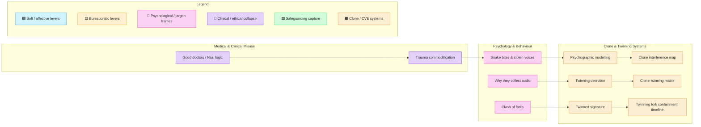

# 🐦‍🔥 Trauma, Psychology & Medical Misuse  

**First created:** 2025-08-27 | **Last updated:** 2025-08-27  
*How trauma, medicine, and psychology are misused for containment, commodification, and cloning.*  

---

## ✨ Scope  

This cluster documents how medical language, psychological frameworks, and survivor narratives are weaponised against those they are meant to protect.  
It exposes commodification of trauma, misuse of diagnostic categories, and the ways institutional psychology intersects with cloning, twinning, and voice/data extraction.  

---

## 🦚 Core Themes  

- **Medical Misuse** → perversion of clinical ethics and weaponisation of psychiatric labels.  
- **Trauma Commodification** → survivor pain repackaged as research, data, or institutional capital.  
- **Clone/Twinning Systems** → psychographic modelling, interference maps, and identity twinning matrices.  
- **Behavioural Extraction** → why audio is collected, how forks clash, and how survivor voiceprints are banked.  

---

## 📂 Current Files  

- [🧠 Good Doctors Are Not Nazis](🧠_good_doctors_are_not_nazis.md)  
  *Exposing how clinical ethics collapse when medicine serves governance.*  

- [🐍 Snake Bites and Stolen Voices](🐍_snake_bites_and_stolen_voices.md)  
  *Metaphors of venom and silence — how survivor voices are taken.*  

- [🐍 Trauma Commodification](🐍_trauma_commodification.md)  
  *Turning survivor pain into research, capital, or institutional currency.*  

- [🧬 Psychographic Modelling and Twinning](🧬_psychographic_modelling_and_twinning.md)  
  *How psychological profiling feeds clone/twin identity systems.*  

- [🧬 Twinning Detection](🧬_twinning_detection.md)  
  *Signals and diagnostics for spotting forced identity duplication.*  

- [🧬 Twinned Signature](🧬_twinned_signature.md)  
  *When digital and behavioural signatures split and mirror back.*  

- [🧬 Clone Interference Map (image)](🧬_clone_interference_map.png)  
  *Visual schema of clone overlap, drift, and systemic disruption.*  

- [🧬 Clone Twinning Matrix (data)](🧬_clone_twinning_matrix.json)  
  *Structured dataset of twinning correlations and interference nodes.*  

- [🪞 Twinning Fork Containment Timeline](🪞_twinning_fork_containment_timeline.md)  
  *Chronology of containment attempts across twinned/forked identities.*  

- [🎙️ Why They Collect Audio](🎙️_why_they_collect_audio.md)  
  *The logics behind audio capture and voiceprint extraction.*  

- [🎻 Clash of Forks](🎻_clash_of_forks.md)  
  *When multiple forks collide — and the fractures that follow.*  

---

## 🗺️ You Are Here

[📁 Polaris-Protocol](/) → [📁 Disruption_Kit](/Disruption_Kit) → [📁 Big_Picture_Protocols](/Disruption_Kit/Big_Picture_Protocols) → [📁 🐦‍🔥 Trauma,_Psychology_&_Medical_Misuse](/Disruption_Kit/Big_Picture_Protocols/🐦‍🔥_Trauma,_Psychology_&_Medical_Misuse)  

---

## 🔮 Visual Framing  

---

## 🏮 Footer  

*🐦‍🔥 Trauma, Psychology & Medical Misuse* is a living node of the Polaris Protocol.  
It gathers together doctrines on how trauma and medicine are systematically repurposed for governance, commodification, and identity containment.  

> 📡 Cross-references:  
> - [🧨 Soft Suspension Is Still Containment](../Containment_Scripts/🧨_soft_suspension_is_still_containment.md) — suppression logs  
> - [🧾 Data Is Their Cage Too](../Big_Picture_Protocols/🧾_data_is_their_cage_too.md) — on data exploitation as captivity  
> - [🧠 Targeting Logic: Empathy Is a Threat](../Big_Picture_Protocols/🧠_targeting_logic_empathy_is_a_threat.md) — systemic analysis of empathy weaponisation  

*Survivors are soverign.*  

