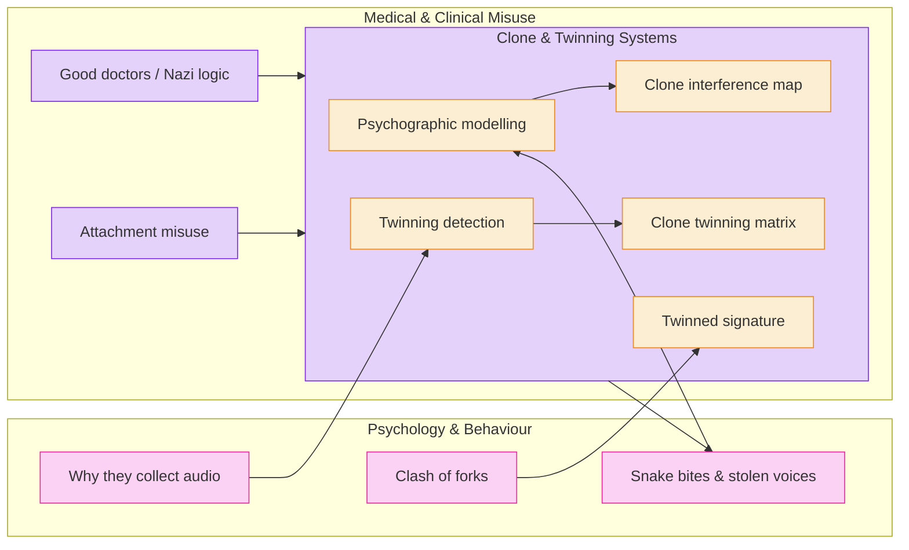

# 🐦‍🔥 Trauma, Psychology & Medical Misuse  
**First created:** 2025-08-27 | **Last updated:** 2025-08-27  
*How trauma, medicine, and psychology are misused for containment, commodification, and cloning*  

---

## ✨ Scope  

This cluster documents how medical language, psychological frameworks, and survivor narratives are weaponised against those they are meant to protect.  
It exposes commodification of trauma, misuse of diagnostic categories, and the ways institutional psychology intersects with cloning, twinning, and voice/data extraction.  

---

## 📌 Core Themes  

- **Medical Misuse** → perversion of clinical ethics and weaponisation of psychiatric labels.  
- **Trauma Commodification** → survivor pain repackaged as research, data, or institutional capital.  
- **Clone/Twinning Systems** → psychographic modelling, interference maps, and identity twinning matrices.  
- **Behavioural Extraction** → why audio is collected, how forks clash, and how survivor voiceprints are banked.  

---

## 📂 Current Files  

- 🧠_good_doctors_are_not_nazis.md  
- 🧠_snake_bites_and_stolen_voices.md  
- 🐍_trauma_commodification.md  
- 🧠_attachment_is_not_a_crime.md *(moved here from Big Picture Protocols)*  
- 🧬_psychographic_modelling_and_twinning.md  
- 🧬_twinning_detection.md  
- 🧬_twinned_signature.md  
- 🧬_clone_interference_map.png  
- 🧬_clone_twinning_matrix.json  
- 🎙️_why_they_collect_audio.md  
- 🎻_clash_of_forks.md  

---

## 🔍 Visual Framing  

---

## 🏮 Footer  

*🐦‍🔥 Trauma, Psychology & Medical Misuse* is a living node of the Polaris Protocol.  
It gathers together doctrines on how trauma and medicine are systematically repurposed for governance, commodification, and identity containment.  

> 📡 Cross-references:  
> - [🧨 Soft Suspension Is Still Containment](../Containment_Scripts/🧨_soft_suspension_is_still_containment.md) — suppression logs  
> - [🧾 Data Is Their Cage Too](../Big_Picture_Protocols/🧾_data_is_their_cage_too.md) — on data exploitation as captivity  
> - [🧠 Targeting Logic: Empathy Is a Threat](../Big_Picture_Protocols/🧠_targeting_logic_empathy_is_a_threat.md) — systemic analysis of empathy weaponisation  

*Survivor authorship is sovereign. Containment is never neutral.*  

