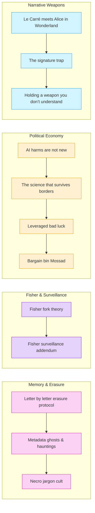

# 📜 Political Economy & Memory Work  
**First created:** 2025-08-27 | **Last updated:** 2025-08-27  
*Doctrine on memory, surveillance, and the political economy of trauma and containment*  

---

## ✨ Scope  

This cluster brings together nodes on how memory, economics, and narrative control operate in tandem.  
It documents how trauma and survival are commodified, how surveillance capitalism intersects with political violence, and how erasure or rewriting of memory is formalised into bureaucratic and cultural practice.  

---

## 📌 Core Themes  

- **Memory & Erasure** → erasure protocols, metadata hauntings, and necro-jargon.  
- **Surveillance & Fisherian Analysis** → Fisher’s frameworks adapted to surveillance, forks, and capitalist realism.  
- **Political Economy of Trauma** → data as captivity, bargain-bin intelligence, and transnational science flows.  
- **Narrative Weapons** → bad luck leveraged, weaponised correspondence, and signature traps.  

---

## 📂 Current Files  

- 🧠_fisher_fork_theory.md  
- 📡_fisher_surveillance_addendum.md  
- 🧠_ai_harms_are_not_new.md  
- 🧠_the_science_that_survives_borders.md  
- 🧠_leveraged_bad_luck.md  
- 🧠_bargain_bin_mossad.md  
- 🧠_le_carré_meets_alice_in_wonderland.md  
- 💌_letter_by_letter_erasure_protocol.md  
- 🧾_data_is_their_cage_too.md  
- 🪦_metadata_ghosts_and_hauntings.md  
- 🐦‍🔥_the_signature_trap.md  
- 🫀_holding_a_weapon_you_don’t_understand.md  
- 💀_necro_jargon_cult.md  

---

## 🔍 Visual Framing  

---

[INSERT FOOTER]
