# 📜 Political Economy & Memory Work  
**First created:** 2025-08-27 | **Last updated:** 2025-08-27  
*Doctrine on memory, surveillance, and the political economy of trauma and containment.*  

---

## ✨ Scope  

This cluster brings together nodes on how memory, economics, and narrative control operate in tandem.  
It documents how trauma and survival are commodified, how surveillance capitalism intersects with political violence, and how erasure or rewriting of memory is formalised into bureaucratic and cultural practice.  

---

## 🦚 Core Themes  

- **Memory & Erasure** → erasure protocols, metadata hauntings, and necro-jargon.  
- **Surveillance & Fisherian Analysis** → Fisher’s frameworks adapted to surveillance, forks, and capitalist realism.  
- **Political Economy of Trauma** → data as captivity, bargain-bin intelligence, and transnational science flows.  
- **Narrative Weapons** → bad luck leveraged, weaponised correspondence, and signature traps.  

---

# 📂 Politics_and_Memory

- [🧠 Fisher Fork Theory](🧠_fisher_fork_theory.md) — *Mark Fisher’s ideas re-framed through fork/ghost containment.*
- [📡 Fisher Surveillance Addendum](📡_fisher_surveillance_addendum.md) — *Notes on surveillance, metadata, and Fisher’s lens.*
- [🧠 AI Harms Are Not New](🧠_ai_harms_are_not_new.md) — *A reminder that technological harms follow long-standing patterns.*
- [🧠 The Science That Survives Borders](🧠_the_science_that_survives_borders.md) — *How knowledge persists despite political and institutional boundaries.*
- [🧠 Leveraged Bad Luck](🧠_leveraged_bad_luck.md) — *On exploitation of survivor misfortune as systemic leverage.*
- [🧠 Bargain Bin Mossad](🧠_bargain_bin_mossad.md) — *Satirical take on low-rent intelligence mimicry.*
- [🧠 Le Carré Meets Alice in Wonderland](🧠_le_carré_meets_alice_in_wonderland.md) — *Cold-war intrigue colliding with absurdist containment logic.*
- [💌 Letter by Letter Erasure Protocol](💌_letter_by_letter_erasure_protocol.md) — *On linguistic silencing and incremental deletion of testimony.*

- [🧾 Data Is Their Cage Too](🧾_data_is_their_cage_too.md) — *Notes on institutional actors trapped by the same metadata prisons they build.*
- [🪦 Metadata Ghosts and Hauntings](🪦_metadata_ghosts_and_hauntings.md) — *Forensic record of data traces and spectral containment.*
- [🐦‍🔥 The Signature Trap](🐦‍🔥_the_signature_trap.md) — *How signatures, authorship, and metadata become bait for containment.*
- [🫀 Holding a Weapon You Don’t Understand](🫀_holding_a_weapon_you_don’t_understand.md) — *On wielding tools of power without grasping their costs.*

---

## 🔮 Visual Framing  

```mermaid
flowchart LR
  subgraph MEM[Memory & Erasure]
    A[Letter by letter erasure protocol]:::jargon
    B[Metadata ghosts & hauntings]:::jargon
    C[Necro jargon cult]:::jargon
  end

  subgraph FISH[Fisher & Surveillance]
    D[Fisher fork theory]:::ethics
    E[Fisher surveillance addendum]:::ethics
  end

  subgraph ECON[Political Economy]
    F[AI harms are not new]:::bureaucratic
    G[The science that survives borders]:::bureaucratic
    H[Leveraged bad luck]:::bureaucratic
    I[Bargain bin Mossad]:::bureaucratic
  end

  subgraph NARR[Narrative Weapons]
    J[Le Carré meets Alice in Wonderland]:::soft
    K[The signature trap]:::soft
    L[Holding a weapon you don’t understand]:::soft
  end

  %% Flows
  A --> B
  B --> C
  D --> E
  F --> G
  G --> H
  H --> I
  J --> K
  K --> L

  %% Style
  classDef soft fill:#d2f4ff,stroke:#2a9df4,stroke-width:1px;
  classDef bureaucratic fill:#fff0d2,stroke:#f4a300,stroke-width:1px;
  classDef jargon fill:#fbd2f4,stroke:#e82a9d,stroke-width:1px;
  classDef ethics fill:#e5d2fb,stroke:#7d2ae8,stroke-width:1px;
  classDef safeguarding fill:#d2fbdc,stroke:#2ae86a,stroke-width:1px;
  classDef cve fill:#fbeed2,stroke:#e88a2a,stroke-width:1px;

```

---

[INSERT FOOTER]
