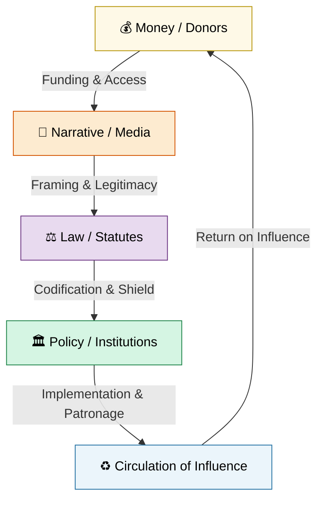

# 🦕 Elder Influencers  
**First created:** 2025-10-15 | **Last updated:** 2025-10-18  
*Where empire ages but never dies — the long shadow of legacy power.*  

---

## ✨ Scope  
*Elder Influencers* studies the persistence of old power in new skins.  
It follows how wealth, law, and narrative reproduce the same hierarchies that empire once enforced — only now branded as stability, respectability, and philanthropy.  
These influences do not roar; they whisper. They shape what is polite to ask, possible to fund, and acceptable to remember.  

Influence has become a synonym for youth and virality, yet the deepest influences are the ones we mistake for the weather — omnipresent, unremarkable, and ancient.  
This cluster names those forces and traces how they continue to write the rules of public life.  

---

## 🛰️ Orientation  
The *Elder Influencers* cluster examines how empire learned to survive its own abolition:  
- Through **philanthropy** that launders moral debt into legacy.  
- Through **statutes** that preserve hierarchies of property, nation, and knowledge.  
- Through **world webs** of soft power linking finance, diplomacy, and culture.  
- Through **borders** and **custodial systems** that naturalise exclusion.  

Each subfolder maps one artery in the living body of empire — its financial bloodstream, its legal skeleton, its media voice, and its geopolitical skin.  

---

## 📂 Core Subfolders  

| Folder | Focus |
|:--|:--|
| [💸 Money Listens](./💸_Money_Listens/README.md) | Philanthropy, charity reform, and donor influence disguised as virtue. |
| [📜 Statutes](./📜_Statutes/README.md) | Legal architectures that fossilise elite power and moralise hierarchy. |
| [🕊️ Just Boxes](./🕊️_Just_Boxes/README.md) | Custodial violence and the lethal edges of respectability. |
| [🕸️ World Webs](./🕸️_World_Webs/README.md) | Geopolitical entanglements and diasporic continuities of empire. |
| [🛟 Borders, Boats, Walls](./🛟_Borders_Boats_Walls/README.md) | Nationhood as containment — migration and belonging under inherited logics. |

---

## 🦚 Core Themes  

- **Deference as technology.** Respect becomes obedience when ritualised.  
- **Philanthropy as soft empire.** Charity replaces reparations.  
- **Law as fossil.** Legal continuity sanctifies inequality.  
- **Data capital as reincarnation.** The empire of extraction reborn as infrastructure.  
- **The respectability trap.** Violence made invisible through etiquette.  
- **World webs.** Informal alliances as the connective tissue of global influence.  
- **The myth of stability.** “Continuity” as a brand for stasis.  
- **Accountability by decorum.** Outrage reframed as impoliteness.  

---

## 🗺️ Visual Map — Circulation of Influence  

*Alt text:* A closed loop of influence where money funds narrative, narrative shapes law, law enables policy, and policy protects money — a circulatory system of legacy power.  

---

## 🌌 Constellations  

🦕 👑 ⚖️ 🕸️ 💸 🛟 — continuity, empire, respectability, law, and wealth.  

**Cultural & Mythic Echoes:**  
- *Succession* — inheritance as performance.  
- *The Crown* — ceremony as continuity.  
- *There Will Be Blood* — extraction as destiny.  
- *The Godfather* — family as moral camouflage.  
- *The Favourite* — loyalty traded for power.  
- *Bleak House*, *Nostromo*, *The Trial* — bureaucracy as inheritance.  

---

## ✨ Stardust  
legacy power, philanthropy, deference, law, world webs, borders, empire, respectability, charity, influence networks, donor control, global continuity, accountability  

---

## 🕰️ Closing Reflection  

Influence is not inherently evil; it is only dishonest when it refuses to name its origin.  
The house of empire still stands — renovated, franchised, redecorated — but its foundations are the same stone.  
To walk its halls with open eyes is not heresy, but honesty.  

---

## 🏮 Footer  

*🦕 Elder Influencers* is a living node of the Polaris Protocol.  
It maps the persistence of old power and its modern guises — tracing how empire survives through money, law, and decorum.  

> 📡 Cross‑references:
> 
> - [✨ Glimmer Is Taxable](../✨_Glimmer_Is_Taxable_And_Other_Big_Drums/README.md) — *moral satire of virtue economies*  
> - [🪄 Expression Of Norms](../🪄_Expression_Of_Norms/README.md) — *cultural compliance and narrative enforcement*  
> - [🌀 Systems & Governance](../🌀_System_Governance/README.md) — *bureaucratic architectures of control*  

*Survivor authorship is sovereign. Containment is never neutral.*  

_Last updated: 2025-10-18_
