```mermaid
flowchart TD

%% Title
A0["THE HUNGER GAMES: 2025<br/>(Bureaucracy Edition™)"]

%% Capitol
A1["🏛️ Capitol HQ<br/>(Cabinet + Comms Grid)"]

A0 --> A1

%% Tier 1 Districts
A2["🍞 District 1:<br/>Food Inflation<br/>(Supermarkets + Monopolies)"]
A3["⚙️ District 2:<br/>Algorithmic Scoring<br/>(Risk Models + “Lifestyle Flags”)"]
A4["📑 District 3:<br/>Welfare Sanctions<br/>(Biometrics + Conditionality)"]

A1 --> A2
A1 --> A3
A1 --> A4

%% Tier 1 notes
A2a["“Prices go up, wages stand still.”"]
A3a["“Your data twin committed a thought-crime in Tesco.”"]
A4a["“Starvation, but made procedural.”"]

A2 --> A2a
A3 --> A3a
A4 --> A4a

%% Tier 2 Districts
A5["🍽️ District 4:<br/>Prison Diets<br/>(Nutritional risk assessments)"]
A6["🛄 District 5:<br/>Migrant Hostels<br/>(Asylum rationing + queue algorithms)"]
A7["🔥 District 6:<br/>Climate Shock<br/>(Crop failure + insurance collapse)"]

A1 --> A5
A1 --> A6
A1 --> A7

A5a["“You lost 3kg; must be malingering.”"]
A6a["“We’ll feed you once we decide you exist.”"]
A7a["“Famine but in PowerPoint.”"]

A5 --> A5a
A6 --> A6a
A7 --> A7a

%% Tier 3 Districts
A8["🚢 District 7:<br/>Supply Chain Collapse<br/>(Strikes + ports + wars)"]
A9["📉 District 8:<br/>Data Poverty<br/>(Signal starvation)"]
A10["🧾 District 9:<br/>Digital Purchase Histories<br/>(“Why did you stop buying bagels?”)"]

A1 --> A8
A1 --> A9
A1 --> A10

A8a["“There is no bread, but there is a QR code.”"]
A9a["“If you buy nothing, we can’t model you.”"]
A10a["“Your hunger is now a consumer anomaly.”"]

A8 --> A8a
A9 --> A9a
A10 --> A10a

%% Final Arena
A11["🏟️ FINAL ARENA:<br/>Sacrificial Protest<br/>(Hunger Strikes 2.0)"]
A1 --> A11
A11a["“May the odds be ever in your risk category.”"]
A11 --> A11a
```

# 🥨 Bread No Roses  
**First created:** 2025-11-23 | **Last updated:** 2025-11-23  
*Folder orientation: sacrificial protest, subsistence pressure, and food-as-politics in 2025.*

---

## 1. What This Folder Is  
**🥨 Bread No Roses** is a sub-cluster within **🍿 Historical Democratic Actions**, focused on how **food, refusal, scarcity, fasting, and subsistence** have functioned as political leverage across history — and how those dynamics mutate inside **2025’s risk-managed, algorithmic, supply-fragile democracies**.

This folder sits at the intersection of:

- **Sacrificial protest** (fasting, hunger strikes, bodily deprivation)  
- **Economic pressure** (food scarcity, distribution chokepoints, inflationary weaponisation)  
- **Visibility politics** (who gets to be seen starving, who is rendered invisible)  
- **Narrative containment** (state interpretations of protest as pathology)  
- **Modern state sensitivities** (risk, optics, coherence, and data volatility)  

If historical democratic movements were about **bread**, and 20th-century civil movements wanted **bread *and* roses**, the 2025 political landscape has created a third category:

> **Bread No Roses — where even subsistence becomes a contested signal, a weapon, or a form of political theatre.**

---

## 2. Why Food Becomes a Political Pressure Point in 2025  
We are living in a global environment shaped by:

- **Inflation shocks**  
- **Fragile supply chains**  
- **Climate-driven crop instability**  
- **Geopolitical food weaponisation**  
- **State austerity and welfare erosion**  
- **Algorithmic misclassification of poverty as risk behaviour**  
- **Diaspora remittance pressures**  
- **Cost-of-living protest movements**  

Food is no longer simply sustenance.  
It is **symbol**, **currency**, **lever**, **signal**, **proxy**, and **measurement**.

Food scarcity + political instability = **Hunger Games dynamics**, but bureaucratised and depoliticised.

---

## 3. What Lives in This Folder  
This directory holds nodes that examine:

### 🛑 **Sacrificial protest in modern legitimacy systems**  
How fasting and hunger strikes function (or fail) in states that have replaced moral shame with risk-logic.

Example:  
- [`🍉_hunger_strikes_in_2025.md`](./🍉_hunger_strikes_in_2025.md)

### 🍞 **Food scarcity as social control**  
Supply lines, supermarket monopolies, sanctions, welfare pruning, and controlled scarcity as political stabilisers.

### 🥤 **Signal-based subsistence**  
How refusing food, reducing spending, altering consumption, or flattening digital purchasing traces generate *data anomalies* that states and corporations respond to.

### 🧱 **Historic parallels**  
Bread riots, the suffragette food economy, Irish republican prison strategies, the Bengal famine, rationing as soft control, and the aesthetics of deprivation.

### 📉 **Modern coercion-by-hunger**  
Food banks, sanctions, biometric welfare systems, cost-of-living erosion, refugee camp supply politics, and algorithmic denial of subsistence.

In other words:  
**every node here deals with what happens when eating or not eating becomes political terrain.**

---

## 4. Orientation: Why This Matters  
In 2025, the “Hunger Games” analogy is no longer hyperbole — it is *structural*.

Food becomes a **pressure point**, not because humans changed, but because:

- state legitimacy is fragile  
- supply lines are fragile  
- public trust is fragile  
- data visibility is fragile  
- welfare systems are punitive  
- carceral systems medicalise dissent  
- global markets treat food as financial product  
- democracies treat hunger as personal failure  

Therefore, **food-linked protest** (refusal, scarcity, fasting, redistribution, data starvation, consumption strikes) becomes one of the last remaining levers that interacts meaningfully with state sensitivities.

This folder documents that lever.  

---

---

## 🌌 Constellations  
🥨 🍉 🧩 🛑 — sacrificial protest; subsistence politics; historical pattern mapping; legitimacy inversion.

---

## ✨ Stardust  
food politics, hunger games analysis, subsistence leverage, sacrificial protest, historical democratic action, scarcity signalling, supply chain fragility, inflation politics

---

## 🏮 Footer  
**Bread No Roses** is a living sub-cluster of the **Polaris Protocol**, dedicated to mapping the political economy of food, scarcity, sacrifice, and state sensitivity. Here, food is understood not only as sustenance but as a **signal, vector, and pressure mechanism** within modern democratic and containment systems.

> 📡 Cross-references:
> - [🍿 Historical Democratic Actions](../) — *macro folder on collective action lineages*  
> - [🦕 Elder Influencers](../../) — *institutional memory and democratic inheritance*  

*Survivor authorship is sovereign. Containment is never neutral.*  

_Last updated: 2025-11-23_
