# ⚖️ Surveillance-Driven Wealth — Tort Exposure at the Top of the Table  
**First created:** 2025-10-29  |  **Last updated:** 2025-10-31  
*How long-term surveillance, creative exploitation, and wealth concentration reshape civil-liability scale.*  

---

## 🧭 Orientation
This node translates complex tort and equity principles into plain language for non-specialists.
It asks: **What happens when unlawful surveillance and data exploitation feed exponential private wealth?**

- The focus is systemic, not personal.
- The scenario assumes long-term data capture of writing, voice, and creativity through personal devices.
- It models how that behaviour, when performed by ultra-wealthy or state-scale private actors, can generate unprecedented civil exposure.

---

## 🧩 From Individual Breach to Systemic Risk

| Layer | Description | Legal Pathway | Potential Exposure |
|--------|--------------|---------------|--------------------|
| **Personal-level surveillance** | Unlawful monitoring of devices, voice, writing, or movement | Misuse of Private Information / Data Protection Act | £3 k – £50 k per person |
| **Creative exploitation** | Use of writings, voice, or ideas without consent | Breach of Confidence / Unjust Enrichment | Restitution = value of work appropriated |
| **Safeguarding failure** | Trafficking or sexual exploitation not prevented | Negligence / Human-rights breach (Arts 3–4 ECHR) | £20 k – £150 k + per person |
| **Institutional complicity** | State or corporate omission enabling harm | Misfeasance / Vicarious Liability | Unlimited compensatory damages |
| **Systemic profit from surveillance economies** | Wealth accumulation via unlawful or unethical data capture | Unjust Enrichment / Account of Profits | Up to full traced enrichment (no cap) |

---

## 📈 Outer-Limit Damages Logic

```mermaid
flowchart TD
A["💠 Harm Detected — Creative Citizen Surveilled / Trafficked"] --> B{"Criminal exploitation proven?"}
B -->|Yes| C["⚖️ Criminal & Survivor Compensation"]
C --> C1["→ CICA award (£20k–£110k+)"]
C --> C2["→ Offender compensation order"]
B -->|No| D{"Institutional or Corporate Negligence?"}
D -->|Yes| E["🏢 Civil Tort / Negligence Damages"]
E --> E1["→ Pain & suffering (£20k–£250k+)"]
E --> E2["→ Loss of earnings (variable)"]
E --> E3["→ Aggravated / exemplary damages"]
D -->|No| F{"Private data or creative work misused?"}
F -->|Yes| G["🕵️‍♀️ Misuse of Private Information / Data Breach"]
G --> G1["→ Distress damages (£3k–£50k)"]
G --> G2["→ GDPR penalties / compensation"]
F -->|No| H{"Misuse yielded measurable profit?"}
H -->|Yes| I["💰 Unjust Enrichment / Account of Profits"]
I --> I1["→ Disgorgement = traced profit share (unlimited)"]
I --> I2["→ Constructive trust over assets"]
H -->|No| J{"Systemic failure to safeguard?"}
J -->|Yes| K["🕊️ Human-Rights Breach (Arts 3–4–8 ECHR)"]
K --> K1["→ Damages £10k–£150k + "]
K --> K2["→ Declaratory / reform orders"]
K --> L{"Was enrichment state-scale?"}
L -->|Yes| M["🚀 Outer-Limit Restitution"]
M --> M1["→ Disgorgement up to total enrichment (no statutory cap)"]
M --> M2["→ Exemplary damages (oppression / abuse of sovereignty)"]
M --> M3["→ Structural remedies — divestment or victim fund"]
```

---

## 💰 Top 20 Richest Individuals — 2025 (illustrative, by net worth)

| Rank | Name | Approx. Net Worth (USD) | Country | Industry | Primary Source of Wealth |
|------|------|---------------------------|----------|-----------|--------------------------|
| 1 | [Elon Musk](https://en.wikipedia.org/wiki/Elon_Musk) | US $480 billion (480 B) | US | Automotive & Aerospace | Tesla, SpaceX |
| 2 | [Larry Ellison](https://en.wikipedia.org/wiki/Larry_Ellison) | US $340 billion (340 B) | US | Software | Oracle |
| 3 | [Mark Zuckerberg](https://en.wikipedia.org/wiki/Mark_Zuckerberg) | US $255 billion (255 B) | US | Social Media | Meta Platforms |
| 4 | [Jeff Bezos](https://en.wikipedia.org/wiki/Jeff_Bezos) | US $235 billion (235 B) | US | E-commerce | Amazon |
| 5 | [Larry Page](https://en.wikipedia.org/wiki/Larry_Page) | US $210 billion (210 B) | US | Technology | Google |
| 6 | [Sergey Brin](https://en.wikipedia.org/wiki/Sergey_Brin) | US $195 billion (195 B) | US | Technology | Google |
| 7 | [Bernard Arnault & family](https://en.wikipedia.org/wiki/Bernard_Arnault) | US $185 billion (185 B) | France | Luxury Goods | LVMH |
| 8 | [Jensen Huang](https://en.wikipedia.org/wiki/Jensen_Huang) | US $165 billion (165 B) | US | Semiconductors | NVIDIA |
| 9 | [Steve Ballmer](https://en.wikipedia.org/wiki/Steve_Ballmer) | US $158 billion (158 B) | US | Software | Microsoft |
| 10 | [Michael Dell](https://en.wikipedia.org/wiki/Michael_Dell) | US $152 billion (152 B) | US | Hardware | Dell Technologies |
| 11 | [Warren Buffett](https://en.wikipedia.org/wiki/Warren_Buffett) | US $148 billion (148 B) | US | Investments | Berkshire Hathaway |
| 12 | [Mukesh Ambani](https://en.wikipedia.org/wiki/Mukesh_Ambani) | US $93 billion (93 B) | India | Energy & Telecom | Reliance Industries |
| 13 | [Carlos Slim Helú & family](https://en.wikipedia.org/wiki/Carlos_Slim) | US $82 billion (82 B) | Mexico | Telecom | América Móvil |
| 14 | [Françoise Bettencourt Meyers & family](https://en.wikipedia.org/wiki/Fran%C3%A7oise_Bettencourt_Meyers) | US $81 billion (81 B) | France | Consumer / Cosmetics | L’Oréal |
| 15 | [Bill Gates](https://en.wikipedia.org/wiki/Bill_Gates) | US $120 billion (120 B) | US | Software | Microsoft |
| 16 | [Amancio Ortega](https://en.wikipedia.org/wiki/Amancio_Ortega) | US $77 billion (77 B) | Spain | Retail | Zara / Inditex |
| 17 | [Zhong Shanshan](https://en.wikipedia.org/wiki/Zhong_Shanshan) | US $72 billion (72 B) | China | Beverages | Nongfu Spring |
| 18 | [Rob Walton](https://en.wikipedia.org/wiki/Rob_Walton) | US $70 billion (70 B) | US | Retail | Walmart |
| 19 | [Jim Walton](https://en.wikipedia.org/wiki/Jim_Walton) | US $69 billion (69 B) | US | Retail | Walmart |
| 20 | [Alice Walton](https://en.wikipedia.org/wiki/Alice_Walton) | US $68 billion (68 B) | US | Retail | Walmart |

---

## 🧮 Wealth Trajectories 2005 → 2025 — Top 5 Tech Figures

| Person | Sector | Est. Net Worth ~2005 | Est. Net Worth ~2025 | Growth Multiple |
|---------|----------|--------------------|----------------------|----------------|
| Elon Musk | Tesla / SpaceX | ≈ US $ 2.7 billion | ≈ US $ 470 billion (470 B) | ≈ 175 × – 185 × |
| Jeff Bezos | Amazon | ≈ US $ 4.8 billion | ≈ US $ 240 billion (240 B) | ≈ 45 × – 50 × |
| Larry Ellison | Oracle | ≈ US $ 15 billion | ≈ US $ 340 billion (340 B) | ≈ 23 × – 27 × |
| Mark Zuckerberg | Meta / Facebook | ≈ US $ 0.8 billion | ≈ US $ 255 billion (255 B) | ≈ 300 × + |
| Larry Page & Sergey Brin | Google / Alphabet | ≈ US $ 11 billion each | ≈ US $ 205 billion each | ≈ 19 × – 21 × |

---

## 🪙 Interpretation

- Exponential accumulation over twenty years demonstrates how digital infrastructures convert knowledge into wealth at planetary scale.
- If even a small % of that enrichment derived from unlawful surveillance or creative expropriation, restitutionary exposure could reach tens to hundreds of billions.
- This mapping translates individual privacy harms into systemic civil-liability logic.

---

## 🌌 Constellations
🧠 ⚖️ 💰 🕊️ — Cognition, Law, Wealth, Sovereignty.

---

## ✨ Stardust
surveillance, data exploitation, wealth inequality, unjust enrichment, tort law, restitution, creative sovereignty, systemic accountability, tech ethics, human rights

---

## 🏮 Footer

*⚖️ Surveillance-Driven Wealth — Tort Exposure at the Top of the Table* is a living node of the **Polaris Protocol**.
It models how extreme wealth concentration and data exploitation converge to create state-scale civil-liability potential.

> 📡 Cross-references: *TBC*  

*Survivor authorship is sovereign. Containment is never neutral.*
_Last updated: 2025-10-31_
