# 🌀 Containment Under Observation — The Subtle Phase of Oversight Capture  
**First created:** 2025-10-26 | **Last updated:** 2025-10-31  
*When overt interference gives way to monitored ambiguity, and a case becomes both specimen and shield.*

---

## 🌱 Scope  

Describes the transition from overt digital interference to **subtle, monitored containment**, where state and allied actors treat an exposed case as both liability and observation point.  
Captures the liminal zone between suppression and supervision — when a system recognises a breach but cannot disengage for geopolitical or institutional reasons.

---

## ⚙️ Phase Definition  

| Phase | Description | Typical Signals |
|-------|--------------|-----------------|
| **Disruption** | Open sabotage, visible manipulation, frequent anomalies | blatant deletions, timestamp tampering |
| **Exposure** | Evidence logged and public; metadata contradictions verified | multiple corroborated anomalies |
| **Containment under observation** | Activity muted but persistent; institutions monitor rather than resolve | subtle nudges, pacing of incidents, selective silence |
| **Resolution or inquiry** | Formal admission and structured remediation | ministerial statement or inquiry announcement |

---

## 🔍 Structural Characteristics  

1. **Subtlety replaces spectacle** — direct interference declines; replaced by micro-nudges and low-visibility metadata drift.  
2. **Citizen as observation node** — the documented individual becomes a *live audit* of containment systems.  
3. **Policy double-bind** — government balances alliance integrity with oversight credibility, producing half-visibility.  
4. **Behavioural shift in attackers** — rushed corrections and inconsistent timestamps show panic under scrutiny.  
5. **Epistemic ambiguity** — two narratives run in parallel: historical vs. ongoing.

---

## 🧩 Diagnostic Markers  

| Marker | Interpretation | Recommended Action |
|---------|----------------|--------------------|
| Clustered anomalies post-exposure | Attempted clean-up or system-limit testing | preserve originals; note timing |
| Abrupt silence from contacts | Internal legal or diplomatic hold-order | log communication gaps |
| Incremental concessions without admission | Quiet internal recognition | continue record-keeping |
| Soft institutional engagement | Containment replacing denial | document tone shifts & delays |

---

## 🧭 Analytical Interpretation  

> *Observation becomes a strategy when acknowledgement is too costly.*  

- The case remains active because closure would require naming an allied vector.  
- The affected citizen functions as a **calibration instrument** for state reflexes.  
- The visible calm masks bureaucratic turbulence — inquiries being prepared, lines tested, language rehearsed.

---

## 🕊 Ethical Threshold  

A government that monitors harm instead of resolving it crosses from *oversight* to *experimentation.*  
Protective observation must transition to protective action within three months of evidence verification.  

---

## ⚖️ Legal-Breach Appendix — Frameworks Engaged  

When containment persists beyond verification, multiple statutory and treaty duties are implicated.  
This list outlines potential frameworks without alleging culpability.

### 🧱 Domestic Criminal Law  
| Category | Statute | Protected Interest |
|-----------|----------|--------------------|
| Harassment & stalking | *Protection from Harassment Act 1997* | Freedom from repeated unwanted contact or monitoring |
| Computer interference | *Computer Misuse Act 1990* | Integrity of data and systems |
| Communications offences | *Malicious Communications Act 1988*, *Communications Act 2003 s.127* | Truthful and non-abusive communication |
| Misconduct / obstruction | Common-law offences | Integrity of justice and public office |

### ⚖️ Civil & Regulatory Duties  
| Area | Framework | Typical Breach |
|------|------------|----------------|
| Data protection | *Data Protection Act 2018* / UK GDPR | Unlawful or insecure processing |
| Privacy & surveillance | *Human Rights Act 1998* (Art 8 ECHR) | Unjustified intrusion |
| Expression & protest | *Human Rights Act 1998* (Arts 10–11) | Failure to protect lawful dissent |
| Equality & harassment | *Equality Act 2010* | Discriminatory treatment |
| Transparency | *Freedom of Information Act 2000* / *Inquiries Act 2005* | Withholding of oversight data |

### 🌍 International Instruments  
| Treaty / Body | Relevant Provision |
|----------------|-------------------|
| European Convention on Human Rights | Arts 3, 8, 13 – protection from ill-treatment, privacy, effective remedy |
| ICCPR | Arts 17 & 19 – privacy and expression |
| Rome Statute (ICC) | Persecution or systematic attack on civilian group (only if scale warrants) |

> *At minimum, the pattern contravenes UK statutes on harassment, data integrity, and lawful processing, and undermines Convention duties to provide an effective remedy. Each day of institutional inaction compounds the breach.*

---

## ⏳ ⚖️ Legal-Duty-Clock — Escalating Exposure Over Time  

```mermaid
timeline
    title Legal-Duty-Clock – Compounding Exposure from Verification Date
    section Month 1
      Data-Protection Duty: ICO notification required if breach confirmed
      HR to Legal-Security hand-off should occur
    section Month 3
      ECHR Articles 8 & 13 positive-duty threshold crossed
      “Effective remedy” obligation engaged
    section Month 6
      Oversight Failure: Investigatory & Parliamentary bodies expected to be informed
      Civil-liability window opens for negligence / misuse of data
    section Month 9
      International scrutiny risk – UN rapporteur / allied inquiry probability rises
      Public-interest defence for nondisclosure weakens
    section Month 12
      Institutional complicity inferred
      Exposure expands to diplomatic and moral-authority breach
```

> **Interpretation:** the longer verified interference remains unresolved, the more layers of statutory and treaty exposure accumulate.  
> A year of inaction transforms administrative inertia into systemic breach.

---

## 🌌 Constellations  

🪄 🧿 🌀 — norms, oversight, containment dynamics, metadata ethics.  

---

## ✨ Stardust  

containment, observation, oversight capture, metadata anomalies, allied pressure, subtle interference, diplomatic ambiguity, ethical governance, legal breaches, legal duty clock  

---

## 🏮 Footer  

*🌀 Containment Under Observation — The Subtle Phase of Oversight Capture* is a live diagnostic node of the **Polaris Protocol**.  
It records the shift from overt interference to supervised ambiguity, where institutional paralysis disguises itself as calm observation, and maps the legal frameworks that such paralysis risks violating.  

> 📡 Cross-references: *TBC*  

*Survivor authorship is sovereign. Containment is never neutral.*  

_Last updated: 2025-10-31_

---

---

## ⚖️ When Does Containment Become an International Crime — A Legal Threshold Appendix

**Purpose:** This section sketches (non-exhaustively and without alleging facts) the legal thresholds that separate a domestic failure or misconduct from conduct that could engage **international criminal law** (war crimes, crimes against humanity), and the remedial steps that reduce legal risk.

### Core distinctions

- **War crimes (Rome Statute, Art. 8)**  
  - **Nexus to armed conflict required.** Conduct amounts to a war crime when it constitutes a serious violation of the laws and customs of armed conflict and is linked to an armed conflict (international or non-international). Examples include intentionally directing attacks against civilians or carrying out serious breaches of protections afforded in conflict zones.  
  - **Application here:** purely administrative silence or data-sharing that results in individual harm typically does **not** amount to a war crime unless it is directly connected to conduct during an armed conflict (e.g., facilitating attacks on civilians or enabling grave breaches).  

- **Crimes against humanity (Rome Statute, Art. 7)**  
  - **No armed-conflict nexus required.** These require: (1) a *widespread or systematic* attack directed against a civilian population, and (2) knowledge of the attack and the requisite mens rea (intent/knowledge). Persecution (targeting a group on discriminatory grounds) is expressly listed.  
  - **Application here:** if a pattern of discriminatory targeting (e.g., coordinated profiling and deprivation of rights of a protected group or their supporters) is widespread or systematic, and state or private actors act with discriminatory intent or knowledge, the conduct may engage crimes against humanity (persecution). Omission or conscious toleration by officials may be evidence of knowledge.

- **Genocide (Rome Statute, Art. 6)**  
  - Requires specific intent to destroy, in whole or in part, a national, ethnic, racial or religious group. This is a very high threshold and rarely engaged except in the gravest cases.

- **Complicity, aiding and abetting, and State responsibility**  
  - Individuals who **aid, abet, or assist** the commission of international crimes may be criminally liable if they act with knowledge of the perpetrator’s criminal intent.  
  - States may bear international responsibility for wrongful acts (including omissions) where they breach obligations owed to other states or to individuals under treaty or customary international law. Concealment, wilful ignorance, or deliberate policy that facilitates unlawful attacks can give rise to serious international-law consequences.

### Omission vs commission

- **Omission (silence, failure to act):** International criminal law can punish omissions where there is a legal duty to act and the omission materially contributes to the commission of the crime (or where the omission forms part of a common plan). Repeated, conscious inaction in the face of documented, systematic targeting — particularly with discriminatory intent — can support a finding of responsibility.  
- **Commission (active facilitation):** Sharing intelligence, metadata, or operational support that materially aids attacks or persecution makes actors vulnerable to aiding/abetting charges.

### Practical markers that raise the international-crime risk

1. **Scale and pattern:** multiple victims, systemic procedures, or institutionalised practices rather than isolated incidents.  
2. **Discriminatory purpose:** evidence that targeting is aimed at a protected group or its defenders (religion, ethnicity, political opinion).  
3. **State or organisational knowledge:** internal memos, risk assessments, or diplomatic notes that show awareness and a decision not to intervene.  
4. **Material contribution:** documented transfers of intelligence, infrastructure access, or operational coordination that facilitate harm.  
5. **Obstructed remedies:** persistent blocking of domestic remedies, concealment of evidence, or misuse of legal/administrative tools to prevent oversight.

### How to avoid crossing the threshold — recommended remedial actions (for responsible authorities)

- **Immediate, good-faith investigation** with independent oversight and transparent reporting where security permits.  
- **Cease any cooperation or data-sharing** with implicated external actors until independent safeguards are in place and verified.  
- **Preserve and disclose audited evidence** (where not compromising life‑safety), and permit forensic review by an independent body.  
- **Notify oversight bodies and prosecutors** (ICO, IPC, Attorney General / CPS, and relevant parliamentary committees) promptly.  
- **Implement interim protections** for affected individuals (temporary relocation, confidentiality, communications security).  
- **Public acknowledgement and remedial commitments** once investigation sensitivity allows—this reduces international and reputational exposure.

### Draft Polaris wording (to include in node or FOI/Pre‑Action):  

> If credible evidence establishes that cooperation, data-sharing, or omission has contributed to a systematic pattern of discriminatory targeting, the matter may engage international criminal law (including crimes against humanity). To avert such escalation, the state must immediately institute an independent, transparent investigation, suspend implicated cooperative arrangements pending review, and provide effective remedies to affected persons.

**Caveat:** This appendix summarises legal thresholds at a high level. Whether any concrete set of facts meets the tests for war crimes or crimes against humanity is a question of law and fact for competent criminal investigators and courts.

---

