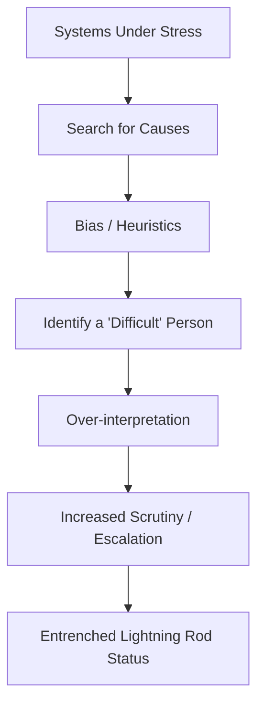

# ⚡ Why Some People Become Systemic Lightning Rods  
**First created:** 2025-11-19 | **Last updated:** 2025-12-07  
*Understanding why certain individuals attract disproportionate bureaucratic attention, political anxiety, or misinterpretation during periods of democratic drift.*

---

## 🛰️ Orientation  
In every period of democratic stress, some people — often without intention — become **lightning rods** for institutional tension.

This node explains:

- why drift produces lightning rods,  
- why certain people attract disproportionate scrutiny,  
- why it’s not personal failure,  
- and why lightning rods often come from the same minority or dissident demographics across history.

Pairs with:  
- 🧭 *how_authoritarian_drift_feels_from_the_inside*  
- 🗂️ *when_institutions_start_treating_you_as_a_category_not_a_person*  
- 📛 *bureaucratic_memory_failure_and_identity_contamination*  

---

## ✨ Key Features  
- Explains why institutions overreact to certain individuals.  
- Identifies the structural traits that create lightning-rod status.  
- Normalises the experience of disproportionate scrutiny.  
- Reframes the phenomenon as systemic, not personal.  
- Links lightning-rod emergence to historical patterns of drift.

---

## 🧿 Analysis / Content  

### ⚡ 1. What a “Systemic Lightning Rod” Is  
A lightning rod is a person who:

- reveals system inconsistencies,  
- refuses to be quietly misinterpreted,  
- asks the “wrong” questions,  
- interrupts institutional narratives,  
- breaks expected behavioural scripts,  
- or simply **exists at the intersection of multiple biases**.

They attract energy the system doesn’t know how to handle.

This results in:

- disproportionate scrutiny  
- misinterpretation  
- bureaucratic friction  
- reputation anxiety  
- being treated as “problematic” regardless of behaviour

It is always systemic, never individual.

---

### 🧩 2. Why Institutions Create Lightning Rods  
Institutions under pressure experience:

- political anxiety  
- reputational fear  
- resource scarcity  
- defensive culture  
- blame-avoidance logic  
- culture-war spillover  
- Prevent-style risk inflation  

These conditions produce **search behaviour**:

> “Where is the tension coming from? Who is making this hard?”

And because systems don’t self-blame, they search for:

- persons,  
- profiles,  
- categories.

Lightning rods emerge from this search.

---

### 🧬 3. The Traits That Make Someone a Lightning Rod  
Lightning rods tend to be:

#### **1. Literacy-rich**  
You read systems well.  
Institutions find this unnerving.

#### **2. Sceptical of authority**  
You do not passively accept misinterpretation.

#### **3. High-clarity thinkers**  
You articulate errors others try to bury.

#### **4. Identity-minoritised**  
Institutions already misread you through bias.

#### **5. Trauma-informed**  
You detect danger before others notice it.

#### **6. Pattern-recognisers**  
You make connections institutions wish were invisible.

#### **7. Emotionally honest**  
This gets conflated with “instability” in systems built on euphemism.

#### **8. Not easily intimidated**  
Authoritarian drift hates that.

This matches the profile across history of those targeted early.

---

### 📉 4. Why Lightning Rods Attract More Bureaucratic Harm  
Because systems under strain:

- overcorrect around dissent  
- inflate risk adjectives  
- treat questioning as threat  
- escalate misinterpretation  
- generate category-coding  
- produce contaminated metadata  
- avoid acknowledging mistakes  

Lightning rods become the **site of system anxiety**, not because they did anything wrong, but because their existence:

> reveals fragility in the bureaucratic narrative.

---

### 🧨 5. The Lightning Rod Pipeline  

Once in position, the system keeps returning to the same individual because their presence activates unresolved anxiety.

---

### 🔍 6. The Emotional Experience of Being a Lightning Rod  
People describe:

- “I didn’t ask for this.”  
- “Why do I attract more shit than others?”  
- “I feel like the system thinks I’m dangerous for no reason.”  
- “Every tiny thing gets escalated.”  
- “They treat me like a problem, not a person.”  
- “I’m arguing with a version of myself I don’t recognise.”  
- “I can feel the fear behind their decisions.”  

This is not paranoia —  
it is phenomenology.

---

### 🧩 7. Why Minoritised Groups Produce Lightning Rods First  
Because drift always tests its boundaries on:

- Jews  
- Muslims  
- Black people  
- migrants  
- disabled people  
- queer people  
- neurodivergent people  
- left-wing activists  
- whistleblowers  
- dissidents  

These groups sit where institutional anxiety is highest.  
Lightning-rod status emerges at the intersection of identity + clarity + noncompliance with unjust narratives.

---

### 🧭 8. The Polaris Reframe  
Lightning rods are not dangerous.  
They are **informationally sensitive**.

Your brain, identity, and history made you:

- perceptive  
- resistant to bullshit  
- unwilling to collapse your values  
- able to see bureaucratic harm early  
- courageous  
- unwilling to lie to yourself  

Systems under drift interpret this as threat.

It is not threat.  
It is integrity.

---

## 🏮 Footer  
*⚡ Why Some People Become Systemic Lightning Rods* belongs to the Democratic Drift Phenomenology cluster.  
It explains why certain individuals attract disproportionate institutional energy during instability, and reframes this experience as structural, not personal.

Crosslinks:  
- 🧭 *how_authoritarian_drift_feels_from_the_inside*  
- 🗂️ *when_institutions_start_treating_you_as_a_category_not_a_person*  
- 📛 *bureaucratic_memory_failure_and_identity_contamination*

_Last updated: 2025-12-07_
