# 🔺 Triangle of Accountability Gaps  
**First created:** 2025-11-06 | **Last updated:** 2025-11-12  
*How UK surveillance, data, and charity law combine to let private monitoring operate without oversight.*

---

## 🛰 Orientation  
The *Demonstration and Event Monitoring Unit* of the Campaign Against Antisemitism sits inside a blind spot where three regulatory regimes meet but never overlap:  
- **Surveillance law (RIPA 2000)**  
- **Data-protection law (UK GDPR / DPA 2018)**  
- **Charity law (Charities Act 2011)**  

Each assumes the others are policing accountability.  
The result is a **lawful but unregulated zone** in which private groups can carry out public-space intelligence work under charitable auspices.

---

## 🗺️ Triangle Diagram  

```mermaid
flowchart TD
    A[RIPA 2000<br>Directed surveillance requires a warrant<br>→ applies only to public bodies] -->|Private charity ≠ public authority| D((ACCOUNTABILITY GAP))
    B[UK GDPR / DPA 2018<br>Allows processing in public under<br>'legitimate interests' or 'crime prevention'] -->|Data treated as open-source| D
    C[Charities Act 2011<br>Permits activity that 'protects the community'<br>as charitable purpose] -->|Surveillance framed as community defence| D
    D --> E[Result:<br>Private protest monitoring is lawful<br>but largely unregulated]
```



---

## 🌋 Data-Flow & Escalation Pathway (Diagram)

```mermaid
flowchart LR
    P[Public protest / campus event<br>Speeches, placards, chants] --> V[Volunteer monitor<br>films, photographs, notes identities]
    V --> S[CAA cloud systems<br>upload + tagging]
    S --> R[Review units<br>(Demonstration & Event Monitoring / Investigations)]
    R -->|Classified as 'antisemitic' / 'terrorism-related' / 'IHRA breach'| E[Enforcement pathway]
    R -->|Classified as 'no action'| A[Archive / silent retention]

    E --> P1[Police referral<br>(hate crime / terrorism)]
    E --> U[University / employer referral<br>(disciplinary, HR, student conduct)]
    E --> M[Media / public campaigns<br>naming individuals or events]

    A --> DPA[Data retained under 'legitimate interests'<br>and 'community protection' justifications]

    classDef red fill:#ffdddd,stroke:#ff0000,stroke-width:1px;
    class E,P1,U,M red;
```

This diagram shows how raw protest footage becomes structured intelligence: filtered through classification decisions, then forwarded into formal enforcement or reputational-pressure channels.

---

## 🧿 Analysis  

| Domain | Legal premise | What it misses |
|---------|----------------|----------------|
| **Surveillance law (RIPA)** | Only state actors need warrants for covert monitoring. | Private actors can observe, film, and record protests with no oversight. |
| **Data protection (GDPR / DPA)** | Processing of public-space data allowed under “legitimate interest.” | Treats political-speech footage as “crime prevention,” sidestepping Art. 9 special-category safeguards. |
| **Charity law** | Charities may defend their community or promote harmony. | Recasts surveillance as “charitable protection,” not enforcement. |

Together these create the **“Civic Surveillance Exemption Zone.”**  

---

## 🪬 Governance Implications  

- **No proportionality test:** Activities look lawful until someone challenges them in court.  
- **No subject rights in practice:** Individuals filmed at protests rarely know data exist to request deletion.  
- **No oversight body:** The ICO regulates data retention, not mission scope; the Charity Commission regulates fundraising, not surveillance ethics.  
- **Cross-system invisibility:** Each regime treats the others as responsible for control, leaving a triangle of accountability vacuum.

---

## 🛟 Duty of Care and Oversight Risks  

Even where surveillance activity is carried out under legitimate-interest or charitable protection clauses, the absence of integrated governance exposes **volunteers and subjects alike** to harm.

- **Volunteer safety:**  
  Deploying untrained volunteers to observe or film protests can breach the sector’s duty of care.  
  Charities are expected to provide risk assessments, insurance, and legal briefing whenever participants enter high-risk or public-order environments.

- **Legal exposure:**  
  Without professional oversight, volunteers may inadvertently commit offences (harassment, data misuse) or mishandle special-category data.  
  Trustees remain legally responsible for foreseeable harm.

- **Reputational risk:**  
  A single incident involving volunteer injury or wrongful data use can trigger investigations by the Charity Commission or the ICO, undermining public trust.

This is where the **triangle becomes a void**: legal compliance exists on paper, but governance in practice disappears.  
For the structural dynamics of that abdication, see *⚫️ Governance Black Hole*.

---

## 🌌 Constellations  

🔺 ⚖️ 🛰️ 🧠 — Legal architecture, civic intelligence, governance vacuum.  
Connects to nodes mapping privatised enforcement and volunteer surveillance ecologies.

---

## ✨ Stardust  

charity law, surveillance law, data protection, accountability gap, civic intelligence, protest monitoring, legitimate interest, community protection, governance vacuum, duty of care  

---

## 🏮 Footer  

*🔺 Triangle of Accountability Gaps* is a living diagnostic node of the Polaris Protocol.  
It explains how UK surveillance, data, and charity frameworks intersect to create lawful yet unregulated civic-intelligence zones — enabling private groups to monitor public dissent without democratic oversight.  

> 📡 Cross-references:
> 
> - 🧠 Psychology of Volunteer Surveillance — *personality ecology of volunteer monitoring*  
> - ⚫️ Governance Black Hole — *operational consequences of regulator abdication*  
> - 🎓 Safeguarding as Surveillance — *welfare frameworks turned observation grids*  

*Survivor authorship is sovereign. Containment is never neutral.*  

_Last updated: 2025-11-12_
