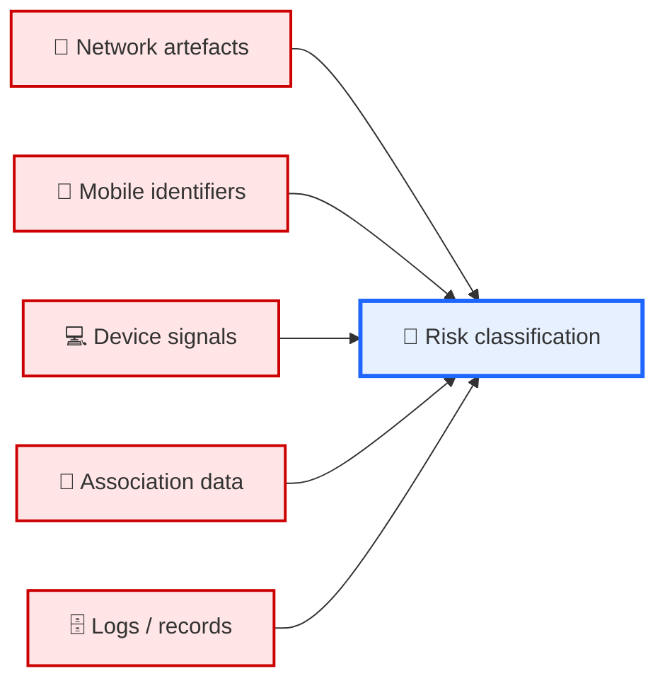
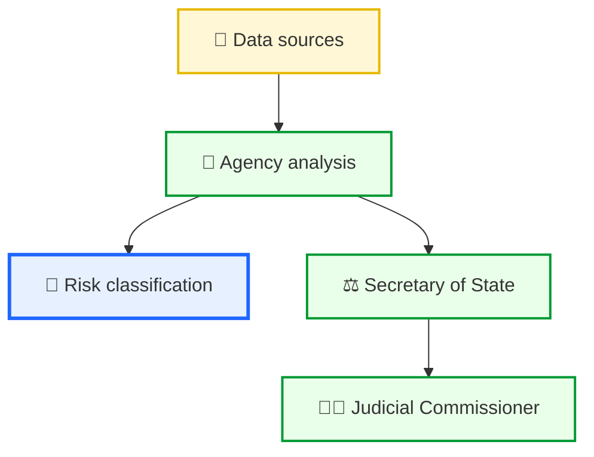

# ⚖️ Surveillance, OSA, and Citizen Forking — MEGA NODE  
**First created:** 2025-09-05 | **Last updated:** 2026-05-03  
*A longform diagnostic of UK surveillance opacity, cyberforensic spoofing, and how structural conditions can limit citizen visibility and contestability.*  

---

## 📑 Sections  

0. [Legal Backdrop](#0-legal-backdrop)  
1. [Problem as it Presents](#1-problem-as-it-presents)  
2. [Oversight Chain](#2-oversight-chain)  
3. [Cybersecurity Attack Surface](#3-cybersecurity-attack-surface)  
4. [Citizen Experience](#4-citizen-experience)  
5. [Mitigation Ring](#5-mitigation-ring)  
6. [Trust-Weight Oversight Graph](#6-trust-weight-oversight-graph)  
7. [Exit Planning](#7-exit-planning)  
8. [Closing Frame](#8-closing-frame)  

---

## 0. Legal Backdrop  

UK surveillance operates through layered statutes and oversight mechanisms:  

- **Investigatory Powers Act 2016 (amended 2024):** provides powers for interception, retention, and equipment interference, including the *double-lock* authorisation process (Secretary of State + Judicial Commissioner).  
- **Official Secrets Acts (1911–1989):** criminalise unauthorised disclosure of protected national-security information, reinforcing operational secrecy.  
- **Data Protection Act 2018 / UK GDPR:** establishes rights and safeguards, with exemptions where required for national security or defence purposes.  
- **Online Safety Act 2023:** expands platform duties around illegal content risk assessment, moderation systems, and record-keeping, creating adjacent data and compliance surfaces.  

**Layering effect:**  
IPA enables powers → secrecy frameworks limit disclosure → data protections include exemptions → platform regulation expands data environments.  

**Structural tension:**  
These systems depend on assumptions of **data integrity and traceability**, which may be challenged in environments where spoofing, mimicry, or data contamination occur.  

[🔝 Back to top](#⚖️-surveillance-osa-and-citizen-forking--mega-node)  

---

## 1. Problem as it Presents  

**From a citizen perspective (in contested cases):**  
- Surveillance may be perceived without visibility into underlying evidence.  
- Decisions can appear opaque, particularly where disclosure is restricted.  
- Outcomes (flags, frictions, interventions) may not be fully explained.  

```mermaid
graph TD
    Citizen["👤 Citizen"]:::neutral
    Agency["🏢 Agency dossier"]:::uk
    Minister["⚖️ Secretary of State"]:::uk
    JC["👩‍⚖️ Judicial Commissioner"]:::uk
    IPCO["📋 IPCO audits"]:::uk
    IPT["🏛 IPT tribunal"]:::uk

    Citizen -. challenge .-> IPT
    Agency --> Minister --> JC
    JC --> Agency
    IPCO -. audits .-> Agency
    IPCO -. audits .-> Minister
    IPT -. closed evidence procedures .-> Agency

    classDef neutral fill:#eeeeee,stroke:#999999;
    classDef uk fill:#eaffea,stroke:#009933,stroke-width:2px;
````

[🔝 Back to top](#⚖️-surveillance-osa-and-citizen-forking--mega-node)

---

## 2. Oversight Chain

* **Agency → Minister → Judicial Commissioner → IPCO → IPT**
* Oversight focuses primarily on **legality, necessity, and proportionality**.
* Verification of underlying data quality or authenticity may depend on upstream systems and procedures.

```mermaid
sequenceDiagram
    participant A as 🛠 Attacker (hypothetical)
    participant DS as 💾 Data Sources
    participant AG as 🏢 Agency
    participant MS as ⚖️ Secretary of State
    participant JC as 👨‍⚖️ Judicial Commissioner
    participant IPCO as 📋 IPCO
    participant IPT as 🏛 IPT
    participant C as 👤 Citizen

    A->>DS: Potential data contamination / spoofing
    DS->>AG: Signals interpreted as risk indicators
    AG->>MS: Warrant application
    MS->>JC: Double-lock request
    JC-->>MS: Approval (based on dossier)
    AG-->>C: Covert or administrative actions
    IPCO-->>AG: Audit (sampled, retrospective)
    C-->>IPT: Challenge
    IPT-->>AG: Closed material procedures
    IPT-->>C: Outcome (limited disclosure)
```

[🔝 Back to top](#⚖️-surveillance-osa-and-citizen-forking--mega-node)

---

## 3. Cybersecurity Attack Surface

Potential areas where data integrity may be affected:

* 📡 Network-layer spoofing (IP overlap, access-point impersonation)
* 📶 Mobile identity manipulation (SIM swap, IMSI catcher environments)
* 💻 Device/session mimicry (session replay, fingerprint duplication)
* 🧩 Association ambiguity (shared identifiers, typosquatting)
* 🗄️ Log integrity issues (incomplete, altered, or context-limited records)



[🔝 Back to top](#⚖️-surveillance-osa-and-citizen-forking--mega-node)

---

## 4. Citizen Experience

In constrained or disputed cases, individuals may experience:

* limited visibility into evidence
* difficulty tracing causation
* recursive reinforcement of prior classifications
* multi-agency deferral



[🔝 Back to top](#⚖️-surveillance-osa-and-citizen-forking--mega-node)

---

## 5. Mitigation Ring

Possible measures to strengthen evidentiary position or data integrity signals:

* 🔒 Network assurance (e.g. DNS validation, provider records)
* 📱 Mobile account monitoring (SIM change alerts)
* 💻 Device integrity (hardware-backed authentication, audit logs)
* 🧾 Identity documentation (timelines, corroborated records)
* 🗂 Immutable storage (hashing, write-once logs)

These do not eliminate risk but may improve traceability and contestability.

---

## 6. Trust-Weight Oversight Graph

Conceptual lens showing relative verification strength (`tw` = trust weight):

* upstream data sources: partial verification
* agency interpretation: context-dependent
* ministerial/judicial review: legal scrutiny
* audits/tribunal: procedural oversight

Key observation:
**verification strength varies across layers, particularly at data origin points.**

---

## 7. Exit Planning

Challenges in contesting outcomes may include:

* restricted disclosure
* reliance on closed evidence procedures
* complexity of proving data inaccuracy

Potential routes:

* 🔬 independent technical analysis
* 🛡 data accuracy challenges (e.g. regulatory complaints)
* 🏛 tribunal processes
* 🏛 parliamentary engagement
* 📰 public-interest pathways (where appropriate)

Effectiveness varies significantly by case.

---

## 8. Closing Frame

* Surveillance law combines **power, secrecy, and oversight**, each with defined roles.
* Data integrity is a critical dependency across the system.
* Where visibility is limited, contestability may be constrained.
* Outcomes depend on both **legal process** and **quality of underlying data**.

The system is not static; its behaviour emerges from the interaction between law, technology, and institutional practice.

---

## 🌌 Constellations

⚖️ 🛰️ 🧿 🧩 🗂️ — surveillance-law node; maps opacity, data integrity, and contestability limits

---

## ✨ Stardust

surveillance law, investigatory powers act, official secrets act, online safety act, data protection, cyberforensics, spoofing, oversight, data integrity, legal opacity

---

## 🏮 Footer

*⚖️ Surveillance, OSA, and Citizen Forking — MEGA NODE* is a living node of the **Polaris Protocol**.
It examines how surveillance law, data systems, and oversight mechanisms interact, and how these interactions can affect visibility, contestability, and citizen experience.

> 📡 Cross-references:
>
> * [⚖️ Legal State Governance](../⚖️_Legal_State_Governance/README.md) — *state law, opacity, and procedural structure*
> * [🛰️ Containment Scripts](../../../Containment_Scripts/README.md) — *visibility and platform-level control dynamics*
> * [🧿 Survivor Tools](../../../Survivor_Tools/README.md) — *practical countermeasures and evidence-building*

*Survivor authorship is sovereign. Containment is never neutral.*

*Last updated: 2026-05-03*
