```mermaid
flowchart LR
    A["4chan: diffusion cloud ☁️"] -->|meme seed| B["Reddit: forum hive 🧩"]
    B --> C["TikTok / YouTube: challenge culture 📱"]
    C --> D["Mainstream discourse 📰"]
    D --> A
```

# 🧩 From Diffusion to Forum Cross-Pollination  
**First created:** 2025-11-03 | **Last updated:** 2025-12-14  
*How early anonymous boards and structured forums shaped the spread of masculine-discipline memes online.*  

---

## 🧭 Orientation  
Mapping how ideas migrate from *chaotic diffusion* (4chan-style) to *structured cross-pollination* (Reddit-style).  
This dynamic underpins how bio-vitalist and abstinence memes stabilised into durable ideologies.  

---

## 🔍 Platform Ecology  

| Property | 4chan | Reddit / Old-School Forums |
|-----------|--------|----------------------------|
| **Identity model** | Anonymous / transient | Persistent usernames / karma |
| **Information flow** | Brownian diffusion (memes as gas molecules) | Compartmental recursion (threads as cells) |
| **Lifespan of content** | Short half-life, viral bursts | Long half-life, cumulative archives |
| **Knowledge transfer** | Lateral — memes collide | Vertical — deep expertise |
| **Cross-site effect** | Osmosis (ideas leak outward) | Pollination (users carry ideas between hives) |
| **Outcome** | Chaos → cultural sediment | Order → ideological crystallisation |

---

---

## 🌌 Constellations  
🪩 🧿 🧠 🧬 — This node sits at the intersection of digital anthropology, memetic transmission, and behavioural governance.

## ✨ Stardust  
4chan, Reddit, forum culture, meme diffusion, abstinence challenges, masculinity, online ecology, algorithmic culture

## 🏮 Footer  
*From Diffusion to Forum Cross-Pollination* is a living node of the **#PolarisProtocol**.  
It documents how ephemeral joke economies on anonymous boards harden into persistent ideological communities once forum architecture gives them memory.  

> 📡 Cross-references:
> 
> - [🪩 Algorithmic Female Dominance Aura] — memetic genealogy of discipline and desire  
> - [🧩 Genealogy of the Life-Force Discipline] — historical antecedents of purity culture  

*Survivor authorship is sovereign. Containment is never neutral.*  

_Last updated: 2025-12-14_
