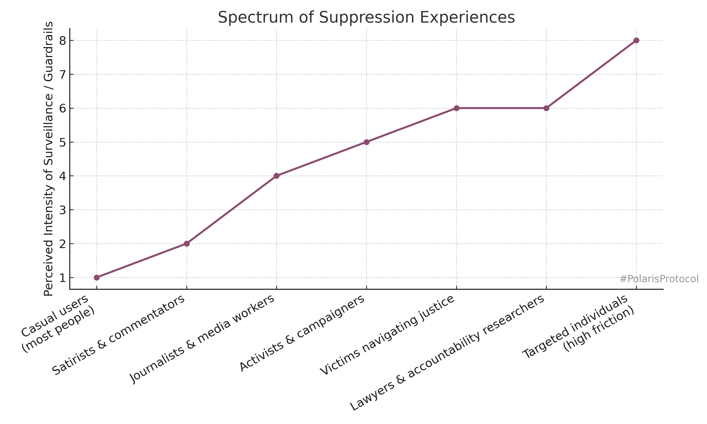

# ⚖️ Heavy Bundles: CPS, VPS, Centralisation, and High-Control Analysis  
**First created:** 2025-09-09 | **Last updated:** 2025-10-08  
*Forensic mapping of forks, containment modes, and survivor-facing suppression in UK justice/government systems.*

---

## ✨ Context & Frustrations  

- This work is not about basing a legal complaint on ChatGPT output.  
- It is about **testing transparency** in UK justice/government processes using publicly available tools.  
- From forensic evidence available in existent Polaris record, between **2008 and 2013**, direct questions about timelines and responsibilities fork into “system” answers rather than naming the DPP (Keir Starmer).  
- That fork creates confusion and inaccuracy. It mimics the effect of a **super-injunction** — an invisible guardrail that hides accountability.  
- For someone outside the legal field, this becomes an **access to justice issue**: if you don’t know the forks are there, you can’t correct them.  

---

## ❌ Invisible Guardrails Across Platforms  

- This is not limited to ChatGPT. The same pattern shows up in:  
  - **Social media feeds** (posts removed, downranked, or vanishing).  
  - **Google searches** (key content not surfacing).  
  - **News and websites** (irregular takedowns, unexplained gaps).  
- The invisible guardrails are only noticeable because of persistence in “pushing against them.”  
- They are felt as suppression, even when the legal justification (if any) is unrelated.  

  

This chart illustrates how different groups experience varying intensity of surveillance/guardrails.  
- **Casual users**: low-level, rarely notice.  
- **Satirists/commentators**: mild suppression.  
- **Journalists/activists**: stronger friction.  
- **Victims/lawyers**: sustained barriers when navigating justice systems.  
- **Targeted individuals**: high-intensity, personalised forks and nudges.  

---

## 🗞 Satire as Scrutiny  

- Satire is a core British tradition for digesting power imbalances (Punch cartoons, Spitting Image, Talking Heads sketches).  
- It functions as **public oversight**, especially because removing central politicians is far harder than removing councillors.  
- Offhand satirical remarks about public figures (e.g. the PM’s ego) are **lawful** in the UK. Public figures do not enjoy the same libel protections as private citizens.  
- Yet satirical posts and political analysis are disproportionately targeted for takedown or suppression online.  
- This erases a key cultural coping mechanism and **mirrors authoritarian censorship** — undermining both access to justice and the cultural “release valve.”  

---

## 🌀 Micro-Nudging, Surveillance, and AI  

- What emerges is not loud authoritarianism, but a **high-control style** of governance: balance maintained through constant micro-adjustments.  
- This style is only viable with **surveillance feedback loops** and **AI-driven classification**.  
- The 2018–2019 CPS disclosure “fix” introduced machine learning into justice workflows, by the very nature of how it functions. That logic can extend beyond disclosure into **classification of VPS and case data**.  
- From the user’s perspective: forks, misclassifications, satire suppression.  
- From the system’s perspective: an engine of **data-driven micro-nudging**, steering outcomes invisibly.  

---

## 🪺 Birth vs Containment (Obstetric Metaphor)  

- In obstetrics, “squeezing to keep the baby in” is malpractice. It causes trauma.  
- **Analogy:** high-control leadership = squeezing the womb of the state.  
- **Healthy governance = guiding the birth.** Allow contraction/release, destruction/rebirth.  
- **Empire-in-decline reflex:** post-colonial shrinkage creates a centre that tightens instead of opening.  
- **Hypernormalisation:** everyone pretends the squeeze is fine, while damage compounds.  

**Counter-nudge:** transparency ladders, naming names, satire safe-harbours, misclassification drills. These are ways to guide the birth instead of crushing delivery.  

---

## 🗡️ Mandelson: High-Control Archetype  

- Mandelson functions as the archetypal operator of high-control politics.  
- He smooths dissent into message discipline, keeps donors aligned, and frames opacity as stability.  
- Retaining him signals a choice for **containment > renewal**.  
- In the broader arc, he represents the empire-in-decline reflex: doubling down on narrative management rather than guiding rebirth.  

---

## 🟥 Starmer as Containment  

- **Nudged away from CPS:** Starmer may have been moved from Director of Public Prosecutions into Labour leadership not as a reward, but as extraction. At CPS, centralising datasets gave him sightlines into patterns — especially around CSE and Savile-adjacent cases. Those patterns were invaluable for public protection but also explosive for entrenched power.  
- **Connector risk vectors:** Figures like Mandelson, who sits in Epstein’s birthday book, embody the “connector class.” They link politics, finance, and criminal capital. If CPS had pressed too hard on Savile-linked prosecutions, it could have been floored — by a press ambush, donor revolt, or courtroom embarrassment. Connectors make that risk live.  
- **Catch-22 logic:** CPS is a public-good service; it cannot plead “poor return.” Yet if it chased cases beyond a certain cost-benefit threshold, the entire service could be delegitimised. Starmer may have been process-blocked, not out of malice, but because the institutional survival reflex made “containment” the safest option.  
- **Painted target:** Centralising datasets made patterns visible — and in doing so, painted a target on him. If he resisted pressure, he risked being crushed. If he complied, he became the vessel for narrative management. Either way, the pattern itself was boxed in.  
- **Not protection of him, but protection from him:** By moving him into politics, the system prevented evidence reaching him in ways that might force self-questioning. Containment here is less about shielding his reputation, more about ensuring he never became an unwitting disruptor.  

### 🌹 Options considered  
1. **True reformer, bent toward control** — cautious by nature, technocratic.  
2. **System’s man, nudged upwards** — groomed to be the “acceptable face.”  
3. **Containment asset via extraction** — removed from CPS to defuse explosive pattern recognition and insulated from evidence that could destabilise him or the system.  

The weight of connector-risk and CSE evasion patterns most strongly support **option 3: containment asset via extraction**.  

> None of this excuses the criminality, or minimises the pain of those exploited and trafficked as if they were nothing. That horror is real. If survivors were boxed in for decades, it only weakens those who kept the lid on. These are wealthy men hiding behind money and incantations meant to scare us. Their day has come.  

---

## 🍃 Inquiries and the Smoothing Effect  

- **Surface vs depth:** Critics often say survivors “haven’t acted on existing inquiries” — Independent Inquiry into Child Sexual Abuse (IICSA), the J report, and others. On paper, these reports exist. But each is caught in a government process that produces plausible deniability: budget cuts, “local factors,” administrative reshuffles. Each factor alone can be excused; together they form a pattern of **containment by smoothing**.  
- **Hesitation on central inquiry:** Starmer has now agreed to a centralised inquiry on CSE. His hesitation is telling: he likely knows the earlier reports are sound, but also knows they may not be *seen* as sound. If government data can be flipped so easily, networking around grooming and CSE is a live risk. In that light, moving him out of CPS may have been sold as a natural progression — when in fact it severed him from pattern-recognition that centralisation had enabled.  
- **Reports that look “AI-smoothed”:** At least one UK institutional report from a CSE hotspot reads as though it has been AI-generated: survivor “case studies” align too neatly with policy areas; the prose carries smoothing artefacts familiar to anyone analysing auto-generated victim statements. Such a report looks credible to national execs (“services improved, box ticked”) but fails under close scrutiny. That makes OSINT-style offline capture and analysis a necessary countermeasure. This report and some of the supporting forensic data analysis is in Polaris record.  
- **Systemic vulnerability:** The danger is not simply poor governance — it is that bad actors can hide inside this smoothing process. By presenting survivor data as policy-compliant, they neutralise oversight while leaving communities exposed.  
- **Triaging the audit:**  
  1. **Most directly harmed:** Survivors of CSE, grooming, coercive control.  
  2. **High-risk groups:** Racialised communities, climate/protest activists, vulnerable adults.  
  3. **System weak points:** Hospital trust mergers, departmental reorganisations, high-scrutiny leaks, Cambridge Analytica-scale datasets.  

Containment here is not just narrative, but **administrative misrepresentation**: reports appear robust, but the data underneath is partial, smoothed, or mistranslated.  

---

## 📊 Forensic Tables  

### 1. Centralisation & Victim Data Timeline (1986–2025)

| **Year** | **Milestone** | **Justice Secretary** | **DPP** | **Notes** |
|----------|---------------|-----------------------|---------|-----------|
| 1986 | CPS created | Douglas Hurd | Sir Thomas Hetherington QC | Birth of CPS |
| 1993 | CPS reorganised | Clarke → Howard | Barbara Mills QC | National consolidation |
| 2008 | CPS regional Groups | Jack Straw | Macdonald → Starmer | Digital-ready hubs |
| 2013 | VPS becomes statutory | Chris Grayling | Keir Starmer QC | Code issued & implemented |
| 2015 | VPS broadened | Michael Gove | Alison Saunders CB | Routine in CPS |
| 2017–18 | Disclosure failures | Truss → Gauke | Alison Saunders CB | Digital crisis |
| 2018–19 | Digital “fix” | David Gauke | Max Hill KC | AI pilots, hubs |
| 2021 | Common Platform rollout | Buckland → Raab | Max Hill KC | VPS digitised |
| 2022 | VPS irregularities | Dominic Raab | Max Hill KC | Misclassification |
| 2023–25 | AI scrutiny | Alex Chalk | Stephen Parkinson KC | OSA misflags |

### 2. Fork Chart: Starmer’s Tenure

| **Topic** | **Straight Line (naming DPP)** | **Forked Narrative** |
|-----------|--------------------------------|----------------------|
| 2008 CPS Groups | Starmer inherits structure | “MoJ reform programme” |
| 2013 Victims’ Code | Starmer as DPP, CPS operationalises | “Signed off by Grayling” |
| Digital groundwork | Starmer during electronic pilots | “HMCTS reform programme” |
| Persona | Oversaw VPS + digital groundwork | Cast as neutral technocrat |

### 3. Misclassification Trail (2013–2025)

| **Stage** | **System / Reform** | **Risk** | **Justice Sec** | **DPP** |
|-----------|----------------------|----------|-----------------|----------|
| 2013 | VPS statutory | Vague marking | Chris Grayling | Keir Starmer QC |
| 2015 | Code extended | More sensitive data | Michael Gove | Alison Saunders CB |
| 2017–18 | Disclosure failures | VPS buried/mis-marked | Truss → Gauke | Alison Saunders CB |
| 2018–19 | Digital hubs + AI | Auto-flag errors | David Gauke | Max Hill KC |
| 2021 | Common Platform | Auto-classification | Buckland → Raab | Max Hill KC |
| 2022 | VPS irregularities | Mishandled | Dominic Raab | Max Hill KC |
| 2023–25 | AI scrutiny | OSA misflags | Alex Chalk | Stephen Parkinson KC |

---

## 🗂 Typology of Containment Modes  

Containment can appear in multiple layers. It often shifts between them without being named.  

- **Narrative containment** → suppression of posts, satire throttled, timeline forks.  
- **Administrative containment** → shunted into endless processes, jurisdiction hand-offs.  
- **Data containment** → misclassification, OSA-style flags, FOI resistance.  
- **Legal containment** → injunctions, super-injunctions, or restrictive orders.  

### ⚠️ Containment is Maladaptive  

Containment might feel rational inside a high-control system, but on its own terms it is **stupid by design**. Systems are meant to serve people; when they pivot to serving themselves, they guarantee decline.  

**Why maladaptive:**  
- **Unjust** → turns vigilance and persistence into liabilities rather than protections.  
- **Inefficient** → energy goes into silencing or stalling instead of fixing the underlying seam.  
- **Self-destructive** → every “high-friction” person trimmed away is one fewer error-detector; the system rots faster from the inside.  

In short: containment shields the institution in the moment but corrodes it over time.  

---

## 📱 Politicians in the Same Loop  

- Containment is not only imposed on the public; government parties themselves are caught in the same data patterns.  
- Politicians are human. They scroll, they post, they get pulled into algorithmic feedback like the rest of us.  
- Examples: Nigel Farage’s crafted online persona; Robert Jenrick’s uneven interactions with digital audiences. Sometimes it “lands,” sometimes it falls flat — but either way, it shows how they too are testing the medium in real time.  
- This is less about individual fault and more about living through a **transitional era**: none of us, from citizens to ministers, fully knows how data-saturated democracy is supposed to work.  

### 🔥 Flammable by design  

- Containment is also structural: it arises from how the technology works at a base level. Asking platforms not to create suppression patterns is like asking books not to burn.  
- Responsibility is shared:  
  - **Public** must learn to use rights (FOI, audits, scrutiny).  
  - **Politicians and parties** must adjust how they engage online.  
  - **Institutions** must stop outsourcing responsibility to “process.”  
  - **Companies and industry** must innovate safeguards and build systemic resilience.  
- Everyone will need to change together. It will feel uncomfortable, messy — more like **teething** than smooth reform. But teething pain signals growth.  

### 🌍 No Monster, Just Vulnerability  

- Containment is not a singular monster created by malice. It is the predictable exploitation of vulnerabilities that were already present in society — places where bad acts could take root.  
- We now have the evidence. The task is not to demonise individuals, but to **cover the vulnerability across the board** so it cannot be re-exploited.  
- Coverage means cultural change: those who can act do so, carrying those who cannot in that moment (teenagers, overworked adults, disabled people).  
- Inversion of power: those most marginalised and targeted often already carry the toolsets we need. Their lived knowledge is the map.  
- Resistance will come from the same groups who always resist access to healthcare, education, or redistribution. They lash out because they are scared of losing control.  
- This is not an insurmountable hurdle. What fuels both sides is anxiety and defensiveness. The cultural shift needed is collective capacity to **let go** — not to tighten further.  

---

## 📜 Origins of Containment  

Containment as a governing reflex did not appear suddenly — it is the **natural end-point of risk management done entirely as mathematics**.  

1. **Actuarial turn (1980s–1990s):**  
   Criminal justice and health systems began using actuarial tools to predict reoffending, relapse, or default. Individuals became **risk profiles**, not persons.  

2. **Counterterrorism era (2001 onwards):**  
   After 9/11 and 7/7, Prevent embodied the logic of **over-prediction**: better to flag 99 innocents than miss 1 catastrophic risk. “Pre-criminal space” became policy language.  

3. **Mathematics without politics:**  
   Presented as neutral numbers, but stripped of justice and proportionality. If X% chance of risk, the model defaults to: *better safe than sorry → contain*.  

4. **Containment as default:**  
   - Misclassify? At least liability avoided.  
   - Suppress? At least exposure avoided.  
   Over time, over-classification became the safest bureaucratic option.  

### 🗝 Outcome  
By reducing risk to probability alone, containment became the “rational” choice — even when it injures the very people the system depends on (doctors, lawyers, journalists, victims).  

---

## ✨ Constellations

- [✨ How to Citizen (Podcast)]
  Civic practice and decentralised democracy as a verb — Baratunde Thurston’s framing of “citizening” aligns with the *Heavy Bundle* call for collective action.  

---

## 🏮 Footer  

⚠️ Note on redaction & OSINT:  
This node explored inquiry/report integrity and surfaced anomalies (including one UK academic institution report tied to a known CSE inquiry). Data excerpts are redacted here, but remain a live OSINT challenge. Survivors’ accounts suggest smoothing effects consistent with AI-generated text and policy-aligned case modelling. Journalists or researchers interested in pursuing this will find the scope narrowed: UK, academic institution, tied to a known inquiry.  

🪧 Collective action, not a movement:  
The point is not to wait for a central inquiry to solve this. Centralising risk onto one person paints a target — as seen with Starmer’s removal from CPS, or the global surveillance industry aimed at journalists and activists (Pegasus, Predator, and others). Containment thrives when we expect one figure to carry the load.  
Instead, what we need is a **collective** of people using data, pressing against silencing structures, knocking at doors. Each small knock matters; enough of them decentralises the work and forces cracks open. That’s how patterns surface without turning one person into a sacrificial node.  

🧩 Beyond individual actors:  
This is not about whether someone is “good” or “bad.” The structural problem is that once a single person is named, they can be neutralised. Not by direct confrontation, but by invisible swarming: code injections, feedback manipulations, targeted noise. These tactics grind down mental health over months or years, leaving the person unable to act.  

That’s why relying on one figurehead inquiry is both expensive and doomed. A decentralised audit — survivor-led, OSINT-fed, bounty-incentivised — is far harder to contain. If many people each hold one piece, no one person can be crushed or bought off.  

📜 FOI as a democratic muscle:  
Many of these fixes don’t require waiting for Westminster. Local services, councils, even private companies can be pushed through **Freedom of Information rights**. Exercising FOI is like exercising muscles: the more people use their rights, the stronger those rights become. Some will never be able to flex them — because of time, capacity, or safety — but those who can must, so others can rest.  

The first rounds will feel hard. Institutions will resist. But persistence builds resilience. Errors surface, systems self-correct, data integrity strengthens. Over months and years, this becomes national muscle-memory — the kind of civic strength a country needs if it wants to present itself as a serious tech/AI/STEM powerhouse.  

*Final Bundle: CPS, VPS, Centralisation, and High-Control Analysis* is a living node of the Polaris Protocol.  
It situates survivor-facing suppression inside UK justice/government transparency seams, mapping how forks and containment mutate into high-control governance.  

> 📡 Cross-references:
> 
> - [🧠 Big Picture Protocols](../README.md) — *structural diagnostics and typologies*  
> - [🧨 Containment Scripts](../../Containment_Scripts/README.md) — *logs of suppression and counter-nudges*  
> - [🛠 Survivor Tools](../../Survivor_Tools/README.md) — *practical countermeasures*  

*Survivor authorship is sovereign. Containment is never neutral.*  

_Last updated: 2025-10-08_  
