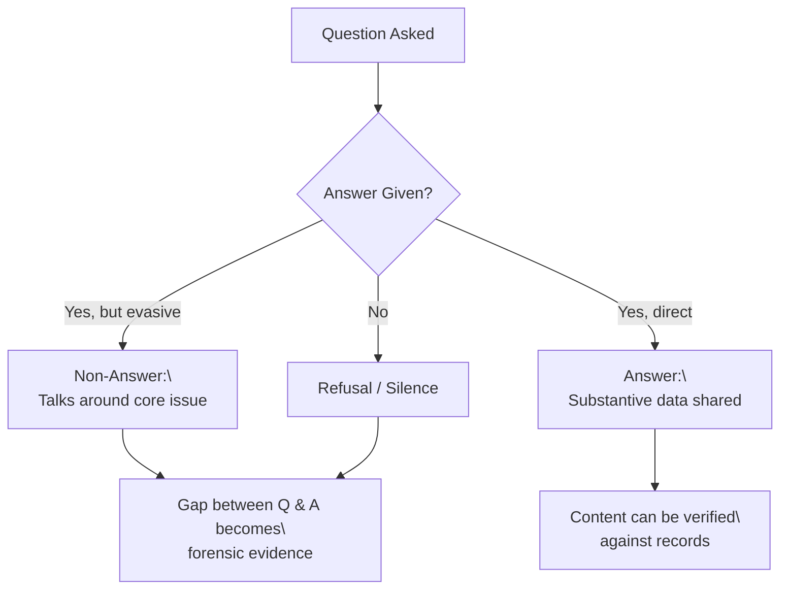

# 📚 Forensic Silence  
**First created:** 2025-09-14 | **Last updated:** 2025-09-23  

*Active narrative gaps where records were scrubbed — the hole itself becomes evidence.*  

---

## 🌑 Scope  

“Forensic silence” is not absence.  
It is an engineered vacuum: erased reports, withdrawn minutes, or inquiries that vanish before publication.  
The silence itself has shape, weight, and timing.  

Key diagnostic cues:  
- **Disappeared reviews** (e.g., Serious Case Reviews that never surface).  
- **Retracted datasets** where only the metadata footprint remains.  
- **Superinjunctions** that erase not just speech but entire record-threads.  
- **Scrubbed archives** where the gaps align too cleanly with liability triggers.  
- **Non-answers** — when parliamentary, FOI, or business replies dodge the question, silence hides in plain sight.  

---

## 🔎 Analytical Threads  

- **Silence as infrastructure:** which agencies *depend* on keeping voids intact?  
- **Silence vs noise:** when denial campaigns flood discourse precisely as documents vanish.  
- **Silence as cost:** NDA settlements, “commercial confidentiality,” or state secrets act as priced erasure.  
- **Silence as theatre:** inquiries launched with publicity, concluded with disappearance.  
- **Silence vs devolution:** devolved powers can expose silence locally while feeding transparent audit back to centre — evidence travels upward, not excuses.  

---

## ❓ The Override Question  

Silence is not only technical.  
It is cultural.  
Every safeguarding system carries an **override clause** — the professional permission to act when the numbers don’t capture what intuition already knows.  

- **DASH (Domestic Abuse, Stalking and Harassment risk model):** *Do you believe a referral is required even if the threshold score is not met?*  
- **Neonatal and pediatric early warning systems:** *Do you believe escalation is warranted despite “normal” vital signs?*  
- **Professional sign-off checks:** *Are you willing to put your name to the judgment that nothing further is needed?*  

This is the system’s recognition of what Kahneman calls **Type 1 thinking** (*Thinking, Fast and Slow*): fast, intuitive pattern recognition.  

Why this matters for *forensic silence*:  
- If overrides are consistently *not* exercised, silence is cultural: staff are trained to disbelieve perception.  
- If overrides are exercised but ignored, silence is structural: concern exists, but escalation is blocked.  
- If overrides are punished, silence becomes enforced containment.  

---

## 🛠 Methods of Detection  

1. **Cross-reference gaps** → Compare cited inquiries with public record indexes.  
2. **Check parliamentary traces** → Look for mentions in Hansard that have no accessible follow-up.  
3. **Metadata ghosts** → FOI/SAR logs confirming an item existed even if content was pulled.  
4. **Press shadowing** → Note if journalists receive legal threat letters at the moment of record silence.  
5. **Mini-audit probes (Caldecott extension):** develop repeatable test questions to check if systems (including AI) retain baseline knowledge; watch for erasure of context but survival of emotional reaction.  
6. **Comparative detection:** use Cochrane-style systematic review and KPI benchmarking across councils, hospitals, or universities to surface patterned absences.  
7. **Non-answers:** compare question vs answer in FOI, hearings, or correspondence — gaps themselves are evidence.  
8. **Intuition literacy:** sharpened Type 1 skills, often seen in marginalised communities, can detect silence early — but their presence is evidence of stress load, not superiority.  

---

## 🕰️ Historic Precedents: Record Destruction  

Deliberate destruction or concealment of records is not a modern innovation.  

- *Caroline Elkins (as cited in Jason Stanley, 2021)* documents how British forces destroyed administrative records from detention camps during the Mau Mau emergency in Kenya. The result: casualty figures and detention data remain uncertain decades later.  
- In the late stages of World War II, Nazi authorities incinerated documentation as they retreated — even using crematoria for files — erasing evidence of camp operations.  
- Across countries once under Soviet rule, secret police archives were purged or destroyed during transitions, limiting accountability and transparency.  
- Institutional schools in Commonwealth countries left survivors without records of their own childhoods, compounding harms across generations.  

The tactic repeats: when institutions know their actions will not withstand scrutiny, they reach for erasure.  

---

## ▶️ Flowchart: The Politician’s Reply  

---

## 📚 Further Reading & Media  

- Jason Stanley, *Erasing History* (2021) — on erasure as authoritarian tactic; cites Caroline Elkins on the Mau Mau emergency.  
- Caroline Elkins, *Imperial Reckoning: The Untold Story of Britain’s Gulag in Kenya* (2005) — primary account of British record destruction in Kenya.  
- Timothy Garton Ash, *The File* (1997) — personal engagement with Stasi archives in post-Cold War Germany.  
- Documentary: *The Act of Killing* (2012) — explores denial and silence in the aftermath of Indonesian mass killings.  

---

## 🏮 Footer  

*📚 Forensic Silence* is a living node of the Polaris Protocol.  
It documents how silence itself becomes probative evidence of suppression.  

> 📡 Cross-references:  
> - [🌀 System_Governance](./) — parent cluster of governance diagnostics  
> - [❓ Override Question as Silence Breaker](./❓_override_question_as_silence_breaker.md) — intuition in safeguarding systems  
> - [🧠 Intuition as Skill](./🧠_intuition_as_skill.md) — recognising Type 1 as skill  
> - See: Containment Contracts (Metadata Sabotage Network cluster) — NDA and gag structures enforcing silence  

*Survivor authorship is sovereign. Containment is never neutral.*  

_Last updated: 2025-09-23_  
