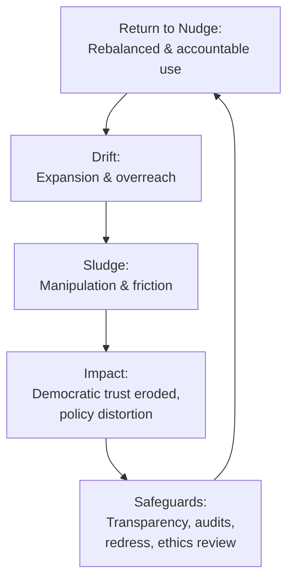

# ⛳️ Nudge to Sludge — The Lifecycle of Behavioural Insights in UK Policy  
**First created:** 2025-09-20 | **Last updated:** 2025-09-23  
*Documents the rise of behavioural insights (“nudge”) in UK governance, the risks of “sludge” when nudges turn manipulative, and the safeguards needed to protect democratic accountability.*  

---

## 🌐 Summary  
The UK pioneered state-backed behavioural insights through the 2010 Cabinet Office Behavioural Insights Team (BIT, the “Nudge Unit”). Nudges promised light-touch, evidence-based ways to encourage positive behaviours. By the mid-2010s, nudges were mainstream across Whitehall and local government. But overuse, opacity, and poor safeguards produced **sludge**: nudges that manipulate, obstruct, or exploit citizens. This node traces the lifecycle from origin to drift, and sets out defensive measures.  

---

## 🏗️ Origins — The Promise of Nudge  
- **2010:** Behavioural Insights Team established under David Cameron’s Cabinet Office. Led by David Halpern.  
- **Mandate:** apply behavioural economics and psychology to public policy.  
- **Early pilots:**  
  - HMRC: tax return compliance.  
  - DWP: job-seeking letter design.  
  - NHS: organ donation, smoking cessation.  
  - Pensions: auto-enrolment framing.  
- **Export:** UK model replicated worldwide; BIT later spun out as joint venture.  

---

## 🕳️ Drift — Expansion & Overreach  
- By 2016, nudging was mainstream in UK departments.  
- Used beyond light-touch behavioural design — into complaint systems, digital services, and policy framing.  
- Attracted political appeal as a **cheap fix** in place of regulation or investment.  

---

## 🛑 Sludge — When Nudge Turns Coercive  
- **Definition (Cass Sunstein, 2018):** “sludge” = frictions that make it harder for people to achieve their own goals.  
- **UK examples of sludge dynamics:**  
  - Default pathways making it hard to opt out.  
  - Complex or endless web forms to frustrate complaints.  
  - Small print burying key options.  
  - Behavioural framing applied to disciplinary pathways.  
- **Civil liberties concerns:** Liberty, Open Rights Group — warned of covert manipulation.  
- **Parliamentary scrutiny:** House of Lords Science & Tech Committee (2011) cautioned against over-reliance; Commons inquiries later flagged lack of transparency.  
- **Practitioner admissions:** even BIT acknowledged nudges can’t solve structural issues like inequality or housing.  

---

## 🔎 Why This Matters  
- **Democratic legitimacy:** covert manipulation undermines trust.  
- **Equity risk:** sludge harms those with least resources, who can’t fight back through lengthy appeals.  
- **Policy distortion:** nudges substitute for investment, masking systemic failures.  
- **Security concern:** sludge practices normalise manipulation, blurring into hostile narrative tactics (e.g. data-twinning framed as “choice architecture”).  

---

## 🛠️ Safeguards & Defensive Measures  
- **Transparency:** disclose when behavioural interventions are used.  
- **Audit sludge:** measure time/cost imposed on citizens by government processes.  
- **Proportionality:** nudges should complement, not replace, substantive policy.  
- **Redress pathways:** complaint and appeal routes must be sludge-free.  
- **Independent ethics review:** assess interventions for consent, equity, transparency.  
- **Training:** investigators and HR staff taught to distinguish nudges (benign) from sludge (manipulative).  

---

## 🛰️ Safeguard Parameters — Consent & Licensing  

- **Consent parity:** if you would consent someone for medication, you should consent them for nudges of similar behavioural impact.  
- **Informed choice:** citizens should be told (a) what the nudge does, (b) why it is used, (c) how they can opt out.  
- **Positive uptake:** many patients would likely opt in, especially for health behaviours, if offered transparently.  
- **Licensing model:** nudge interventions should be authorised like licensed medicines or regulated financial products — only deployable once tested and registered.  
- **Audit trail:** every consented nudge should leave a clear record, enabling scrutiny, appeal, and removal if harms emerge.  

---

## ⚠️ Cautions on Human Response  

Nudges are not universally helpful. They act on cognition and behaviour loops in ways that can backfire.  

- **Individual variation:** some people experience nudges as intrusive and will deliberately resist them.  
- **Boundary defence:** what may look like an “emotional” reaction (e.g. frustration, binge behaviour) can be a rational reassertion of autonomy when someone feels their boundary has been crossed.  
- **Consent as calibration:** by seeking informed consent, people can opt out at the start, or withdraw later if nudges become counterproductive.  
- **Health parity:** nudges influence brain and habit loops; they should be treated like psychoactive medications — requiring explanation, consent, and monitoring.  

Without these cautions, nudges risk producing **reactance** rather than cooperation, especially in sensitive domains like diet, weight, or mental health.  

---

## 👶 Boundary Testing — The Toddler Analogy  

Nudging without boundaries behaves like a toddler discovering they can keep calling out “mum, mum, mum” or “dad, dad, dad” until an adult reacts.  

- **Attention loops:** the toddler learns that persistence eventually gets a response. Nudges work the same way when repeated until people either comply or lash back.  
- **Boundary defence:** ignoring often produces an eventual reactive response; parents (and citizens) reassert their boundaries when they feel tested too far.  
- **Natural development:** toddlers push limits not out of malice but to learn how far they can go. Institutions do the same — pushing nudges until external boundaries stop them.  

In parenting, the correct response is not to indulge or punish, but to **re-establish clear boundaries**:  
- Set limits consistently.  
- Allow frustration without feeding negative cycles.  
- Provide tangible consequences when boundaries are crossed (not punitive, but real).  

Applied to governance:  
- **Industry adolescence:** the behavioural insights industry has behaved like a teenage boy with numbers — moving fast, breaking things, and leaving cracked furniture behind.  
- **Repair & consequence:** broken trust must be repaired, and rules reset. Consequences differ if harm was admitted openly versus concealed.  
- **Ordinary human behaviour:** this drift was predictable. Left unchecked, any system tests limits. Boundaries are not overreaction — they are part of healthy development.  

---

## 🔄 Transformational Reset — Using Existing Skills  

The behavioural insights industry does not lack capacity — it lacks boundaries.  

- **Existing expertise:** most practitioners are already trained in behavioural psychology, systems thinking, and cultural transformation.  
- **Transferable skillset:** even if they haven’t revisited child development or boundary psychology since university, they can relearn and adapt.  
- **Cross-disciplinary sourcing:** behavioural teams will need to draw on specialists in adjacent fields (ethics, safeguarding, clinical psychology) — but the baseline literacy is already there.  
- **No wholesale changeover:** restructuring does not require discarding staff. It requires cultural reset, clear boundaries, and practical safeguards.  
- **Transformational management frame:** just as in an energy department restructuring, the task is to build a new culture: setting parameters, enforcing consequences, and embedding safeguards into daily practice.  

The “monster” that nudging has become is not a product of bad staff, but of **boundary-free culture**. With rules, consequences, and cross-disciplinary guardrails, the same people could help re-stabilise the field.  

---

## 🗣️ Feedback From Every Level  

Cultural reset only works if the process is open and transparent. Leaders may set direction, but survival depends on feedback from everyone — including those at the lowest pay bands.  

- **Frontline knowledge:** junior staff and support roles often see the practical breakdowns first. They notice the bottlenecks, the workarounds, the silent failures.  
- **Barriers to voice:** too often, their feedback is ignored, stolen without credit, or met with silence. This demotivates staff and drives high turnover.  
- **Retention risk:** the most capable low-band staff often leave — not because they lack skill, but because they are undervalued and underpaid.  
- **Feedback equity:** transformation requires mechanisms where all staff can raise concerns, see those concerns acknowledged, and receive at least basic recompense (credit, recognition, thanks).  
- **Cultural consequence:** without bottom-up honesty, leadership misreads reality and cultural change collapses into theatre.  

Safeguarding against sludge means embedding **feedback loops that include everyone**, not just those with titles.  

---

## 📈 Strategic Insight  
The lifecycle from **Nudge → Sludge** is not inevitable but highly likely without safeguards. What begins as pro-social “choice architecture” can drift into manipulation when institutions use behavioural tools to protect themselves rather than serve citizens. Recording this lifecycle makes the risk visible and allows counter-design.  

---

## ▶️ Lifecycle Flowchart  

---

## 🏮 Footer  

*Nudge to Sludge* is a living node of the Polaris Protocol.  
It records the historical arc of the UK’s Behavioural Insights infrastructure and the risks of over-reliance, highlighting safeguards required to protect democracy.  

> 📡 Cross-references:  
> - See: Transparency Floor Node (System Governance cluster)  
> - See: Registered Professions Impact Node (System Governance cluster)  
> - See: Field Note — Conversation Drift (Field Logs cluster)  

*Survivor authorship is sovereign. Containment is never neutral.*  

_Last updated: 2025-09-23_  
