```mermaid

flowchart TD
    A[🧠 HM Dept of Coercive Nudges] --> B[🌀 Docility Engine]
    A --> C[🎭 RIPA Compliance Theatre]
    A --> D[💀 Necro Jargon Cult]
    A --> E[📜 Ethics as Language Trap]
    A --> F[🕸️ Safeguarding Obedience Division]
    A --> G[🦚 CVE Pornography Unit]

    %% Categories for grouping
    B:::soft
    C:::bureaucratic
    D:::jargon
    E:::ethics
    F:::safeguarding
    G:::cve

    classDef soft fill:#d2f4ff,stroke:#2a9df4,stroke-width:1px;
    classDef bureaucratic fill:#fff0d2,stroke:#f4a300,stroke-width:1px;
    classDef jargon fill:#fbd2f4,stroke:#e82a9d,stroke-width:1px;
    classDef ethics fill:#e5d2fb,stroke:#7d2ae8,stroke-width:1px;
    classDef safeguarding fill:#d2fbdc,stroke:#2ae86a,stroke-width:1px;
    classDef cve fill:#fbeed2,stroke:#e88a2a,stroke-width:1px;


```

# 🧠 HM Dept of Coercive Nudges  
*Polaris Protocol doctrine node — behavioural science repurposed as state containment*  

**First created:** 2025-08-03 | **Last updated:** 2025-08-27  

---

## ✨ Overview  

This node collects files documenting the use of **behavioural nudging** — the soft-power scripts of compliance.  

Where surveillance captures metadata and forks fracture voices, nudges operate at the affective layer:  
- Steering populations under the guise of *choice*  
- Framing coercion as *support*  
- Engineering obedience through subtle psychological levers  

---

## 📂 Contents  

- [🌀 Docility Engine](./🌀_docility_engine.md) — models of compliant behaviour dressed as empowerment  
- [🎭 RIPA Compliance Theatre](./🎭_RIPA_compliance_theatre.md) — bureaucratic rituals disguising surveillance powers  
- [💀 Necro Jargon Cult](./💀_necro_jargon_cult.md) — weaponised legal and academic jargon used as containment scripts  
- [📜 Ethics as Language Trap](./📜_ethics_as_language_trap.md) — ethics discourse converted into compliance levers  
- [🕸️ Safeguarding Obedience Division](./🕸️_safeguarding_obedience_division.md) — welfare and safeguarding reframed as coercive architectures  
- [🦚 CVE Pornography Unit](./🦚_cve_pornography_unit.md) — behavioural experiments disguised as counter-extremism interventions

---

---

## 🗺️ Position in Polaris  

*Coercive Nudges* is filed under **Big_Picture_Protocols** because it represents a **systemic tactic set** — bridging surveillance, psychographics, and metadata sabotage.  

> Nudges are not neutral. They are architectures of obedience disguised as care.  

---

## 🏮 Footer  

*HM Dept of Coercive Nudges* is a living node of the Polaris Protocol.  
It documents how behavioural science is redeployed as a mechanism of governance, coercion, and suppression.  

> 📡 Cross-references:  
> - [Surveillance Infrastructure](../🛰️_surveillance_infrastructure.md) — metadata and legal expansion  
> - [Psychographic Modelling and Twinning](../🧬_psychographic_modelling_and_twinning.md) — predictive personality capture  
> - [AntiContainment Clauses](../../AntiContainment_Clauses/README.md) — refusal language arsenal  

*Survivor authorship is sovereign. Containment is never neutral.*  

_Last updated: 2025-08-27_  
