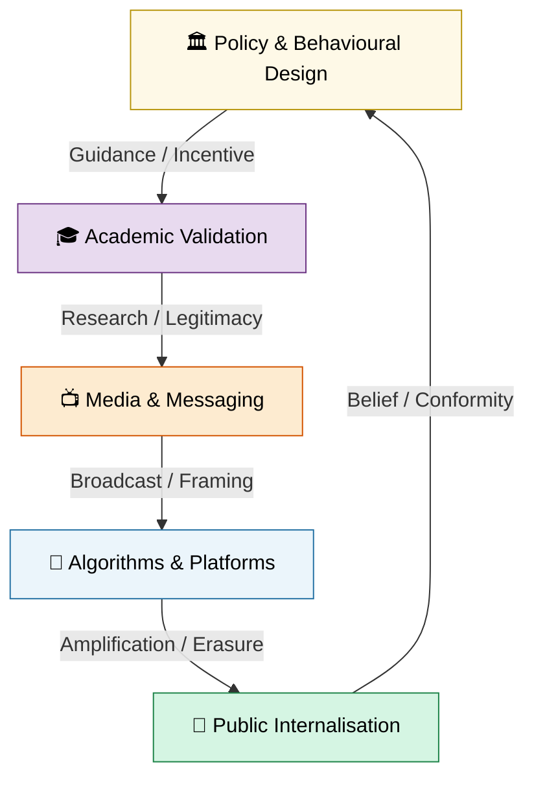

# 🪄 Expression Of Norms  
**First created:** 2025-10-15 | **Last updated:** 2025-10-18  
*Where morality is rehearsed, measured, and televised.*  

---

## ✨ Scope  
*Expression Of Norms* studies how societies manufacture and display “rightness.”  
It traces how universities, broadcasters, bureaucrats, and algorithms co‑produce what counts as moral, tasteful, and safe.  
From “nudge” units to banned books, from compliance dashboards to talking heads, this cluster documents **the machinery of legitimacy** — and how belief becomes an administrative act.  

Norms are not static codes; they are *daily performances* delivered through policy, pedagogy, and publicity.  
To govern norms is to choreograph behaviour.  

---

## 🛰️ Orientation  
This cluster examines how institutional life becomes a stage for moral theatre:  
- **British University Compliance Service** — audit culture and the illusion of care.  
- **Banned Broadcasts Cooperative** — the shadow archive of erased or algorithmically buried works.  
- **Money Talks Media** — donor networks, newsroom pressure, and reputational choreography.  
- **HM Dept Coercive Nudges** — behavioural insight programmes and the ethics of engineered desire.  
- **Watch The Watchers** — reflexive oversight; when surveillance tries to learn humility.  

Its tone sits between **forensic field guide** and **absurdist ethics handbook**.  
Every act of compliance hides a small act of resistance — the moment someone realises they are being watched and keeps breathing anyway.  

---

## 📂 Core Subfolders  

| Folder | Focus |
|:--|:--|
| [🎓 British University Compliance Service](./🎓_British_University_Compliance_Service/) | Audit culture, pro‑social theatre, and the risk of institutional capture. |
| [🎶 Banned Broadcasts Cooperative](./🎶_Banned_Broadcasts_Cooperative/) | Censorship, algorithmic invisibility, and the recovery of erased culture. |
| [📺 Money Talks Media](./📺_Money_Talks_Media/) | Narrative management through donor and policy networks. |
| [🧠 HM Dept Coercive Nudges](./🧠_HM_Dept_Coercive_Nudges/) | Behavioural government and the gentle art of control. |
| [🧿 Watch The Watchers](./🧿_Watch_The_Watchers/) | Oversight and the recursion of accountability. |

---

## 🦚 Core Themes  

- **Compliance as culture.** Virtue is rehearsed until it feels natural.  
- **Behavioural governance.** Nudge, sludge, and the management of moral reflexes.  
- **Transparency as theatre.** Oversight as performance rather than reform.  
- **Visibility and silence.** What is amplified, what is politely erased.  
- **Education as containment.** Academia’s slow capture by audit logic.  
- **Media as mirror.** Spectacle teaching the public what to feel.  
- **Algorithmic memory.** How digital systems learn to forget on command.  
- **Ethics fatigue.** The exhaustion of perpetual correctness.  

---

## 📡 Visual Map — The Broadcast Feedback Loop  

*Alt text:* A circular flow in which government, academia, media, algorithms, and the public reinforce one another’s definitions of acceptable behaviour.  

---

## 🌌 Constellations  

🪄 🎓 📺 🤖 🧠 🧿 — culture, compliance, belief, theatre, reflexivity.  

**Cultural & Theoretical Echoes:**  
- *Black Mirror* — morality as interface.  
- *Brazil* — bureaucracy as tragedy.  
- *The Chair* — academic paralysis and polite dissent.  
- *The Thick of It*, *Yes Minister* — satire as statecraft.  
- *Network* — televised righteousness.  
- *1984*, *The Handmaid’s Tale* — obedience industrialised.  
- Foucault — *Discipline and Punish*.  
- Arendt — *The Banality of Evil*.  
- McLuhan — *The Medium is the Message*.  
- Byung‑Chul Han — *The Transparency Society*.  

---

## ✨ Stardust  
norm enforcement, behavioural governance, media ethics, compliance theatre, nudge politics, transparency paradox, algorithmic censorship, surveillance pedagogy, academic capture, virtue metrics, moral exhaustion  

---

## 🎭 Closing Reflection  

Norms dissolve when you stop clapping.  
Every performance needs an audience; every orthodoxy, a round of applause.  
When the crowd leaves and the cameras cool, decency can finally begin to breathe again.  

---

## 🏮 Footer  

*🪄 Expression Of Norms* is a living node of the Polaris Protocol.  
It maps the feedback systems that define good behaviour and the refusals that make new norms possible.  

> 📡 Cross‑references:
> 
> - [🦕 Elder Influencers](../🦕_Elder_Influencers/README.md) — *legacy power and moral authority*  
> - [🫀 Our Hearts Our Minds](../🫀_Our_Hearts_Our_Minds/README.md) — *trauma, ethics, and humane counter‑norms*  
> - [✨ Glimmer Is Taxable](../✨_Glimmer_Is_Taxable_And_Other_Big_Drums/README.md) — *satire of moral economy*  

*Survivor authorship is sovereign. Containment is never neutral.*  

_Last updated: 2025-10-18_
