```mermaid
flowchart TD
    A[⚖️ Charity Shell<br>Exempt status light-touch regulation] --> D[📉 Deficits<br/>Universities financially strained]
    B[💸 Market Logic<br>9k fees per-head shrinking block grants] --> D
    C[🏦 Block Grant Collapse<br>Reduced public subsidy] --> D

    D --> E[🟥 Authoritarian Donors<br>Oligarchs Gulf states Confucius Institutes]
    D --> F[⚙️ Exploitative Industries<br>Fossil fuels Defence Surveillance tech]

    E --> G[🏛️ Legitimacy Capture<br>Research shaped dissent silenced<br>citizens trained in obedience]
    F --> G

    G --> H[⚠️ Democratic Crisis<br>Looks like glossy brochures<br>actually authoritarian drift]
```

# ⚠️ Authoritarian Incentives in Universities  
**First created:** 2025-09-23 | **Last updated:** 2026-01-04  
*Why UK universities are structurally nudged toward authoritarian contracts, and why this is a democratic crisis.*  

---

## 🌱 Scope  

This node records how the **legal shell + funding logic** of British universities  
make authoritarian alignments more likely than democratic partnerships.  

It never looks like a crisis.  
It looks like glossy brochures, international collaborations, new campus wings.  
But beneath the branding, it is one of the first capture points in the slide toward tyranny.  

---

---

## ⚖️ Structural Bias  

- **Charity shell**: Universities = exempt charities. Regulator (OfS) measures financial sustainability, not ethical integrity.  
- **Market logics**: £9k fees, per-head funding, and collapsed block grants push institutions into deficit.  
- **Revenue dependence**:  
  - High-fee international students.  
  - Donors and contracts with authoritarian regimes.  
  - Partnerships with exploitative industries (fossil fuels, surveillance, defence).  
- **Contractual asymmetry**:  
  - Authoritarian funders offer large sums + tolerate gag clauses.  
  - Democratic/pro-social funders rarely provide equivalent resources.  

Result: The safest path to institutional survival is signing authoritarian contracts.  

---

## 🕳 The Democratic Cost  

Universities are not just schools.  
They are **factories of legitimacy**.  
When they normalise authoritarian partnerships, they:  
- Shape what is researched and published.  
- Constrain what can be taught.  
- Silence dissenting voices.  
- Train graduates in obedience, not democracy.  

---

## 🌍 Current Context  

- UK streets show rising racialised violence (Tommy Robinson rallies, 2024 riot aftershocks).  
- Governments abroad use fascist rhetoric and step through the Ten Stages of Genocide.  
- Authoritarian capital has deep pockets; democratic capital is cautious.  
- UK universities, under financial stress, lean toward authoritarian deals.  

---

## ⚠️ Crisis Logic  

This is a crisis that will never look like one.  
It will be smoothed over for market reasons.  
It will present as:  
- “Internationalisation strategy.” 
- “Global excellence partnerships.” 
- “Expanding access to education worldwide.” 

In reality, it is a **transfer of sovereignty**:  
our universities selling legitimacy to regimes whose values run against democracy itself.  

---

## ✨ Why This Is Where to Start  

If we value liberal democracy, we cannot ignore this.  
- Education is where authoritarians always begin.  
- Capture of universities = capture of future citizens, professions, knowledge pipelines.  
- This is not marginal; it is central.  

We are standing at a fork:  
- Continue smoothing, pretending nothing is wrong → drift into tyranny.  
- Or confront the incentives honestly, and re-engineer funding so that democracy is the easier partner, not the harder one.  

---

---

## 🏮 Footer  

*⚠️ Authoritarian Incentives in Universities* is a living node of the Polaris Protocol.  
It marks the point where market smoothing masks democratic collapse.  

> 📡 Cross-references:
> 
> - [📜 Funding and Charitable Status Timeline](./📜_funding_and_charitable_status_timeline.md)  
> - [⚖️ Charitable Status Paradox](./⚖️_charitable_status_paradox.md)
> - [🌀 The Full Authoritarian Capture Lifecycle](../../../../Metadata_Sabotage_Network/Structural_Analysis/🧬_Structural_Mapping/🌀_authoritarian_capture_lifecycle.md)
> - [👾 Why Policing and PREVENT Are Susceptible to Authoritarian Drift](../../../../Metadata_Sabotage_Network/Governance_And_Containment/🈺_Governance_And_Prevent/👾_Just_A_Quick_Wellbeing_Check/👾_why_policing_and_prevent_are_susceptible_authoritarian_drift.md)  

*Survivor authorship is sovereign. Containment is never neutral.*  

_Last updated: 2026-01-04_  
