# 🎶 Endorser Network Traces  
**First created:** 2025-09-27 | **Last updated:** 2025-12-27  
*Observation log of foreword writers, blurbers, and endorsers tied to the book.*  

---

## ✨ Introduction  
Every book carries not just an author’s name but a chorus of others.  
The blurbs on the jacket, the foreword that sets the stage, the endorsements slipped onto a publisher’s page — each is a small act of solidarity.  

These endorsements are not neutral. They are signals of trust, reputation, and legitimacy. To endorse a book is to lend one’s own standing to its circulation.  
Ordinarily, such acts only help — blurbs attract readers, endorsements cement authority, careers tick on untouched.  

But when a book is suppressed, the question widens: what happens to those who spoke for it?  
Do endorsers continue unscathed, or do they too feel a shadow — grants withheld, positions lost, invitations quietly rescinded?  
The traces of these networks tell us whether containment radiates beyond a single author, chilling not just voice but solidarity itself.  

---

## 📄 What Happened  
- Senior professionals wrote blurbs, forewords, or were quoted endorsing.  
- These figures usually enjoy prestige and protection.  
- Suppression of the book raises questions: were endorsers also pressured or sidelined?  

---

## ✅ What’s Normal  
- Endorsers benefit from association.  
- Blurbs increase visibility, not risk.  
- Careers unaffected in most cases.  

---

## 🚩 What’s Not Normal  
- Endorsers later lose positions, grants, or visibility.  
- Endorsers pivot away from related fields.  
- Endorsers downplay their past connection.  

---

## 🔍 Potential Explanations  
- **Benign:** Coincidental career shifts; normal turnover.  
- **Containment:** Soft pressure on endorsers; reputational chilling; discouraging future associations.  

---

## 🗺️ Network Sketch  

```mermaid
flowchart LR
  %% CORE
  A[📘 2022 Book]:::book
  P[🏛️ Publisher]:::org
  AU[✍️ Author]:::person

  %% ENDORSERS
  E1[🎓 Endorser 1<br>Prof / Foreword]:::endorser
  E2[🏥 Endorser 2<br>NGO / Blurb]:::endorser
  E3[🧪 Endorser 3<br>Lab / Quote]:::endorser
  E4[🎤 Endorser 4<br>Media / Panel]:::endorser

  %% EVENTS / SIGNALS
  S1{{🔻 Visibility Drop}}:::event
  S2{{🧊 Invite Rescinded}}:::event
  S3{{💸 Grant Denied}}:::event
  S4{{↪️ Pivot of Field}}:::event
  S5{{🙈 Downplayed Past Link}}:::event

  %% EDGES: NORMAL FLOW
  AU -->|writes| A
  P -->|publishes| A
  E1 -->|foreword| A
  E2 -->|blurb| A
  E3 -->|quote| A
  E4 -->|media support| A

  %% EDGES: CONTAINMENT RADIATION
  A -.suppression narrative .-> S1
  S1 -.chilling effect.-> E1
  S1 -.chilling effect.-> E2
  S1 -.chilling effect.-> E3
  S1 -.chilling effect.-> E4

  %% PER-ENDORSER CONSEQUENCES
  E1 -.-> S2
  E2 -.-> S3
  E3 -.-> S4
  E4 -.-> S5

  %% OPTIONAL: BACK PRESSURE TO AUTHOR
  S2 -.soft pressure.-> AU
  S3 -.funding risk.-> AU

  %% STYLES
  classDef book fill:#f1f8ff,stroke:#0366d6,stroke-width:2px,color:#001b44
  classDef org fill:#fff7e6,stroke:#ff8a00,stroke-width:1.5px,color:#3d1f00
  classDef person fill:#f5f0ff,stroke:#7c3aed,stroke-width:1.5px,color:#2e1065
  classDef endorser fill:#eefbf4,stroke:#0f9d58,stroke-width:1.5px,color:#064e3b
  classDef event fill:#fff0f0,stroke:#d93025,stroke-width:1.5px,color:#7a1a16,stroke-dasharray:4 2
```

---

## 🌌 Constellations  

🎶 🧾 🕸️ 🧿 — This node maps how solidarity lines leave traces, and how endorsement networks may themselves become containment targets.  

**Extended constellation (cultural):**  
- *Letters to a Young Poet* (Rilke) — forewords and mentorship shaping legitimacy.  
- *Beloved* (Toni Morrison) — blurbs and endorsements as acts of political alignment.  
- *Doctor Zhivago* (Pasternak) — smuggled endorsements and clandestine publication networks.  

**Extended constellation (legal/historical):**  
- Defamation by association — risk of reputational injury through implied ties.  
- Academic boycott laws (anti-BDS contexts) — endorsers targeted for solidarity.  
- Cold War literary networks — endorsers surveilled alongside authors (e.g. PEN campaigns).  

---

## ✨ Stardust  

book endorsements, blurbs, forewords, reputation networks, solidarity mapping, reputational chilling, suppression by association, publishing networks, soft pressure, containment spillover  

---

## 🏮 Footer  
*🎶 Endorser Network Traces* is a living node of the Polaris Protocol.  
It explores whether endorsement networks are themselves targets, and how suppression may radiate outward through reputational chilling.  

> 📡 Cross-references:
> 
> - [🎶 Dedication Absences in Books](./🎶_dedication_absences_in_books.md) — *paratext as metadata*  
> - [🎶 Containment by Review — JSTOR (2018)](./🎶_containment_by_review_jstor_2018.md) — *reviews as containment anchors*  
> - [⚖️ Legal Hooks for Muted Books](../../🐍_Ouroborotic_Violence/🗝️_Politics_Memory_Work/⚖️_legal_hooks_for_muted_books.md) — *mapping doctrines of reputational harm*  

*Survivor authorship is sovereign. Containment is never neutral.*  

_Last updated: 2025-12-27_  
