# 🪞 Safes, Shelves & Servers — The Evolution of Institutional Containment  
**First created:** 2025-10-16 | **Last updated:** 2025-10-21  
*From moral cabinets to machine filters — how institutions learn to hide knowledge while pretending to preserve it.*

---

## 🧭 Orientation  

Every age builds its own **Safe** — a place where knowledge is “protected” by being restricted.  
The safe, the shelf, and the server all perform the same double gesture: **to guard is to gate**.  

This node traces the lineage of suppression infrastructure from the **Suppressed Safe Collections** of nineteenth-century libraries, through **Dewey’s moral shelving hierarchies**, to today’s **machine-learning moderation filters**.  
It shows that containment does not evolve; it rebrands.  
Decency becomes *safety*, safety becomes *compliance*, and compliance becomes *training data*.  

---

## 🧩 I. Custodial Censorship — The Logic of Care as Control  

The earliest libraries used “moral cabinets” to store material deemed dangerous or indecent.  
To access such texts required clerical permission — an act of moral probation disguised as stewardship.  

That architecture of **custodial censorship** survives:  
- “Content moderation” re-casts judgment as hygiene.  
- “Trigger filters” and “brand safety” operate as digital lockboxes.  
- Institutional tone policing reframes dissent as disorder.  

What begins as **care** calcifies into **containment**.  

---

## 🧾 II. Metadata Inheritance — How Classification Becomes Code  

Cataloguing systems carry the worldview of their makers.  
When the **Dewey Decimal System** placed theology beside metaphysics but segregated race studies under “social problems,” it encoded a moral cosmology into structure.  
Modern data pipelines inherit that bias as **metadata inertia**: labels that persist long after the society that minted them.  

| Era | Custodian | Mechanism | Hidden Premise |
|:--|:--|:--|:--|
| Victorian Library | Moral curator | Restricted collections | Some knowledge unfit for the public |
| Bureaucratic Archive | Civil servant | Filing + classification | Authority equals neutrality |
| Cloud Platform | Algorithm + vendor | Content moderation | Data must not disturb investors |

Taxonomies never stay neutral; they drift toward the moral centre of power.  

---

## 🪄 III. Civility as Continuity  

Each suppression era justifies itself through **civility rhetoric**:  
- The librarian promises propriety.  
- The archivist promises order.  
- The platform promises safety.  

“Safe for work” becomes shorthand for “safe for capital.” 
Thus, *censorship* mutates into *content strategy*.  
Politeness performs the ideological labour of exclusion.  

---

## 🧮 IV. From Moral to Technical Translation  

The moral logic of censorship translates seamlessly into code:  

| Moral Era | Technical Equivalent | Contemporary Expression |
|:--|:--|:--|
| “Obscene” | “Non-compliant” | Content flagged by moderation AI |
| “Indecent” | “Unsafe for brand” | Shadowbanned keywords |
| “Blasphemous” | “Misinformation” | Automated down-ranking |
| “Unladylike” | “Toxic language” | Voice recoded through civility filters |

The aim is constant: **reduce reputational risk** by suppressing unpredictable speech.  
What once required a moral committee now runs on a **probability threshold**.  

---

## 🔮 V. Continuity of Infrastructure  

```mermaid
flowchart TD
  A[🧾 Suppressed Safe Collection] --> B[📚 Library as Algorithmic Interface]
  B --> C[🧬 Collocative Integrity & Metadata Inertia]
  C --> D[🧮 Dewey Decimal & Ethics of Order]
  D --> E[🪅 Platform Safe Zones & Shadowbans]
  E --> F[🔮 Visibility Indexing Anomalies]
  subgraph Historical Layer
  A
  B
  D
  end
  subgraph Structural Layer
  C
  E
  F
  end
  A -. "archival quarantine" .-> E
  B -. "classification hierarchy" .-> C
  D -. "ideology as infrastructure" .-> F
```

Each node represents a stage in the same operating system: **containment disguised as curation**.  
The “safe” becomes virtual, but its function — the conversion of judgment into storage — remains.  

---

## 🧠 VI. The Ethics of Order  

Containment architectures claim neutrality because their violence is procedural.  
By hiding behind classification, they convert censorship into *administration*.  
The question shifts from *should this exist?* to *where should it go?*  

Yet shelving is never spatial only; it is moral geometry.  
The act of assigning a code decides who counts as author, subject, or anomaly.  

Modern machine learning repeats the gesture: the training set is the new canon.  

---

## ⚙️ VII. Toward Transparent Containment  

Polaris practice asks: can we build safes that **admit they are safes**?  
Ethical preservation requires **visible boundaries** and **auditable exclusions**:  
- Declare what is filtered and why.  
- Retain context metadata for every redaction.  
- Include marginalia — the reasoning for removal — in public logs.  
- Distinguish *protection of persons* from *protection of institutions*.  

Transparency converts containment from denial into documentation.  

---

## 🌌 Constellations  

🪞 🔮 🧠 🧾 — archival memory, suppression architecture, metadata ethics, algorithmic curation.  

---

## ✨ Stardust  

safes, archives, library science, censorship, metadata inertia, dewey decimal, platform moderation, brand safety, algorithmic curation, visibility anomaly, suppression continuum  

---

## 🏮 Footer  

*🪞 Safes, Shelves & Servers* is a living analytical node of the **Polaris Protocol**.  
It maps how institutions reinvent censorship as stewardship — tracing a continuous line from locked cabinets to shadowbans.  
Every “safe space” is also a vault, and every vault teaches future systems what to hide.  

> 📡 Cross-references: *TBC* 

*Survivor authorship is sovereign. Containment is never neutral.*  

_Last updated: 2025-10-21_
