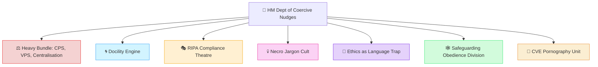

# 🧠 HM Dept of Coercive Nudges  
**First created:** 2025-08-03 | **Last updated:** 2025-09-10  
*Polaris Protocol doctrine node — behavioural science repurposed as state containment.*  

---

## ✨ Overview  

This node collects files documenting the use of **behavioural nudging** — the soft-power scripts of compliance.  

Where surveillance captures metadata and forks fracture voices, nudges operate at the affective layer:  
- Steering populations under the guise of *choice*  
- Framing coercion as *support*  
- Engineering obedience through subtle psychological levers  

---

## 🛰️ Contents  

- [⚖️ Heavy Bundle: CPS, VPS, Centralisation](./⚖️_heavy_bundle_cps_vps_centralisation.md) — CPS timelines, CSE inquiry smoothing, and high-control archetypes reframed as containment logics  
- [🌀 Docility Engine](./🌀_docility_engine.md) — models of compliant behaviour dressed as empowerment  
- [🎭 RIPA Compliance Theatre](./🎭_RIPA_compliance_theatre.md) — bureaucratic rituals disguising surveillance powers  
- [💀 Necro Jargon Cult](./💀_necro_jargon_cult.md) — weaponised legal and academic jargon used as containment scripts  
- [📜 Ethics as Language Trap](./📜_ethics_as_language_trap.md) — ethics discourse converted into compliance levers  
- [🕸️ Safeguarding Obedience Division](./🕸️_safeguarding_obedience_division.md) — welfare and safeguarding reframed as coercive architectures  
- [🦚 CVE Pornography Unit](./🦚_cve_pornography_unit.md) — behavioural experiments disguised as counter-extremism interventions  

---

## 🗺️ Position in Polaris  

*Coercive Nudges* sits at the seam where **behavioural scripts** meet **systemic containment**.  
Though filed here, nodes like the *Heavy Bundle* cross-link to **Big Picture Protocols** because they track not only nudges but their embedding in justice, governance, and culture.  

> Nudges are not neutral. They are architectures of obedience disguised as care.  

---

## 🏮 Footer  

*HM Dept of Coercive Nudges* is a living node of the Polaris Protocol.  
It documents how behavioural science is redeployed as a mechanism of governance, coercion, and suppression.  

🏮 [Return to Big Picture Protocols](../README.md)
