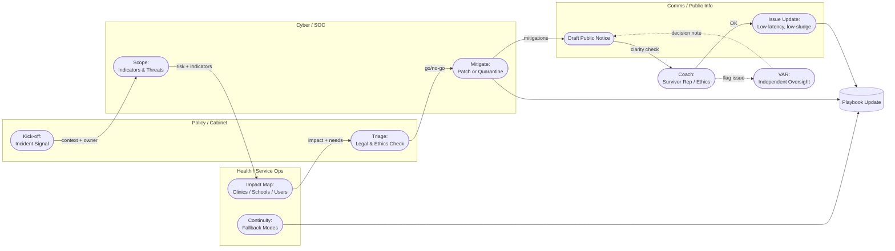

# 🏟️ Hackathon League — Cooperative Training for Digital Resilience  
**First created:** 2025-10-15 | **Last updated:** 2025-10-21  
*Interdisciplinary hackathons as civic training grounds for digital cooperation.*

---

## 🧭 Orientation  

Frames **cross-departmental hackathons** as civic rehearsal spaces for digital governance.  
Like a football league for systems coordination, these recurring events cultivate *muscle memory for collaboration* across government, academia, NGOs, and infrastructure providers.  

The objective is not to “win” or “ship a product” — but to **practise how institutions move together under pressure**.  
Each round strengthens shared language, ethical reflexes, and trust across silos, preparing teams for real crises in data, health, or information security.  

> “Train the coordination layer before the crisis arrives.”

---

## 🧩 I. Philosophy of Play  

Modern infrastructures require rehearsal.  
When complex systems fail, the slowest element is usually **interdepartmental handoff**, not technology.  
Hackathons offer a low-stakes sandbox where people, not protocols, are debugged.  

### Core Principles  
1️⃣ **Play Together Before the Match** — Build familiarity through regular cross-disciplinary sprints.  
2️⃣ **Rotating Captains** — Leadership shifts each round (policy lead, data scientist, survivor advocate).  
3️⃣ **Shared Pitch** — Work on anonymised or synthetic datasets that mimic real stressors.  
4️⃣ **Scouting for Blind Spots** — Each team fields an outsider or critic to flag jargon and assumption drift.  
5️⃣ **Post-Match Film Room** — Review each event like sports tape: where coordination lagged, who saw what, which tools broke.  

The key product is *competence under uncertainty* — not code.  

---

## 🧭 II. The Federation Model  

| Level | Focus | Analogy |
|:--|:--|:--|
| **Local Clubs** | Universities, councils, NGOs | Training academies |
| **Regional Leagues** | Sectoral mixes (health + cybersecurity) | National divisions |
| **Global Cup** | Treaty-level or multilateral drills | World Cup of Resilience |

Outputs are not apps but **trained teams** and **documented plays**.  
Each league match leaves behind annotated playbooks — open-source scripts for coordination.  

---

## ⚙️ III. Match Scoring — The Coordination Rubric  

| Metric | Description | Purpose |
|:--|:--|:--|
| **Coordination latency** | Time from incident signal → correct ownership | Measures clarity of escalation |
| **Handoff quality** | % of passes with full context & next owner | Evaluates traceability |
| **Visibility coverage** | # of teams with live situational awareness | Tests transparency |
| **Ethics on-field** | Adherence to least-harm and survivor-led principles | Integrates accountability |
| **After-action review** | Completeness of debrief and playbook update | Institutionalises learning |

The “score” is procedural literacy — how well participants coordinate, not how much they build.  

---

## 🧱 IV. The Drills Menu — Rehearsal Scenarios  

| Drill | Focus | Starter Dataset | Learning Outcome |
|:--|:--|:--|:--|
| **Cookie Chaos Cup** | Policy & UX | Synthetic logs of consent pop-ups | Harmonise privacy compliance and usability |
| **Data Breach Relay** | Cyber & Comms | Mock CSV of exposed records | Practise containment + crisis communication |
| **Disinformation Derby** | Media & Education | 50 false + 10 verified posts | Detect narrative drift + publish counter-brief |
| **Cloud Outage Scrimmage** | Infra & Health | Simulated API failures | Route fallback + continuity of care |
| **Sandbox Solidarity** | Local Gov & Social Services | School broadband access dataset | Co-design equitable funding dashboards |

Each drill ends with a **film-room debrief** that captures timing, clarity, and harm-minimisation lessons.  

---

## 🧤 V. Coaching Notes — Mentor Template  

| Field | Example Entry | Purpose |
|:--|:--|:--|
| **Match / Drill Name** | 2025-10-15 / *Cookie Chaos Cup* | Reference for logs |
| **Team Composition** | Policy (Cabinet), Cyber (SOC), EdTech NGO | Track diversity & expertise |
| **Best Assist** | Cyber → Comms: timestamped dataset handoff | Celebrate clarity under pressure |
| **Ethical Yellow Card** | Draft leaked prematurely | Flag near-miss or procedural breach |
| **Blind Spot Noted** | Accessibility not reviewed | Feed into next training |
| **Player Substitution** | Health analyst swapped in mid-round | Record flexibility |
| **VAR Decision** | Oversight reversed auto takedown | Preserve accountability chain |
| **Post-Match Reflection** | “Coordination lagged at policy handoff.” | Build institutional memory |

🗒️ *Coaches annotate live; notes feed into the cumulative League Playbook.*  

---

## 🗺️ VI. Team Coordination Flow  

> **Alt text:** The “football pitch” shows four lines (Policy, Cyber, Health, Comms) passing an incident like a ball. Each pass carries context, risk, and next owner. A Coach (Survivor Rep / Ethics) can pause play; a VAR (Oversight) reviews controversial calls. The Playbook updates after every match.

**Interpretation:**  
- **Passes** = task handoffs with context + timing.  
- **Coach** ensures survivor ethics.  
- **VAR** = independent oversight.  
- **Playbook** = institutional learning layer.  

---

## 🌍 VII. Beyond the Metaphor — Civic Function  

The Hackathon League treats *governance as practice*.  
It builds cross-sector trust and embeds lived-experience expertise in institutional response.  
Participants learn **reciprocal accountability**: how to signal, pause, escalate, and hand back responsibility ethically.  

By gamifying complexity, the League creates **muscle memory for democracy** — cooperative reflexes for crisis coordination.  
Where traditional audits find fault, hackathons rehearse repair.  

---

## 🌌 Constellations  

🏟️ 💡 🧠 🤝 — digital cooperation, cross-sector ethics, civic rehearsal, coordination under uncertainty.  

---

## ✨ Stardust  

hackathons, civic tech, interdisciplinary teams, crisis rehearsal, public sector innovation, coordination drills, digital hygiene, survivor-centred ethics, institutional learning, cooperation metrics  

---

## 🏮 Footer  

*🏟️ Hackathon League* is a living node of the **Polaris Protocol**.  
It reframes hackathons as structured practice sessions for democratic coordination — civic exercises that cultivate resilience, transparency, and care in digital infrastructure.  

> 📡 Cross-references:
> 
> - [🌍 Treaty for the English Internet](../../🌀_System_Governance/⚖️_Legal_State_Governance/🌍_treaty_for_the_english_speaking_internet.md) — *transnational coordination models*
> - [🌐 Digital Sovereignty & the Deterritorial Cloud](../../🦕_Elder_Influencers/📜_Statutes/🌐_digital_sovereignty_deterritorial_cloud.md) - *re-defining sovereignty when data and compute ignore borders*
> - [🗺️ Containment Fingerprint Atlas — Visual Map of Repeated Glitches](Metadata_Sabotage_Network/Structural_Analysis/🧼_System_Leakage_Signatures/🗺️_containment_fingerprint_atlas.md) - *how to start catching the errors on anglophone internet*  
> - [🧭 Visual Glossary — Reading the Containment Pulse](Metadata_Sabotage_Network/Structural_Analysis/🧼_System_Leakage_Signatures/🧭_visual_glossary_containment_pulse.md) - *how to start visualising the error status on anglophone internet*  

*Survivor authorship is sovereign. Containment is never neutral.*  

_Last updated: 2025-10-21_
