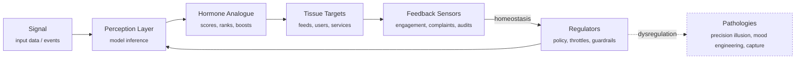

# 🧬 Algorithmic Endocrinology  
**First created:** 2025-11-02 | **Last updated:** 2025-11-02  
*Algorithmic Ecology & Endocrine Governance — how precision systems start to act like hormones.*

---

## 🧭 Orientation  

*Algorithmic Endocrinology* studies the hormonal behaviour of data systems.  
When predictive engines and optimisation loops are designed to *balance* social or informational “health,” they begin to imitate the logic of the body’s endocrine system — feedback-driven, homeostatic, and sometimes self-poisoning.

This folder tracks how digital architectures secrete influence, dose attention, and regulate emotion through feedback signals.  
It belongs to **🪄 Expression Of Norms**, the branch of *Big Picture Protocols* concerned with how moral and behavioural expectations are written into code, metrics, and institutional design.

---

## 🧩 Key Features  

- **Algorithmic Ecology** — systems interacting like organisms within an ecosystem; precision without full context breeds fragility.  
- **Endocrine Governance** — institutions attempting to modulate public “mood hormones” via algorithmic feedback loops.  
- **Precision Illusion** — the false promise that more data yields more truth; mirrors the over-hormoning of the digital body.  
- **Algorithmic Invasiveness (DEET Effect)** — tracing how micro-targeted nudges act as behavioural pheromones.  
- **Governance & Oversight in Algorithmic Health** — comparing biological regulation models with data-oversight architectures.  
- **Ethical Ecology of Design** — grounding algorithmic systems in ecological humility rather than extractive optimisation.

---

## 📚 Folder Contents  

| Node | Focus |
|------|-------|
| [🍬 Algorithmic Endocrine Axis](./🍬_algorithmic_endocrine_axis.md) | Mapping hormonal metaphors to feedback architectures. |
| [🌿 Algorithmic Ecology: Precision Without Context](./🌿_algorithmic_ecology_precision_without_context.md) | Ecological limits of precision systems. |
| [💣 The Precision Illusion](./💣_the_precision_illusion.md) | Statistical overconfidence and governance risk. |
| [🪰 Digital DEET: Algorithmic Invasiveness](./🪰_digital_deet_algorithmic_invasiveness.md) | Defensive metaphors for attention-economy toxicity. |
| [🧭 Governance and Oversight in Algorithmic Health](./🧭_governance_and_oversight_in_algorithmic_health.md) | Comparative models of regulation and adaptive feedback. |
| [📚 Survey of Current Literature](./📚_survey_of_current_literature.md) | Collated references across sociology, biocybernetics, and systems ethics. |
| [🧩 Ecological Ethics of Algorithmic Design](./🧩_ecological_ethics_of_algorithmic_design.md) | Towards regenerative rather than extractive algorithmic cultures. |

---

## 🗺️ Diagram — Endocrine Feedback in Algorithms  

**Legend:**  
*Signal → Perception → Hormone → Target → Feedback → Regulator → (back to) Perception.*  
Where regulation fails or is captured, the loop drifts toward **pathologies**: over-dosing attention, punitive throttling, or performative “health” that harms the ecosystem.

---

## 🌌 Constellations  

🧬 🪄 🪰 🌿 🔬 — system biology, digital ecology, feedback governance, precision ethics, adaptive oversight.

---

## ✨ Stardust  

algorithmic endocrinology, feedback loops, precision illusion, endocrine governance, digital ecology, algorithmic invasiveness, ecological ethics, systemic oversight, mood engineering, behavioural modulation

---

## 🏮 Footer  

*🧬 Algorithmic Endocrinology* is a living node of the **Polaris Protocol**.  
It examines how feedback-based governance borrows the language and logic of biology, revealing the hormonal economy of modern algorithms.

> 📡 Cross-references:
> 
> - [🪄 Expression Of Norms](../README.md) — *social coding and moral infrastructure*  
> - [🌀 Systems & Governance](../../🌀_System_Governance/README.md) — *diagnostic structures and oversight design*  
> - [🐍 Ouroborotic Violence](../../🐍_Ouroborotic_Violence/README.md) — *self-consuming systemic loops*  

*Survivor authorship is sovereign. Containment is never neutral.*  

_Last updated: 2025-11-02_
