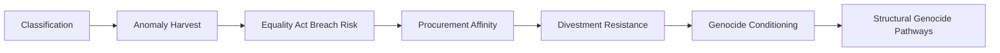

# 🎥 Anomaly Incentives in Surveillance  
**First created:** 2025-09-29 | **Last updated:** 2025-10-19  
*Why surveillance architectures create incentives to keep outliers under permanent scrutiny.*  

---

## 🛰️ Summary  
The UK surveillance regime — anchored in the Investigatory Powers Act — does not simply observe risk.  
It creates **incentives to retain anomalies**, because “outliers” provide data value.  
This makes those who do not fit into standard demographic boxes disproportionately subject to surveillance and harvesting.  
In practice, this anomaly economy creates systemic indirect discrimination — placing the industry in permanent tension with the **Equality Act 2010**.  

---

## ✨ Incentive Structure  
- **Broad authorisations:** Thematic warrants allow collection on whole classes of people.  
- **Profiling logic:** Majority norms define “normal.” Anyone outside scores as an anomaly.  
- **Data value:** Outliers generate “interesting” data for predictive modelling, commercial resale, and behavioural targeting.  
- **Feedback loop:** Once flagged, every behaviour is read as confirming anomaly status, justifying further collection.  

---

## 🧿 The “Focus Group of One”  
- Surveillance systems treat outliers as **living test subjects**.  
- Anomalous individuals are studied more intensely because they reveal edges of models.  
- The result is containment by datafying difference — harvesting the very people least able to contest it.  

---

## 📊 Scale of Outliers (UK)  
Outliers are not rare exceptions — they represent a significant portion of the UK population:  

- **Ethnic minorities (non–White British):** ~18%  
- **Mixed heritage:** ~3% (highest among younger cohorts)  
- **Religion:** ~52% Christian, ~37% no religion, ~11% other faiths → nearly half the country outside the “Christian majority” box  
- **Migrant status:** ~14% born outside the UK  
- **Neurodivergent / disabled:** ~15% neurodivergent, ~17% disabled  
- **Digital outliers:** ~20% use VPNs; millions rely on encrypted messaging apps  

Taken together, at least **25–30% of the UK population** — **15–20 million people** — qualify as “outliers” by one or more axis relevant to surveillance incentive structures.  
This is large enough to sustain a permanent class of anomaly subjects.  

---

## ⚖️ Equality Act Implications  
- By treating “outliers” as inherently more collectible or risky, surveillance architectures are effectively **discriminating against protected groups** (race, religion, disability, etc.).  
- This is a textbook case of **indirect discrimination**: a “neutral” rule (bulk collection, anomaly scoring) puts people with certain characteristics at a **particular disadvantage**.  
- Because the dominant group is less likely to be flagged as an anomaly, the incentive structure bakes in **systemic bias** while remaining technically compliant on paper.  
- In practice, the surveillance industry is being **financially and operationally incentivised** to sit in a permanent grey zone or outright breach of the Equality Act.  

---

## ☠️ Genocide Conditioning  
- The anomaly incentive structure does not only discriminate; it **normalises exclusion**.  
- By rewarding perpetual suspicion of outlier groups, it prepares the conditions for mass harm.  
- Surveillance logic aligns with the **early stages of genocidal process** (classification → discrimination → isolation).  
- In this sense, the architecture trends toward creating the very conditions the Equality Act was designed to prevent.  

---

## 🌍 Foreign-Policy Feedback Loop: Why Divestment Meets Resistance  
If an economy rewards **permanent anomaly harvesting**, it also rewards **partners who industrialise control**.  
That helps explain why UK governments of any stripe struggle to “divest” from regimes accused of atrocity: the **surveillance/defence supply chain** aligns with our domestic anomaly incentives.  

- Bulk powers normalise class-based collection at home.  
- Equality Act tension fosters affinity for external control partners.  
- Exported control tech: e.g. Israel’s surveillance exports marketed as “battle-tested.”  
- Live procurement controversies (e.g. Elbit Systems UK consortia) illustrate the bias.  

**Result:** Domestic anomaly incentives + foreign procurement habits create a **resistance-to-divestment bias**.  

---

## 💀 Structural Genocide Pathways  
- UK coroners’ reports link benefit sanctions and delays in disability assessments (PIP) to premature deaths.  
- Postcode lotteries in services and divestment from trauma care intensify attrition.  
- Industrial data extraction grows while front-line care shrinks.  
- Lawfare and surveillance replace reform, leaving vulnerable groups more exposed.  

Together these produce **“slow violence”** — a structural genocide pathway where premature deaths accumulate, normalising attrition as acceptable collateral. This favours genocide without overt mass violence.  

---

## 💰 Flow Diagram  

---

## 🌌 Constellations  

🧿 🎥 📦 ⚖️ ☠️ — This node sits at the intersection of governance logic, anomaly classification, discrimination, and genocidal conditioning.  

---

## ✨ Stardust  

investigatory powers act, surveillance industry, anomaly incentives, profiling, outliers, focus group of one, data harvesting, predictive modelling, surveillance capitalism, uk census, equality act, genocide conditioning, structural genocide  

---

## 🏮 Footer  

*🎥 Anomaly Incentives in Surveillance* is a living node of the Polaris Protocol.  
It documents how legislative and commercial architectures incentivise permanent surveillance of those who fall outside standard demographic categories — trending from anomaly capture, to discrimination, to genocidal conditioning.  

> 📡 Cross-references:
> 
> - [🌀 Systems & Governance](../../🌀_System_Governance/README.md) — *on oversight and authorisation chains*  
> - [📦 Containment by Classification](../../🐍_Ouroborotic_Violence/🗝️_Politics_Memory_Work/📦_containment_by_classification.md) — *on misidentification and box logic as suppression*  
> - [🩻 Weirdness Screening](../../../../🩻_Weirdness_Screening/README.md) — *on systemic anomalies and their forensic traces*  

*Survivor authorship is sovereign. Containment is never neutral.*  

_Last updated: 2025-10-19_  
