# 🛰️ Overlapping Surveillance Layers  
**First created:** 2025-09-28 | **Last updated:** 2025-10-19  
*How commercial and state surveillance can run in parallel and feel like one operation.*

---

## 🪼 Overview  

In the UK there is no single “one-stop” surveillance body.  
Different organisations — state agencies, regulators, private-intelligence or PR firms — can all monitor the same person at the same time without knowing about each other.  

To the person experiencing it, the combined effect looks like a single, highly-coordinated campaign, even when it is really multiple unconnected operations.

---

## ⚖️ Two Main Streams  

| Stream | Who runs it | What they can do | Oversight |
|--------|-------------|------------------|-----------|
| **State / IPA / RIPA** | Police, security & regulatory bodies under warrant | Intercept communications, location tracking, covert entry, informants | Judicial Commissioner, Investigatory Powers Commissioner, IPT tribunal |
| **Commercial / PR / Private Intel** | Reputation firms, opposition research, insurers, corporate security | OSINT scraping, data-broker purchases, public-space observation, story-seeding | GDPR, harassment law (no licensing) |

---

## 🌀 Why It Feels Unified  

- **Same data brokers**: Both streams buy or access commercial datasets.  
- **Informal tip-offs**: Private contractors can feed state agencies or vice-versa.  
- **Multiple clients**: Employer, adversary, regulator, and government can all be watching separately.  
- **Continuous effect**: Commercial monitoring can run for years; state warrants are renewable.  

---

## 🧵 Chain of Handoffs  

A single “case” may travel through many hands over time:

1. **Local authority or police** open a file for a safeguarding, fraud, or public-order issue.  
2. **Specialist teams** inside that agency run their own checks (social services, cyber units).  
3. If escalated, it may move to **another department** (Home Office, HMRC, DWP, Post Office Investigations).  
4. At each stage, the new team can start fresh surveillance or contract its own private firm.  
5. In rare cases it escalates to **state security** (MI5/MI6) under different powers.  

Each layer can keep its own records, run its own authorisations, and bring in new contractors.  
From the outside it feels like one continuous watch, but it’s actually a relay of different watchers.

---

## 🚩 Signs of Escalation  

There are often subtle shifts when a case passes from one layer to another. These can help you spot when surveillance has been “handed off”:

1. **Change in focus** — local authority watchers look at safeguarding and welfare; HMRC fixates on finances; DWP on benefits; security services on associations and ideology.  
2. **Change in language** — the terms used in correspondence, the jargon in reports, or the style of questioning often signal a new agency’s involvement.  
3. **Change in tactics** — early phases may involve visible visits, interviews, or letters; later phases may turn into silent observation, metadata collection, or more aggressive reputational tactics.  
4. **New contractors appearing** — different PR, investigation, or compliance firms may cycle in as contracts are awarded and expire.  
5. **Timing patterns** — each handoff resets the clock: a new six-month or one-year surveillance window, which keeps the sense of continuous observation alive.  
6. **Escalation triggers** — a failure to comply, a public complaint, or a refusal to sign an NDA can prompt movement to the next tier.  

From a governance perspective, these are predictable transitions.  
From an individual’s perspective, they create the impression of a single omnipresent campaign — and this is why such testimonies are often dismissed as “paranoid” when they’re actually describing the cumulative footprint of multiple systems.

---

## 🦆 Why It’s Always the Same People  

Surveillance on “complex” or “non-standard” individuals tends to circle back to the same analysts and teams because:

- **Small pools of staff:** specialist analysts are few; the same names recur across agencies and contractors.  
- **Selector-driven systems:** once a person’s name, number or passport is in a database it flags automatically on re-entry.  
- **Risk aversion:** it’s safer to escalate or keep a file than to close it.  
- **Bias + escalation triggers:** women, minorities, whistleblowers and highly intelligent people are disproportionately labelled “manipulative” or “difficult” and referred upward.  

From the individual’s point of view, this produces a continuous presence of familiar behaviours and faces; from the inside it’s a loop of small staff pools, inherited notes and risk-averse policy — not a conscious conspiracy but a structural rebound.

---

## 🗣️ Why Speaking Up Is So Difficult  

Even when an analyst, contractor or manager recognises that a case no longer warrants monitoring, raising that concern is hard:

- **Risk-aversion culture** — closing a file is seen as risky; keeping it open is safer for the staff member’s career.  
- **Fragmented responsibility** — no single owner of the case, so no one feels empowered to close it.  
- **Security clearances & NDAs** — staff are bound by secrecy and special access restrictions that limit how, where and to whom they can express doubt.  
- **Fear of blame** — if something happens after a file is closed, the person who recommended closure may be scapegoated.  
- **Institutional inertia** — legacy systems automatically generate alerts on old selectors; stopping those alerts requires multiple approvals.  
- **Informal stigma** — questioning surveillance decisions can be seen as “going native” or “sympathising with the subject.” 

These barriers make it far easier to let low-level surveillance continue indefinitely than to challenge or end it.  
From the outside this looks like deliberate persecution; from the inside it’s often risk-averse process plus fragmented accountability.

---

## 🌐 Diagram of Overlap & Handoffs  

```mermaid
flowchart LR
  A[👁️ Target Individual]

  subgraph Private Sector
    B[📢 PR / Private Intel Firms]
    D[📰 Media / Social Personas]
  end

  subgraph State Agencies
    P[👮 Local Police / Local Authority]
    H[🏢 Home Office / HMRC / DWP]
    S[🕵️ State Security / MI5]
  end

  A -->|Public Data / OSINT| B
  A -->|Warranted Access / CHIS| P
  P -->|Escalation| H
  H -->|Escalation| S

  B -->|Tip-offs / Reports| P
  P -->|Briefings / Data| B

  B -->|Narrative Seeding| D
  S -->|Evidence / Enforcement| E[⚖️ Prosecutions / Regulatory Action]

  classDef private fill:#f9f5d7,stroke:#f39c12,color:#000;
  classDef state fill:#d6eaf8,stroke:#3498db,color:#000;
  classDef media fill:#fce4ec,stroke:#c2185b,color:#000;

  class B private;
  class D media;
  class P state;
  class H state;
  class S state;
  class E state;

```

*(Boxes show the main actors; arrows show typical data or influence flows. “Escalation” arrows show how a case can pass from one team or department to another.)*

---

## 🌌 Constellations  

🛰️ 🧿 🌀 📚 — Overlapping surveillance layers are not new; they echo the faceless bureaucracy of Kafka’s *The Castle*, the interwoven agencies and street-level informants of *The Wire*, and the state–contractor ecosystem revealed in *Snowden* and *Citizenfour*.  
Episodes like *Nosedive* (Black Mirror) show how parallel scoring and data-harvesting systems can converge into a single felt reality for the person scored.  
This node sits where fragmented watch systems blend into one perceived campaign.  

## ✨ Stardust  

parallel surveillance, state–private overlap, handoff effect, kafkaesque bureaucracy, risk-averse process, perceived conspiracy, data brokers, contractors, surveillance escalation, citizenfour, black mirror

---

## 🏮 Footer  

*🛰️ Overlapping Surveillance Layers* is a living node of the Polaris Protocol.  
It documents how separate state and commercial operations can blend into one perceived campaign — including the “handoff” effect as cases move between agencies.  

> 📡 Cross-references:
> 
> – [🛫 Frequent Flyers Club](./🛫_frequent_flyers_club.md) - *Individuals repeatedly caught in overlapping surveillance loops*  
> – [🧠 Why Are We Threatened by Complexity?](./🧠_why_are_we_threatened_by_complexity.md) - *How “complexity” triggers escalation and bias*  

*Survivor authorship is sovereign. Containment is never neutral.*

_Last updated: 2025-10-19_
