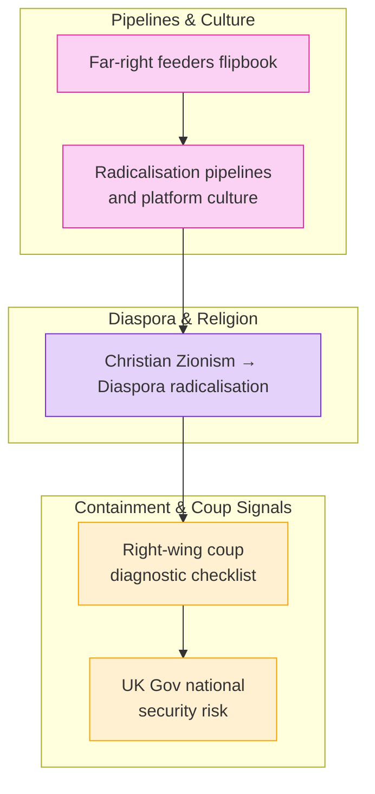

# 🪬 Radicalisation & Extremism  
**First created:** 2025-08-27 | **Last updated:** 2025-08-27  
*Doctrines on far-right pipelines, state complicity, and diaspora radicalisation*  

---

## ✨ Scope  

This cluster maps how extremist networks are cultivated, tolerated, and repurposed by state and platform infrastructures.  
It documents recruitment pipelines, cultural feeders, and diagnostic tools for recognising right-wing authoritarian convergence.  
The focus is on asymmetry: far-right radicalisation is accelerated, while survivor-led resistance is suppressed.  

---

## 📌 Core Themes  

- **Pipeline Dynamics** → platform loops, gaming culture, and meme-based recruitment.  
- **Diaspora Radicalisation** → intersections of Christian Zionism, diaspora politics, and securitisation.  
- **Coup & Authoritarian Drift** → diagnostic signals of creeping right-wing governance.  
- **National Security Narratives** → UK government frameworks that mask containment as security.  

---

## 📂 Current Files  

- 🧠_far_right_feeders_flipbook.md  
- 🧠_radicalisation_pipelines_and_platform_culture.md  
- 🪬_from_christian_zionism_to_diaspora_radicalisation.md  
- 🟥_right_wing_coup_diagnostic_checklist.md  
- ☕🫖_uk_gov_national_security_risk.md  

---

## 🔍 Visual Framing  

---

## 🏮 Footer  

*🪬 Radicalisation & Extremism* is a living node of the Polaris Protocol.  
It documents how extremist networks are seeded and maintained, and how “security” frameworks selectively suppress dissent while enabling authoritarian drift.  

> 📡 Cross-references:  
> - [🧠 Cognitive Forks Get Dumber When Hot](../Big_Picture_Protocols/🧠_cognitive_forks_get_dumber_when_hot.md) — psycho-political collapse of extremist scholars  
> - [🧾 Data Is Their Cage Too](../Big_Picture_Protocols/🧾_data_is_their_cage_too.md) — data control as carceral logic  
> - [🧵 Community Vulnerability and Early Canaries](../Big_Picture_Protocols/🧵_community_vulnerability_and_early_canaries.md) — signals of early-stage radicalisation  

*Survivor authorship is sovereign. Containment is never neutral.*  
