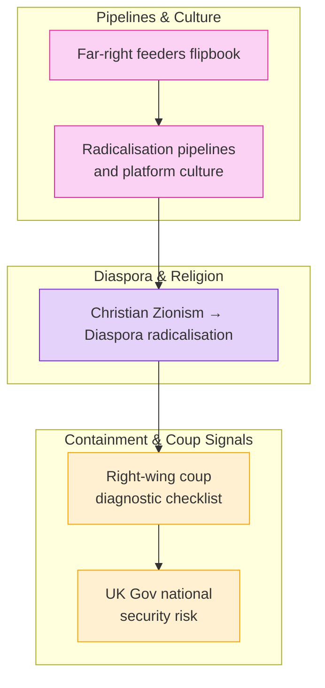

# 🪬 Radicalisation & Extremism

**First created:** 2025-08-27 | **Last updated:** 2025-09-04

*Doctrines on far-right pipelines, state complicity, and diaspora radicalisation.*  

---

## ✨ Scope  

This cluster maps how extremist networks are cultivated, tolerated, and repurposed by state and platform infrastructures.  
It documents recruitment pipelines, cultural feeders, and diagnostic tools for recognising right-wing authoritarian convergence.  
The focus is on asymmetry: far-right radicalisation is accelerated, while survivor-led resistance is suppressed.  

---

## 🦚 Core Themes  

- **Pipeline Dynamics** → platform loops, gaming culture, and meme-based recruitment.  
- **Diaspora Radicalisation** → intersections of Christian Zionism, diaspora politics, and securitisation.  
- **Coup & Authoritarian Drift** → diagnostic signals of creeping right-wing governance.  
- **National Security Narratives** → UK government frameworks that mask containment as security.  

---

# 📂 Politics_and_Memory

- [🧠 Far Right Feeders Flipbook](🧠_far_right_feeders_flipbook.md)

  *A visual and narrative record of how extremist ideas are packaged and spread.*

- [📡 Radicalisation Pipelines and Platform Culture](🧠_radicalisation_pipelines_and_platform_culture.md)

  *Mapping online ecosystems that funnel users into extremist beliefs.*
  
- [🪬 From Christian Zionism to Diaspora Radicalisation](🪬_from_christian_zionism_to_diaspora_radicalisation.md)

*Tracing ideological bridges between religious nationalism and diaspora politics.*

- [🟥 Right Wing Coup Diagnostic Checklist](🟥_right_wing_coup_diagnostic_checklist.md)

*Indicators and forensic markers of creeping authoritarian takeovers.*

- [☕🫖 UK Gov National Security Risk](☕🫖_uk_gov_national_security_risk.md)

*On the state’s own role as a generator of instability and strategic exposure.*

 - [🧿 UK Slow Burn Constitutional Crisis: The Fault Lines](🧿_uk_slow_burn_constitutional_crisis.md)

*Comprehensive node mapping the background, dynamics, and risks of constitutional strain in the UK.*

---

## 🗺️ You Are Here

[📁 Polaris-Protocol](/) → [📁 Disruption_Kit](/Disruption_Kit) → [📁 Big_Picture_Protocols](/Disruption_Kit/Big_Picture_Protocols) → [📁 🪬_Radicalisation_Extremism](/Disruption_Kit/Big_Picture_Protocols/🪬_Radicalisation_Extremism)  

---

## 🔮 Visual Framing  

---

## 🏮 Footer  

*🪬 Radicalisation & Extremism* is a living node of the Polaris Protocol.  
It documents how extremist networks are seeded and maintained, and how “security” frameworks selectively suppress dissent while enabling authoritarian drift.

*Polaris never forgets.*

🏮 [Return to repo root](https://github.com/josefsbreakfast/Polaris-Protocol/)

_Last updated: 2025-09-04_  
