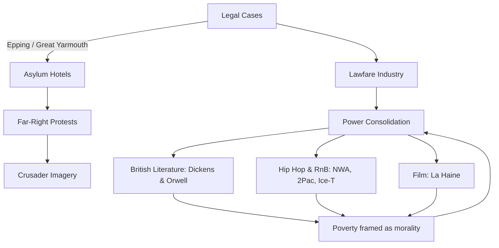

# 🏨 Hotels, Protests, and Power Consolidation  
**First created:** 2025-09-13 | **Last updated:** 2025-09-13  

---

## 📑 Table of Contents  
- [✍️ Executive Summary](#-executive-summary)  
- [⚖️ Case Overview: Epping & Great Yarmouth](#-case-overview-epping--great-yarmouth)  
- [1. Why Hotels?](#1-why-hotels)  
- [2. Why Far-Right Protests Cluster Here](#2-why-far-right-protests-cluster-here)  
- [3. Why It’s Not About Hotels or Asylum Seekers](#3-why-its-not-about-hotels-or-asylum-seekers)  
- [4. Local vs National Power, and the Land Law Pivot](#4-local-vs-national-power-and-the-land-law-pivot)  
- [5. The Real Story: Power Consolidation](#5-the-real-story-power-consolidation)  
- [6. Why This Matters for Journalists](#6-why-this-matters-for-journalists)  
- [📝 Questions Journalists Should Ask](#-questions-journalists-should-ask)  
- [⚔️ Why the Crusader Imagery Matters](#-why-the-crusader-imagery-matters)  
- [🎶 Cultural Constellations](#-cultural-constellations-who-gets-policed-who-gets-amplified)  
- [🔚 Not Revolution, Just Reproduction of Power](#-not-revolution-just-reproduction-of-power)  
- [🗺️ Constellation Diagram](#-constellation-diagram)  
- [🏮 Footer](#-footer)  

---

## ✍️ Executive Summary  
The protests around “asylum hotels” are not really about hotels, asylum seekers, or even national identity. They are **surface theatre**.  

Behind them sits a **repeatable apparatus**:  
- A corporate-legal service industry (barristers, consultants, PR firms) monetising conflict through injunctions and planning disputes.  
- A **tight network of elites** with overlapping interests in surveillance, banking, energy, logistics, and government contracting.  
- **Far-right mobilisation** that supplies the street optics, while the real beneficiaries are the middle actors extracting fees and the elites consolidating power.  

This is a **pattern**: the same groups and methods reappear across domains (student protests, planning law, protest injunctions, superinjunctions). The costs fall on scapegoated groups — usually racialised minorities — while profits and power flow upward.  

➡️ [Back to top](#-executive-summary)  

---

## ⚖️ Case Overview: Epping & Great Yarmouth  
### 🔹 The Epping Case (Bell Hotel)  
- **Parties**: Epping Forest District Council (claimant) vs. Somani Hotels Ltd (owner of the Bell Hotel).  
- **Claim**: The council argues that housing asylum seekers under Home Office contract is a **material change of use** from lawful hotel use (Use Class C1).  
- **Relief sought**: An **injunction under s.187B of the Town and Country Planning Act 1990** to stop asylum accommodation unless permission is granted.  
- **Counterarguments**: The hotel argues it’s still operating as a hotel; the Home Office says blocking use undermines statutory duties.  
- **Current status**: Interim injunction granted by Eyre J, overturned by the Court of Appeal. Full trial scheduled October 2025.  

### 🔹 The Comparator: Great Yarmouth (Villa Rose Hotel & GY6 Policy Area)  
- **Policy hook**: Local Plan Policy GY6 — explicitly protects seafront hotels in the “tourism spine.”  
- **Decision**: High Court continued injunction preventing asylum/hostel use. Key reason: loss of tourist function and no necessity shown by Serco.  
- **Cultural note**: British hotel culture has long prized the **sea view** as a marker of value (see Basil's hard-sell of the sea view in *Fawlty Towers*). In Great Yarmouth, this wasn’t just comic — it was embedded in planning policy.  

➡️ [Back to top](#-executive-summary)  

---

## 1. Why Hotels?  
- Hotels sit in neat planning categories (C1).  
- Councils can argue asylum use = material change.  
- Socially symbolic thresholds (guest vs. intruder).  
- Logistically, the Home Office already uses them.  

➡️ [Back to top](#-executive-summary)  

---

## 2. Why Far-Right Protests Cluster Here  
- **Target selection**: asylum seekers scapegoated.  
- **Narrative fusion**: migration + housing + VAWG.  
- **Mobilisation**: local optics, national networks.  
- **Media echo**: easy visuals for outrage.  

Call them what they are: **far-right protests**.  

➡️ [Back to top](#-executive-summary)  

---

## 3. Why It’s Not About Hotels or Asylum Seekers  
Hotels and asylum seekers are props. The real play is:  
- Councils flexing vs. central government.  
- Law firms monetising controversy.  
- Far-right building mobilisation.  
- Media profiting from rage.  

➡️ [Back to top](#-executive-summary)  

---

## 4. 🏛️ Local vs National Power, and the Land Law Pivot  
- Councils feel disempowered → reach for planning law.  
- Officers nudge councillors into lawfare strategies.  
- Universities mirror this: trespass/possession vs. students.  
- Reinforces **property rights** not human rights.  

➡️ [Back to top](#-executive-summary)  

---

## 5. The Real Story: Power Consolidation  
- **Executive drift**: bypass political debate.  
- **Lawfare industry**: service economy, public funded.  
- **Far-right utility**: optics feed narrative of “the people vs elites.”  
- **Schmittian risk**: exceptions become the norm → law = leader’s decree.  

➡️ [Back to top](#-executive-summary)  

---

## 6. Why This Matters for Journalists  
- Follow the beneficiaries: politicians, chambers, consultants, media.  
- Follow the costs: students, residents, taxpayers, scapegoated minorities.  
- The fight is not about hotels → it’s about whether law disciplines power or launders it.  

➡️ [Back to top](#-executive-summary)  

---

## 📝 Questions Journalists Should Ask  
1. Why fight this in planning law? Who benefits?  
2. Are councillors aware of nudging?  
3. Is this a test case? How does it differ from Great Yarmouth?  
4. How much has it cost? Who profits?  
5. How are far-right groups exploiting it?  
6. What scrutiny exists? Is journalism amplifying optics or interrogating apparatus?  

➡️ [Back to top](#-executive-summary)  

---

## ⚔️ Why the Crusader Imagery Matters  
- Echoes medieval Crusades: channel masculine energy, unite factions, racialised enemy.  
- Modern cosplay reframes grievances as “racialised defence.”  
- Foot soldiers sacrificed to elite agenda.  
- Journalists must interrogate: who supplies this imagery, and why?  

➡️ [Back to top](#-executive-summary)  

---

## 🎶 Cultural Constellations: Who Gets Policed, Who Gets Amplified  
- **Hip hop/R&B**: N.W.A., 2Pac, Ice-T — calling out state violence, structural neglect.  
- **Suppressed**: Black music censored, surveilled, criminalised.  
- **Tolerated**: Neo-Nazi music accessible, white supremacist radio on air.  
- **Asymmetry**: dissent silenced, supremacist voices amplified.  

### 🎬 Film Reference: *La Haine* (1995)  
- Paris riots, racialised banlieues, cycles of poverty and violence.  
- Acts of violence shown as survival narrative where other channels are closed.  

### 📚 British Literature Constellations  
- **Dickens, *Oliver Twist***: poverty framed as morality, survival by accident of ancestry.  
- **Orwell, *The Road to Wigan Pier***: poverty as structural trap, not individual failing.  

➡️ [Back to top](#-executive-summary)  

---

## 🔚 Not Revolution, Just Reproduction of Power  
- It’s never about free speech, safety, or women and girls.  
- It’s about what keeps elites in power.  
- Far-right language of revolt masks reproduction of the same order.  
- Councils, consultants, media, and elites consolidate control; scapegoated groups pay.  

➡️ [Back to top](#-executive-summary)  

---

## 🗺️ Constellation Diagram  

➡️ [Back to top](#-executive-summary)  

---

## 🏮 Footer  
This note is a living node of the Polaris Protocol.  
It documents how “asylum hotels” are being used as a proxy battlefield: far-right mobilisation at the street level, lawfare extraction in the courts, executive drift at the state level.  

*Survivor authorship is sovereign. Containment is never neutral.*  

_Last updated: 2025-09-13_  
