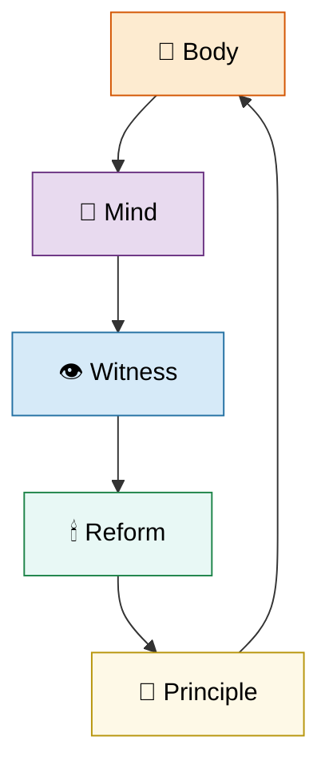

# 🫀 Our Hearts Our Minds  
**First created:** 2025-10-15 | **Last updated:** 2025-10-18  
*How care, harm, and belief are administered through bodies and minds — and how they can be reclaimed.*  

---

## ✨ Scope  
*Our Hearts Our Minds* studies how compassion becomes bureaucracy and how survivors re‑humanise what institutions have mechanised.  
It follows the translation chain between pain and paperwork, belief and policy, witness and reform — revealing how each link shapes what society calls “care.”  

This cluster is not just about suffering; it is about **repair**.  
It maps the places where compassion collapses into compliance, and how dignity, reciprocity, and memory can re‑anchor humane governance.  

---

## 🛰️ Orientation  
The cluster spans five intersecting families of thought: body politics, trauma, witnessing, safeguarding, and ethics.  
Each folder builds on the last — from embodied rights to trauma recovery, from testimony to reform, and from ethics back to design.  

- **🐝 Body Politic** — disability politics, embodiment, access, and rights.  
- **🐦‍🔥 Trauma Psychology & Medical Misuse** — psychological weaponisation and recovery pathways.  
- **👁️‍🗨️ Witness Historical Casefiles** — testimony, timelines, and evidential repair.  
- **🕯 Exorcising Safeguarding Shadows** — failures of protection and institutional audits.  
- **🌱 Human Principles** — normative ethics, dignity, and survivor‑authorship foundations.  

Care, harm, and reform are not opposites here — they are phases of the same cycle.  

---

## 📂 Core Subfolders  

| Folder | Focus |
|:--|:--|
| [🐝 Body Politic](./🐝_Body_Politic/README.md) | Disability politics, embodiment, access, and rights. |
| [🐦‍🔥 Trauma Psychology & Medical Misuse](./🐦‍🔥_Trauma_Psychology_Medical_Misuse/README.md) | Psychological weaponisation and recovery pathways. |
| [👁️‍🗨️ Witness Historical Casefiles](./👁️‍🗨️_Witness_Historical_Casefiles/README.md) | Testimony, timelines, and evidential repair. |
| [🕯 Exorcising Safeguarding Shadows](./🕯_Exorcising_Safeguarding_Shadows/README.md) | Failures of protection and institutional audits. |
| [🌱 Human Principles](./🌱_Human_Principles/README.md) | Normative ethics, dignity, and survivor‑authorship foundations. |

---

## 🫧 Core Themes  

- **Compassion as governance.** The bureaucratisation of care.  
- **Trauma as administrative category.** Paperwork as treatment.  
- **Witnessing as resistance.** Testimony as reform engine.  
- **Care as containment.** How help becomes hierarchy.  
- **Safeguarding as shadow.** Control masked as protection.  
- **Recovery as redesign.** Healing as systemic re‑architecture.  
- **Ethics as infrastructure.** Dignity written into design.  
- **Memory as medicine.** Remembering as refusal of harm.  

---

## 🌊 Visual Map — The Flow of Care  

*Alt text:* A circular flow linking body, mind, witness, reform, and principle — the regenerative loop of humane governance.  

---

## 🌌 Constellations  

🫀 🐝 🕯️ 👁️‍🗨️ 🌱 — memory, care, embodiment, reform, ethics.  

**Cultural & Theoretical Echoes:**  
- *The Handmaid’s Tale* — control through care.  
- *I, Daniel Blake* — bureaucratic cruelty and resistance.  
- *The Diving Bell and the Butterfly* — embodiment and patience.  
- *Chernobyl* — duty versus denial.  
- *A Monster Calls* — grief as revelation.  
- Carol Gilligan — *Ethics of Care*.  
- Nel Noddings — *Caring: A Feminine Approach to Ethics and Moral Education*.  
- Judith Butler — *Precarious Life*.  
- Sara Ahmed — *Complaint!*.  
- bell hooks — *All About Love*.  

---

## ✨ Stardust  
body politic, trauma psychology, witness testimony, safeguarding, ethics, dignity, humane governance, survivor authorship, embodiment, reform design, ethics of care, administrative theology, compassion fatigue  

---

## 💬 Closing Reflection  

To care is to remember.  
To remember is to resist amnesia disguised as mercy.  
Every act of witness re‑teaches a system how to feel.  

---

## 🏮 Footer  

*🫀 Our Hearts Our Minds* is a living node of the Polaris Protocol.  
It integrates ethics, trauma, and embodiment research into a coherent framework for humane governance — showing how systems of care can either heal or repeat harm.  

> 📡 Cross‑references:
> 
> - [🐍 Ouroborotic Violence](../🐍_Ouroborotic_Violence/README.md) — *recursive architectures of harm*  
> - [🌀 System Governance](../🌀_System_Governance/README.md) — *structural accountability frameworks*  
> - [🪄 Expression Of Norms](../🪄_Expression_Of_Norms/README.md) — *compliance and the moral performance of care*  

*Survivor authorship is sovereign. Containment is never neutral.*  

_Last updated: 2025-10-18_
