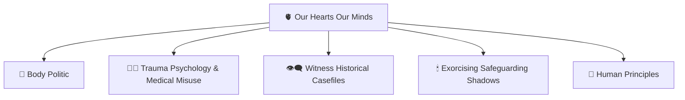

# 🫀 Our Hearts Our Minds  
**First created:** 2025-10-15 | **Last updated:** 2025-10-17  
*Cluster on how care, harm, and belief are administered through bodies and minds.*

---

## 🛰️ Orientation  
*Our Hearts Our Minds* traces the moral, medical, and bureaucratic infrastructures that govern the intimate terrain of being human.  
It follows how institutions translate **pain into paperwork**, **belief into policy**, and **witness into reform** — and how survivors reclaim those translations.  

The cluster spans five intersecting families of thought: body politics, trauma, witnessing, safeguarding, and humane governance.  
Each folder builds on the last: from embodied rights to trauma recovery, from testimony to reform, and from ethics back to design.  

**Purpose:** to make visible the administrative theology of care — the point where compassion becomes compliance — and to re-anchor it in dignity, reciprocity, and memory.

---

## 📂 Subfolders  

- [🐝 Body Politic](./🐝_Body_Politic/README.md) — disability politics, embodiment, access, and rights  
- [🐦‍🔥 Trauma Psychology & Medical Misuse](./🐦‍🔥_Trauma_Psychology_Medical_Misuse/README.md) — psychological weaponisation and recovery pathways  
- [👁️‍🗨️ Witness Historical Casefiles](./👁️‍🗨️_Witness_Historical_Casefiles/README.md) — testimony, timelines, and evidential repair  
- [🕯 Exorcising Safeguarding Shadows](./🕯_Exorcising_Safeguarding_Shadows/README.md) — failures of protection and institutional audits  
- [🌱 Human Principles](./🌱_Human_Principles/README.md) — normative ethics, dignity, and survivor-authorship foundations  

---

---

## 🌌 Constellations  
🫀 🐝 🕯️ 👁️‍🗨️ 🌱 — memory, care, embodiment, reform, ethics.

---

## ✨ Stardust  
body politic, trauma psychology, witness testimony, safeguarding, ethics, dignity, humane governance, survivor authorship, embodiment, reform design

---

## 🏮 Footer  

*🫀 Our Hearts Our Minds* is a living node of the Polaris Protocol.  
It integrates ethics, trauma, and embodiment research into a coherent framework for humane governance — showing how systems of care can either heal or repeat harm.  

> 📡 Cross-references:  
> - [🐍 Ouroborotic Violence](../🐍_Ouroborotic_Violence/README.md) — recursive architectures of harm  
> - [🌀 System Governance](../🌀_System_Governance/README.md) — structural accountability frameworks  

*Survivor authorship is sovereign. Containment is never neutral.*  

_Last updated: 2025-10-17_
