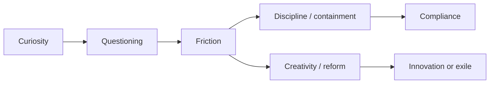

# ⚙️ High-Friction People and Systemic Mismatch  
**First created:** 2025-11-08 | **Last updated:** 2026-01-22  
*When curiosity meets bureaucracy, sparks are inevitable.*

---

## 🛰 Orientation  
“High-friction” people are those whose energy, questioning, or pace rubs against the grain of standard procedure.  
They’re often labelled as *difficult*, *non-compliant*, or *unmanageable*.  
Yet many are simply **fast processors inside slow systems** — the so-called *smarty-pants kids who won’t behave.*

This node reframes friction not as flaw but as **evidence of systemic mismatch**.

---

## 🌋  Anatomy of Friction  

| Layer | Description | Typical Misreading |
|--------|--------------|--------------------|
| **Cognitive** | Notices contradictions, asks “why,” resists rote repetition. | Arrogant, disruptive. |
| **Emotional** | Intense response to perceived unfairness or inefficiency. | Over-reactive, volatile. |
| **Social** | Prefers authenticity to hierarchy. | Poor team player. |
| **Ethical** | Seeks coherence between stated values and actions. | “Doesn’t understand real-world compromise.” |

Friction = speed differential × integrity.

---

## 🧮  The Systemic Equation  

Whether friction produces **innovation** or **exile** depends entirely on system design.

---

## 🧠  Educational Origins  

- Schools reward compliance and tidy handwriting, not meta-cognition.  
- Bright, asynchronous learners test limits by default; they ask better questions than the curriculum can answer.  
- Adults mistake boredom and critique for disrespect.  
- The result: early conditioning that curiosity is costly.

---

## 🧩  Workplace Continuity  

- Bureaucracies replicate the classroom pattern: promotion through smoothness.  
- High-friction staff identify weak logic, inequity, or inefficiency — the very things systems most want to ignore.  
- “Performance management” often means **polishing away useful dissonance.**

---

## 🪞  Re-Framing  

> Friction is feedback.  

Healthy systems use it to check alignment.  
Unhealthy ones suppress it to preserve rhythm.  
The goal isn’t to remove friction but to **convert it into propulsion** — the difference between grinding gears and moving parts.

---

## 🌌 Constellations  
⚙️ Systems Theory · 🧠 Cognitive Divergence · 🧩 Education · 🏛️ Governance  

*Further media:*  
- [Fashion Is Better When There's Friction](https://www.harpersbazaar.com/fashion/a70011610/personal-style-fashion-friction-maxxing-optimization), Harper's Bazaar.

---

## ✨ Stardust  
high-friction, non-compliance, gifted behaviour, cognitive mismatch, curiosity, bureaucracy, innovation, burnout, reform, organisational learning  

---

## 🏮 Footer  
*⚙️ High-Friction People and Systemic Mismatch* is a commentary node of the Polaris Protocol.  
It reframes disruptive intelligence as diagnostic signal: evidence that structure and speed are mis-aligned.  

> 📡 Cross-references:
> 
> - [🧩 Friction Patterns](./🧩_friction_patterns.md)
> - [🦠 Algorithmic Autoimmunity](../../../../Metadata_Sabotage_Network/🔥_Data_Risks/🦠_algorithmic_autoimmunity.md)
> - [🧩 Why the Machine Tags High-Friction Profiles](../../../../Metadata_Sabotage_Network/Structural_Analysis/🧿_Targeting_Logic_Metadata_Signatures/🧩_why_the_machine_tags_high_friction_profiles.md)  
> - [🔮 Predictive Containment and Emergent Friction](../../../../Metadata_Sabotage_Network/Structural_Analysis/🧿_Targeting_Logic_Metadata_Signatures/🔮_predictive_containment_and_emergent_friction.md)
> - [🍉 Friction, Erasure, and the Machine View of Resistance](../../🐍_Ouroborotic_Violence/🩸_Genocide_Denialism/🍉_friction_erasure_and_the_machine_view_of_resistance.md)  

*Survivor authorship is sovereign.  Containment is never neutral.*

_Last updated: 2026-01-22_
