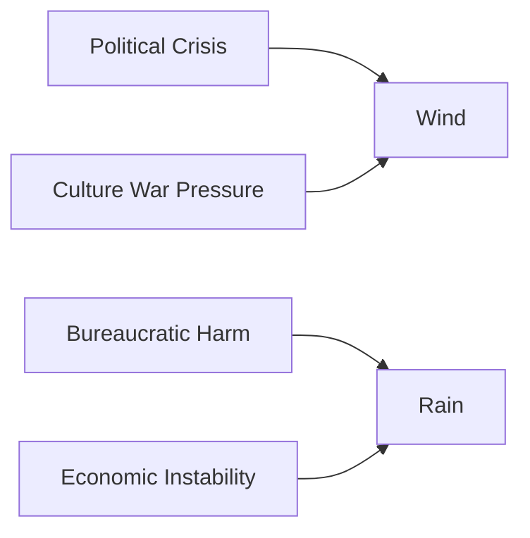

# 🌲 Campfire Stability Model for Modern Citizens  
**First created:** 2025-11-19 | **Last updated:** 2025-12-07  
*A Polaris emotional-systems framework for understanding psychological depletion, resilience cycles, and human stability under democratic stress.*  

---

## 🛰️ Orientation  
When people say “I feel like my life is a very tired campfire,”  
they’re describing something *real*:  

> **the way humans metabolise chronic uncertainty, political instability, and bureaucratic friction.**

This node formalises the metaphor into a **usable stability model**.  
It explains:

- why modern citizens feel depleted,  
- why small stresses hit harder during democratic drift,  
- why emotional resources burn unevenly,  
- and how to rebuild stability after system-induced erosion.

It pairs with:  
- 🔥 *your_emotional_campfire_care_kit*  
- 🌲 *rebuilding_spark_in_a_political_forest_fire*  

---

## ✨ Key Features  
- Introduces the “campfire” as a model of human stability under societal stress.  
- Identifies fuel sources, ember-loss, and smoke signals in citizen psychology.  
- Explains why bureaucratic harm accelerates depletion.  
- Provides a structural rather than individualised explanation of exhaustion.  
- Helps reframe emotional overwhelm as *normal*, *predictable*, and *non-pathological*.

---

## 🧿 Analysis / Content  

### 🔥 1. The Campfire as a Stability Metaphor  
Your emotional system is a campfire:

- **logs** → core resources  
- **kindling** → small joys, daily structure  
- **embers** → residual resilience  
- **smoke** → distress signals  
- **wind** → external pressure  
- **rain** → systemic instability  
- **tinder** → sudden sensitivity  
- **spark** → possibility  

When society destabilises, every part burns faster.

---

### 🌧️ 2. What Depletes the Fire  
The modern environment places chronic stress on the campfire:

#### **a) Bureaucratic friction**  
Data harm, misinterpretation, delays, appeals cycles.

#### **b) Political instability**  
Culture war noise, rapid policy shifts, incoherent governance.

#### **c) Economic uncertainty**  
Cost of living pressure, insecure housing, insecure work.

#### **d) Social fragmentation**  
Online hostility, misinformation, collapsed communal trust.

#### **e) Public-sector exhaustion**  
Under-resourced services, burnout, delayed support.

#### **f) Identity threat**  
Racialisation, antisemitism, Islamophobia, Prevent spillover.

Even if each stressor is small, together they **strip oxygen from the fire**.

---

### 🪵 3. What Fuels the Fire  

#### **Logs: Deep-structure supports**  
- housing  
- secure relationships  
- community  
- financial stability  
- consistent access to care  
- trustworthy institutions  
- bodily safety  

Logs create long-term stability.

---

#### **Kindling: Everyday stabilisers**  
- humour  
- routine  
- pleasure  
- sleep  
- movement  
- small social rituals  
- personal agency  
- sensory grounding  

Kindling makes the world feel manageable.

---

#### **Embers: Stored resilience**  
Embers come from:

- past recovery  
- identity coherence  
- supportive relationships  
- self-trust  
- institutional trust  

But in times of societal stress, **embers burn out fast**.

---

### 🌬️ 4. Wind, Rain & Storms: Systemic Forces  

Wind = agitation, noise, panic.  
Rain = depletion, shutdown, emotional exhaustion.

A campfire can handle one.  
It struggles when hit by both.

---

### 🧨 5. Why System Stress Feels Personal  
Citizens often think:

- “Why can’t I cope?”  
- “Why does everything feel so much harder?”  
- “Why am I reacting so intensely to small things?”

Because:

> **Your emotional system is compensating for structural instability you didn’t cause.**  
>  
> You are not malfunctioning.  
> You are reacting accurately to a malfunctioning environment.

Polaris reframes exhaustion as a *rational physiological response* to societal drift.

---

### 🔍 6. Smoke Signals: Early Warnings  
Smoke in the campfire metaphor = early indications of overwhelm.

Common smoke signals:

- irritability  
- sensory overload  
- resentment  
- shame spirals  
- difficulty initiating tasks  
- hypervigilance around data or bureaucracy  
- apathy  
- emotional volatility  
- feeling “used up”  
- dissociation  

These are **signals**, not failures.

---

### 🧱 7. Why Bureaucratic Harm Accelerates Burnout  
Administrative misinterpretation adds:

- existential threat cues  
- reputational fear  
- identity distortion  
- public invisibility  
- endless cognitive load  
- the need to “perform correctness”  

This is like *pouring cold water* on a fire each day.  
It never quite goes out, but it never thrives.

---

### 🌲 8. How to Interpret Yourself With This Model  
The campfire model helps reframe:

- **weakness** → depletion  
- **overreaction** → wind exposure  
- **shutdown** → rain saturation  
- **anger** → smoke signal  
- **hopelessness** → ember-loss  
- **recovery** → adding logs and kindling  
- **feeling trapped** → structural weather, not personal flaw  

It is psychologically protective to locate distress *outside* the self when appropriate.

---

## 🏮 Footer  
*Campfire Stability Model for Modern Citizens* is part of Polaris’ Emotional Systems & Democratic Drift cluster.  
It provides a compassionate, structural framework for understanding exhaustion during instability and for supporting recovery without self-blame.

Crosslinks:  
- 🔥 *your_emotional_campfire_care_kit*  
- 🌲 *rebuilding_spark_in_a_political_forest_fire*  
- 🧩 *asymmetric_democratic_policing*

_Last updated: 2025-12-07_
