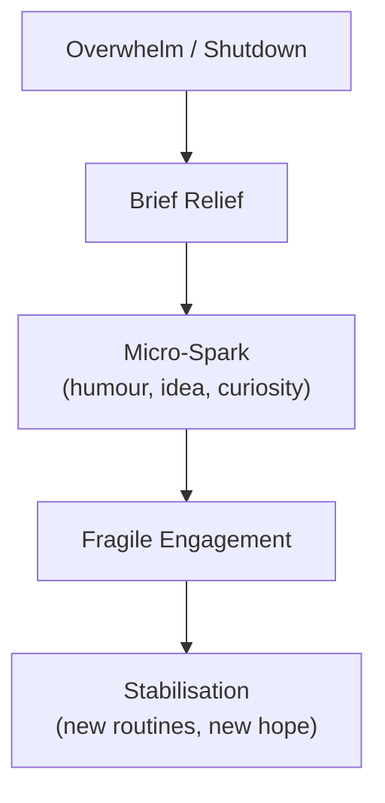

# 🌲 Rebuilding Spark in a Political Forest Fire  
**First created:** 2025-11-19 | **Last updated:** 2025-12-07  
*How to recognise, protect, and nurture early signs of recovery when the world around you still feels unstable, overwhelming, or dangerous.*  

---

## 🛰️ Orientation  
Political instability, bureaucratic harm, and cultural fragmentation create “forest fire” conditions where emotional resources burn faster than they can regenerate.

Recovery does **not** begin with confidence or optimism.  
It begins with something smaller:

> **a spark** —  
a tiny return of energy, curiosity, humour, or forward motion.

This node maps the fragile early-stage recovery process and provides tools for protecting new sparks when the wider environment is still chaotic.

Pairs with:  
- 🌲 *campfire_stability_model_for_modern_citizens*  
- 🔥 *your_emotional_campfire_care_kit*  

---

## ✨ Key Features  
- Defines recovery as an emergent, nonlinear process.  
- Explains the neuroscience behind “spark moments”.  
- Outlines environmental threats to early recovery.  
- Provides strategies for protecting small energy gains.  
- Helps differentiate spark from burnout-false-starts.  

---

## 🧿 Analysis / Content  

### ✨ 1. What “Spark” Actually Is  
A spark is a **micro-restoration** of:

- vitality  
- curiosity  
- humour  
- imagination  
- agency  
- desire  
- attention  
- play  
- creativity  

It appears fleetingly and often without warning.

Psychologically, it represents:

- a reduction in threat-response  
- a shift from shutdown to partial engagement  
- the nervous system allowing small risk again  
- a tiny measure of restored selfhood  

Sparks are signs that you are *not done*.

---

### 🔥 2. Why Sparks Happen After Collapse  
Sparks emerge when:

- cortisol decreases  
- the nervous system detects micro-safety  
- environmental threat slightly reduces  
- identity stabilises even a little  
- someone shows kindness  
- you sleep properly once  
- a burdensome task ends  
- a misinterpretation resolves  
- the political “weather” calms for a moment  

Recovery is rarely dramatic.  
It sneaks up through fractions of relief.

---

### 🌲 3. The Spark Emergence Model  

The danger is trying to jump from **C → E** instantly.  
This burns the spark out.

---

### 🪵 4. What Helps a Spark Become a Flame  

#### **a) Gentle engagement**  
Interact with the spark as if it were delicate.  
Don’t force momentum.

#### **b) Low-friction creativity**  
Do something expressive that requires almost no setup.

#### **c) Remove bureaucratic pressure temporarily**  
You cannot regenerate under administrative threat.

#### **d) Social micro-connection**  
A single safe interaction strengthens the ember.

#### **e) Avoid comparison**  
You are not “behind”.  
You are *recovering*.

#### **f) Give yourself permission to enjoy the spark**  
It is not frivolous — it is survival.

---

### 🧨 5. What Threatens Sparks  

#### **a) Rapid re-exposure to system stress**  
Bureaucratic misinterpretation, emails, appeals, delays.

#### **b) Political panic cycles**  
News storms, culture-war narratives, fear-messaging.

#### **c) Demanding environments**  
Workload, family pressure, social expectations.

#### **d) Self-judgement**  
The fastest way to extinguish a spark.

#### **e) Trauma reactivation**  
Memories of prior misinterpretation or institutional harm.

#### **f) Overexertion**  
Trying to “return to normal” too fast.

Treat the spark like a newborn animal:  
gentle, fragile, responsive to environment.

---

### 🔍 6. Distinguishing a Real Spark from a False-Start  
A **real spark** feels:

- warm  
- gentle  
- slightly exciting  
- small but steady  
- “maybe I could…”  

A **false-start** feels:

- frantic  
- pressured  
- hyperproductive  
- perfectionistic  
- “I have to fix everything now”  

False-starts are the nervous system trying to escape threat,  
not rebuild.

Real sparks do not demand;  
they invite.

---

### 🪴 7. How to Grow a Spark Slowly  
- Give it hours, not days, of attention.  
- Pair it with kindling (comfort, warmth, ease).  
- Don’t narrate it too loudly — keep it close.  
- Protect it from the harsh parts of the world.  
- Let it expand at its own pace.  
- Celebrate *quietly* when it returns.  

Sparks thrive in low-pressure environments.

---

### 🧭 8. Why This Matters in Democratic Drift  
When society is unstable, sparks are:

- acts of resistance  
- signs of ongoing personhood  
- micro-restorations of agency  
- evidence that structural harm has not fully broken you  
- precursors to future civic participation  

Sparks aren’t just emotional phenomena.  
They’re **political survival signals**.

---

## 🏮 Footer  
*Rebuilding Spark in a Political Forest Fire* belongs to Polaris’ Emotional Systems & Resilience cluster.  
It maps how recovery happens under pressure, and how citizens can protect the earliest signs of vitality in an unstable or bureaucratically hostile world.

Crosslinks:  
- 🌲 *campfire_stability_model_for_modern_citizens*  
- 🔥 *your_emotional_campfire_care_kit*  
- 🧯 *signs_your_brain_is_tired_because_society_is_batshit*

_Last updated: 2025-12-07_
