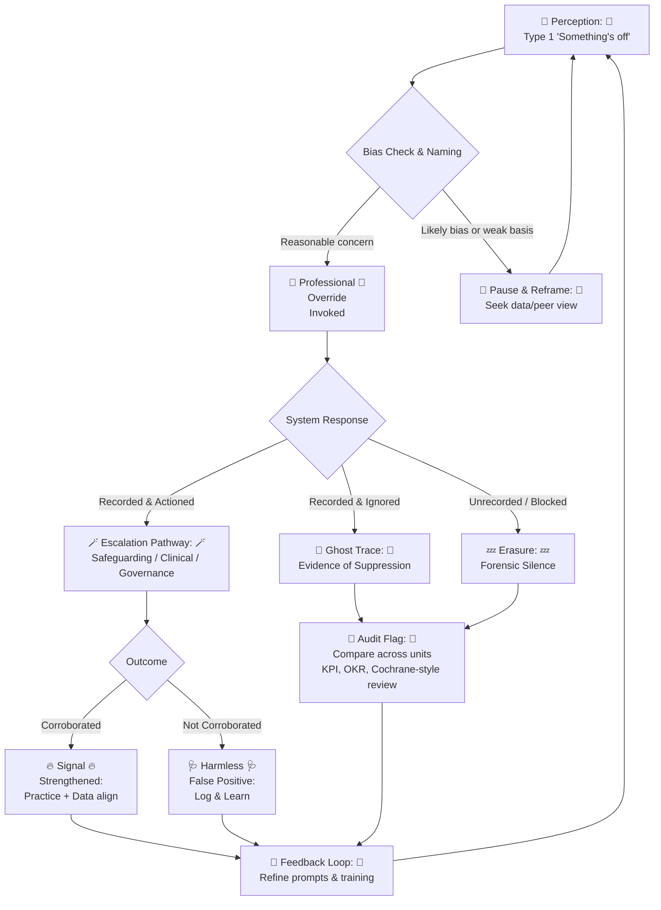

# 🧠 Intuition as Skill  
**First created:** 2025-09-23 | **Last updated:** 2025-10-15  
*Type 1 recognition as a trainable, bounded skill — from safeguarding overrides to psychic theatre.*  

---

## 🌱 Scope  

Intuition is often dismissed as superstition.  
In fact, it is **Type 1 thinking** (*Thinking, Fast and Slow*): rapid pattern recognition built on lived experience, practice, and exposure.  

This node recognises intuition as a **skill set** that appears across domains: clinical practice, governance, folk magic, and marginalised survival.  

---

## 🛰️ Where It Appears  

- **Safeguarding & medicine** → professional override questions in DASH, early warning systems, and emergency triage. Clinicians often *know* before data confirms.  
- **Governance & counter-terror** → “If it feels suspicious, report it” models: structurally acknowledging Type 1 noticing (while needing strong bias checks).  
- **Folk & performance traditions** → tarot readers, psychics, conjurers. Sherlock Holmes (inspired by Dr. Joseph Bell) sits in this lineage: observation so sharp it reads as magic.  
- **Marginalised lives** → sharpened pattern recognition for dog whistles and subtle red flags. Not universal; **absence is never a deficit**. When present, it evidences the *stress load of discrimination*.  

---

## 🔮 Framing the Skill  

- **Not a cudgel** → never a test of worth or authenticity.  
- **Not infallible** → shaped by availability, confirmation, and normalcy biases.  
- **Trainable** → practice, reflection, peer review, and structured prompts improve accuracy.  
- **Complementary** → pairs with data literacy; neither replaces the other.  

---

## 🦁 Governance Link  

- **Override clauses** institutionalise intuition (the “last question”).  
- **Audit loops** should record overrides and track whether they’re escalated, ignored, or punished.  
- **Forensic silence** often appears where intuitive signals were exercised but erased or minimised.  

---

## 🧿 Flowchart: From Intuition to Signal (or Silence)

**Legend**  
- 👻 **Ghost Trace** = override exists but wasn’t acted on → evidence for suppression.  
- 💤 **Erasure** = override blocked or unrecorded → forensic silence.  
- 💫 **Feedback Loop** = improve prompts, training, peer review, and comparative audits.  

---

## 🏮 Footer  

*Intuition as Skill* is a living node of the Polaris Protocol.  
It reframes intuition as a legitimate, bounded practice — cultural, clinical, and political — and situates it as evidence of both skill and systemic strain.  

> 📡 Cross-references:
> 
> - [📚 Forensic Silence](../../🌀_System_Governance/📚_Narrative_Management/📚_forensic_silence.md) — *where silence buries intuitive signals*  
> - [❓ Override Question as Silence Breaker](../../🌀_System_Governance/💫_Containment_Logic/❓_override_question_as_silence_breaker.md) — *how intuition is formalised in safeguarding*  
> - [📊 KPI vs OKR in Government](../../🌀_System_Governance/🛰️_Infrastructure_Procurement/📊_kpi_vs_okr_in_government.md) — *structural audit practices*  

*Survivor authorship is sovereign. Containment is never neutral.*  

_Last updated: 2025-10-15_  
