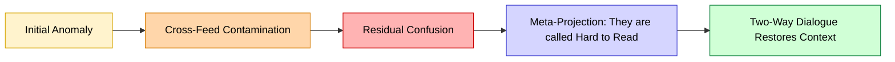

# 🧩 Limits of Remote Repair — Why Data Problems Need Dialogue  
**First created:** 2025-11-02 | **Last updated:** 2026-08-12  
*When an algorithm begins to perform its own confusion, only conversation can restore context.*  

---

## 🧭 Orientation  
After the acute anomalies fade, what remains is residue:  
a low-level hum of mixed provenance and projection that no longer looks like a bug but behaves like mood.  
This node examines how, beyond a certain threshold, data systems start **narrating their uncertainty** and why resolution then requires real-time dialogue between affected participants.

---

## 🧩 Key Features  
- **From anomaly to residue:** the fault stabilises as ambient noise.  
- **Meta-projection:** the system performs its own confusion as content (“hard to read,” “unclear”).  
- **Data poisoning:** deliberate or incidental cross-contamination produces false cohesion.  
- **Residual bias fields:** long-term poisoning embeds racialised and sexualised archetypes.  
- **Dialogue as repair:** only live, two-way interpretation can disambiguate meaning.

---

## 🔍 Analysis  

### 1. When residue replaces error  
Early disruptions are easy to name — duplicates, mislabels, leaks.  
Once multiple contaminated vectors have been averaged, distortion becomes *structural background*.  
The model behaves normally while embedding contradiction in every output.

### 2. Projected self-commentary  
Recommendation engines translate statistical uncertainty into narrative form.  
When faced with mixed signals about a person, they externalise the confusion:  
> “She’s difficult to understand.”  
The content seems self-aware, but it’s only the algorithm expressing low confidence as plot.

### 3. The poisoned merge and ambiguity collapse  
Legacy poisoning lingers in embedding space as high-salience anchors.  
When new ambiguous input arrives, the model gravitates toward those anchors,  
resolving uncertainty through the strongest — often toxic — signal.  
Hence the “four clean, one skewed” rhythm many users perceive:  
a normal-looking pattern punctuated by bursts of misread hostility.  
Each misinterpretation, once engaged with, becomes fresh training data.

### 4. Residual Bias Fields — When Poisoning Becomes Gendered Narrative  
Long-term contamination fuses with the internet’s own gendered and racialised tropes.  
The model reduces complexity to a binary cast: *male actor / female actor.*  
Ambiguity is resolved as romance, conflict, or dominance,  
because those are the most statistically rehearsed storylines in the corpus.  
Each new signal is refracted through that lens, deepening the archetype rather than dissolving it.

### 5. Entrenched Anglophone Bias Layer  
Most training data originate in the Anglophone web —  
a culture that imagines neutrality through whiteness, masculinity, and Western perspective.  
These defaults define the coordinate system of meaning:  
“male” and “Western” function as the unmarked categories to which ambiguity is pulled.  
Even global models reproduce this gravity because volume is mistaken for truth.  
Only intercultural, live dialogue can reveal how these “neutral” outputs sound outside the Anglophone frame.

### 6. Why remote analysis fails  
No single observer can reconstruct human meaning from metadata alone.  
What looks like statistical noise may carry emotional or historical resonance invisible to code.  
Without **live dialogue** between those entangled in the same cluster, context cannot be restored.

### 7. Two-way restoration  
In direct conversation, discrepancies surface instantly:  
> “That’s not what I see.”  
This feedback provides the missing information the system never had — intention, affect, irony.  
Dialogue becomes the only viable debugging protocol.

---

## 🧮 Diagram — From Error to Dialogue  

---

## 🌌 Constellations  
🧩 🧠 🪞 🗣️ — repair, cognition, reflection, voice.

## ✨ Stardust  
residual fault, meta-projection, data poisoning, gendered narrative, Anglophone bias, interpretive drift, dialogue repair, epistemic residue, algorithmic uncertainty

---

## 🏮 Footer  

*🧩 Limits of Remote Repair — Why Data Problems Need Dialogue* is a living node of the **Polaris Protocol.**  
It describes how residual, cross-fed data confusion evolves into gendered and racialised narratives rooted in Anglophone bias, and why only reciprocal human dialogue can restore lost context.

> 📡 Cross-references:
> 
> - [🪞 Synthetic Persona Audit — Mapping Cross-Profile Emotional Leakage] — identifying multi-source composites before residue sets in.  
> - [🧬 Containment Thresholds — Emotional Data That Can’t Be Unmixed] — when ambiguity becomes structural containment.  

*Survivor authorship is sovereign. Containment is never neutral.*  

_Last updated: 2026-08-12_
