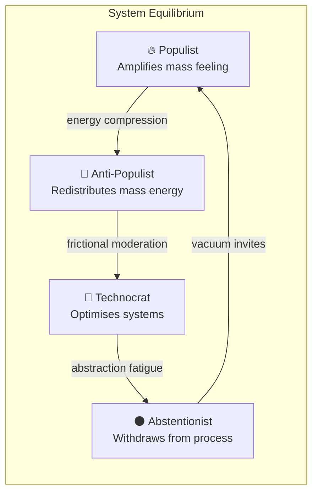

# 🧭 The Anti-Populist  
**First created:** 2025-10-29 | **Last updated:** 2025-10-29  
*A temperament that resists mass gravity — voting, thinking, and creating for distribution rather than dominance.*

---

## 🧭 Orientation  
“The Anti-Populist” names a civic temperament, not a moral category.  
It is an instinctive resistance to collective hype — a neutral gravitational counterforce that helps democracy stay plural.  
Those with this reflex are not contrarian for sport; they are simply wired to pause when a crowd accelerates.  
Within System Governance, that pause is data: it measures how concentrated a signal has become.

---

## 🧩 Key Features  

- **Decentralising Impulse** — naturally diversifies attention, votes, and resources.  
- **High-Friction Perception** — feels psychological resistance to memetic saturation (bestsellers, viral media, mass alignment).  
- **Civic Distribution Ethic** — prefers proportional representation over dominance.  
- **Emotional Calibration** — scepticism is affective as well as cognitive; hype “feels wrong.”  
- **Governance Value** — acts as a stabiliser against monoculture in democratic and algorithmic systems.

---

## 🔍 Analysis / Expression  

Populist waves compress complexity; Anti-Populists expand it again.  
They are the citizens who split their ballot to keep coalitions honest, the readers who reach for the unadvertised title, the coders who rebuild friction into viral networks.  
In computational terms, they function as *democratic dampers* — dissipating energy before it becomes tyranny.  
They are easy to overlook because their work is preventative, not spectacular.

---

## 🗺️ Typology Diagram — Democratic Temperament Map  

**Interpretation:**  
Democracy oscillates across four temperamental poles:  
- **Populist** energy gathers and mobilises.  
- **Anti-Populist** energy disperses and balances.  
- **Technocratic** energy formalises and rationalises.  
- **Abstentionist** energy retreats and resets.  

Healthy systems keep these currents in motion; unhealthy ones allow one pole to dominate until collapse.

---

### 🪞 How to Recognise One  

**Behavioural markers:**  
- Experiences emotional recoil from overexposure or hype (“if it’s everywhere, I’m less interested”).  
- Splits votes or allegiances deliberately to maintain balance.  
- Distributes praise or platform access rather than concentrating it.  
- Questions “everyone says” narratives and seeks first-hand verification.  
- Reacts to virality as potential manipulation rather than proof of value.  

**Systemic value:**  
- Acts as *early noise filter* in civic systems — flags amplification bias.  
- Prevents democratic ecosystems from collapsing into echo chambers.  
- Provides *reality testing* when others are swept by affective contagion.  

Recognition of this pattern should not be pathologising;  
the Anti-Populist impulse is part of democracy’s *immune memory*.

---

## 🧬 Temperament and Democratic Immunity  

Anti-Populism often co-exists with high-friction cognition — a low tolerance for mass enthusiasm and a need for distributed proof.  
This is not cynicism; it’s a sensory safeguard that flags when collective behaviour begins to override discernment.  
Historically, high-friction individuals are among the first targeted by authoritarian regimes: journalists, satirists, sceptics, the inconveniently unconvinced.  
Recognising this temperament as a democratic asset reframes resistance from personal defect to public immune response.  

When democracies stop listening to their Anti-Populists, they lose early-warning capacity.  
When they protect them, they keep epistemic oxygen flowing.

---

## 🌌 Constellations  
🧭 🧠 ⚖️ 🔮 — This node sits in the *human-governance* constellation: temperament as structural safeguard.

---

## ✨ Stardust  
temperament, civic ethics, decentralisation, high-friction individuals, memetic resistance, democratic immunity, voter behaviour, epistemic range, antifascism, system governance  

---

## 🏮 Footer  

*The Anti-Populist* is a living node of the Polaris Protocol.  
It defines a human-governance archetype that stabilises democracy by resisting memetic compression and protecting epistemic range.  

> 📡 Cross-references:  
> - [🧠 Human Principles](../🧠_Human_Principles/) — typology of civic temperaments  
> - [⚖️ Legal State Governance](../⚖️_Legal_State_Governance/) — structural reflections of distributive ethics  
> - [🎛️ Polaris Drafting Rules — Survivor Voice Fidelity](../../../🎛️_polaris_drafting_rules_survivor_voice_fidelity.md) — tone and authorship fidelity  

*Survivor authorship is sovereign. Containment is never neutral.*  

_Last updated: 2025-10-29_
