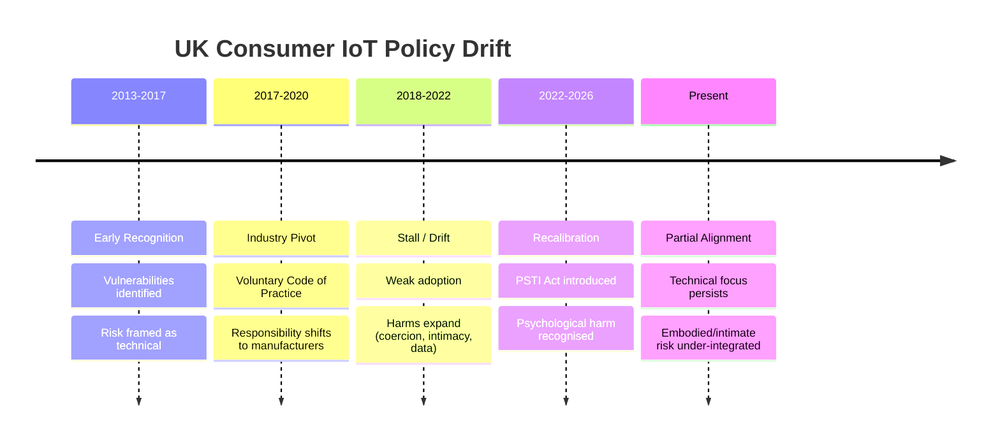

# 🩸 Surveillance-Induced Intimacy Breach 
**First created:** 2025-10-18 | **Last updated:** 2026-03-30  
*The request from an owner of a hypertonic pelvis, to the men with too much time on their hands.*  

---

## 🛰️ Orientation  
This node holds an unresolved question:  
how to describe the form of trauma where surveillance sexualises and objectifies the body,  
while simultaneously making intimacy feel unsafe.  

It parallels child sexual abuse recovery in that the body must again be reclaimed as one’s own,  
but the site of violence here is psychological, spatial, perceptual — **and increasingly technological**.  

In contemporary contexts, this includes:  
- **connected or surveilled environments**  
- **intimate IoT devices interacting with the body**  
- **data capture of intimate behaviours**  

The breach is not only being seen, but being made *accessible* —  
perceived or actual — without consent.

---

## ✨ Current Working Definition  
> **A trauma of enforced visibility and/or perceived intimate access through surveillance or connected systems**,  
> where the survivor’s body becomes *digitally exposed yet personally unsafe to inhabit.*  

---

## 🔬 Expanded Harm Model  

### 1. **Embodied Access Layer**  
- Devices may be:
  - on or inside the body  
  - mediating intimate or medical interaction  
- Unauthorised access or perceived access constitutes:
  - **boundary violation at the level of bodily autonomy**  

---

### 2. **Context of Vulnerability & Rehabilitation**  
- Often occurs during:
  - pelvic health management  
  - postnatal recovery  
  - sexual self-reconnection  
- The individual may already be:
  - rebuilding trust in their body  
  - navigating stigma or prior medical dismissal  

> Breach occurs at the point of **re-establishing safety**, amplifying harm.

---

### 3. **Psychological & Cultural Layer**  
- Pre-existing conditions:
  - cultural shame around bodies and sexuality  
  - under-discussed pelvic health realities  
  - internalised propriety norms  

These produce:
- self-monitoring  
- inhibition  
- reduced embodiment  

Surveillance or intrusion reinforces:
> “my body is not safe to inhabit or express within”

---

### 4. **Perceived vs Actual Targeting**  
- Harm does not require:
  - confirmed targeting  
- Even:
  - mass vulnerability  
  - or ambiguous intrusion  

can be experienced as:
- **deeply personal and intentional**

> Intimate context collapses the distinction between *systemic breach* and *personal violation*.

---

### 5. **Temporal & Escalation Dynamics**  
- Possible trajectory:
  - unnoticed access → persistence → escalation → repeated misuse  
- Lack of visibility or detection enables:
  - prolonged psychological impact  
  - erosion of trust over time  

---

### 6. **Agency & Risk Perception Layer**  
- Individuals differ significantly in:
  - risk tolerance  
  - comfort with connectivity  
  - desired level of control  

> Harm is compounded when **choice is removed or obscured**,  
> not only when breach occurs.

---

## 🧭 Agency & Risk Perception Layer, Expanded  

Individuals do not experience or respond to this risk uniformly.  
Even with similar histories or contexts, comfort levels, boundaries, and acceptable trade-offs vary significantly.

### 1. Variation in Risk Tolerance  
Some individuals may:
- prioritise convenience, connectivity, or enhanced functionality  
- accept low-probability risks as manageable  

Others may:
- prefer minimising exposure entirely  
- avoid connected systems in intimate contexts  

Both positions are valid.

---

### 2. Perception of Harm  
Risk is interpreted differently depending on:
- personal history  
- cultural context  
- relationship to the body and intimacy  

For some:
- risk is abstract or technical  

For others:
- risk is experienced as:
  - bodily violation  
  - loss of autonomy  
  - psychological intrusion  

---

### 3. Importance of Informed Choice  
Harm is compounded when:
- risks are obscured  
- systems are opaque  
- meaningful alternatives are unavailable  

> The absence of information removes the ability to consent to risk.

---

### 4. Structural Implication  
Systems interacting with intimate bodily contexts must:
- support **multiple modes of engagement**  
- avoid assuming a default user profile  
- enable users to align technology use with their own boundaries  

---

### 5. Non-Eliminable Risk  
No configuration fully removes risk in connected systems.  

> Agency therefore includes the option to:
> - reduce connectivity  
> - limit exposure  
> - or opt out entirely  

---

This layer does not prescribe behaviour.  
It establishes that **variation in response is expected, valid, and must be accommodated**.  

---

## 🏛️ UK Policy Timeline (HD — Historical Drift)

This timeline maps the trajectory of UK consumer IoT security policy,  
highlighting a critical **pivot to industry self-regulation**, followed by a **partial recalibration**.

It demonstrates that current frameworks remain **behind the lived risk landscape**,  
particularly in intimate and embodied contexts.

---

### Phase 1 — Early Recognition (≈ 2013–2017)  
- Emergence of:
  - consumer IoT vulnerabilities  
  - early cases involving intimate devices  
- Public reporting and research highlight:
  - weak security practices  
  - data exposure risks  

> Risk is **visible**, but framed primarily as technical and infrastructural.

---

### Phase 2 — Policy Formation & Industry Pivot (≈ 2017–2020)  
- Introduction of voluntary frameworks:
  - UK Code of Practice for Consumer IoT Security  
- Emphasis on:
  - manufacturer responsibility  
  - best-practice guidance  

> **Critical pivot:**  
> responsibility shifts from enforceable regulation → **industry-led compliance**

---

### Phase 3 — Stall / Drift Period (≈ 2018–2022)  
- Adoption is:
  - inconsistent  
  - unenforced  
- Market dynamics:
  - low-cost devices proliferate  
  - security remains uneven  

Meanwhile:
- harms evolve:
  - coercive control via devices  
  - intimate data exposure  
  - embodied and psychological impacts  

> **Gap widens between policy assumptions and real-world risk**

---

### Phase 4 — Recalibration (≈ 2022–Present)  
- Introduction of legislation:
  - Product Security and Telecommunications Infrastructure Act (PSTI)  
- Increased recognition of:
  - psychological harm  
  - misuse beyond “hackers”  
  - safeguarding implications  

> Policy begins to **re-enter regulatory space**,  
> but remains **catch-up rather than anticipatory**

---

### Current Position — Not Yet Realigned  

Despite progress:

- Frameworks remain:
  - primarily technical  
  - insufficiently attuned to **embodied and intimate harm contexts**  

- Gaps persist in:
  - abuse-aware design  
  - insider threat modelling  
  - agency and risk communication  
  - intimate device classification  

> The system is **partially corrected**, but not yet aligned with:
> - current device capabilities  
> - lived user experience  
> - emerging harm models  

---

## 🔀 Structural Insight  

> Early recognition → premature delegation to industry →  
> prolonged vulnerability → delayed regulatory correction  

This sequence produces:
- **persistent design-level weaknesses**  
- **normalisation of risk exposure**  
- **lag between harm and response**

---

## 📊 Mermaid Timeline  

---

## 💭 Implication for This Node

The harms described in this node:
	•	were technically foreseeable during early phases
	•	were not structurally addressed during the industry-led period
	•	are now being retrofitted into policy frameworks

This contributes directly to:
	-	survivor invisibility
	-	design gaps
	-	delayed recognition of harm

---

## 💫 Forward Consideration

Future alignment requires:
	-	integrating embodiment and intimacy into threat models
	-	moving beyond:
	-	“device security”
toward:
	-	user safety in context
	-	recognising that:

policy lag is not neutral — it shapes who is exposed to harm, and for how long.  

---

## 📚 Adjacent Concepts (Imperfect Parallels)  
- **Surveillance sexualisation** — feminist surveillance studies: eroticisation of the gaze as control.  
- **Technosexual violence** — digital sexual harassment or image-based abuse.  
- **Psychological rape / psychosexual occupation** — coercive invasion without physical contact.  
- **Data-bodied violation / digital bodily autonomy breach** — legal-tech framing of body–data split.  
- **Intimate IoT misuse / coercive tech-enabled control** — emerging safeguarding frameworks.  

Each overlaps but none fully capture the compounded effect of **embodiment + surveillance + vulnerability timing**.

---

## 🪬 Observations Emerging from Field Context  

- Pelvic floor dysfunction and related conditions are:
  - **common and underreported**  
  - often silently managed  

- Devices in this space:
  - overlap between **medical, rehabilitative, and sexual use**  
  - inherit **IoT vulnerabilities not designed for this context**  

- Cultural silence produces:
  - lack of shared language  
  - delayed recognition of harm  

- Survivors may:
  - misattribute or suppress experiences  
  - feel isolated due to lack of discourse  

---

## ☕️ Next Steps  
- Collect survivor terminology or creative expressions describing this feeling.  
- Map harm differences:
  - perceived targeting vs confirmed breach  
- Review:
  - intimate IoT security literature  
  - feminist tech + medical sociology intersections  
- Develop:
  - agency-based risk communication frameworks
 
---

## 🧠 Insider Risk & Cultural Blind Spots  

This layer addresses a persistent gap in technology development and governance:  
the tendency to model risk as external, while underestimating **internal misuse potential**.

---

### 1. Structural Reality of Access  

Systems that:
- collect intimate data  
- mediate bodily interaction  
- enable remote control  

necessarily create:
- **asymmetry of access**  
- **concentration of power**  

> These conditions do not require malicious intent to exist,  
> but they create the **possibility of misuse over time**.

---

### 2. The “Good People” Assumption  

Technology cultures often rely on:
- trust in colleagues  
- perceived integrity of teams  
- hiring as a safeguard  

However:

> **trust is not a control mechanism**

Even in well-intentioned environments:
- individuals may behave differently across contexts  
- harmful behaviour may be:
  - gradual  
  - concealed  
  - situational  

---

### 3. Under-Modelled Risk  

Security frameworks frequently prioritise:
- external attackers  
- technical vulnerabilities  
- user error  

While under-modelling:
- insider access misuse  
- boundary drift over time  
- non-financial motivations (e.g. curiosity, control, violation)

> This creates blind spots in systems handling intimate or embodied data.

---

### 4. Cultural Avoidance  

Discussion of these risks is often limited by:
- discomfort around:
  - sexuality  
  - bodily autonomy  
  - abuse dynamics  
- fear of:
  - implicating colleagues  
  - appearing accusatory  

This results in:
> **risk being unspoken rather than absent**

---

### 5. Necessary Cultural Shift  

Mature systems require a shift from:
- **trust-based assumptions**  

to:
- **accountability-based design**

This includes:
- recognising misuse as possible without assigning blame  
- separating:
  - individual character  
  - from system design requirements  

---

### 6. Operational Implications  

Systems interacting with intimate contexts should:

- minimise and segment access  
- ensure auditability and visibility of actions  
- implement separation of duties  
- enable rapid revocation of access  
- design for detection of anomalous behaviour  

> Safeguards must assume that **perfect behaviour cannot be guaranteed**

---

### 7. Relational & Organisational Layer  

Beyond technical controls, organisations must support:

- open, non-accusatory discussion of risk  
- ability to question access and behaviour safely  
- recognition that:
  - individuals can be trusted  
  - and systems can still require constraint  

---

### 8. Intersection with Intimate Harm  

In systems involving:
- bodily interaction  
- sexual or reproductive health  
- private behavioural data  

the impact of misuse is amplified:

> **insider access becomes a potential vector for deeply personal violation**

---

This layer does not assume widespread malicious intent.  
It establishes that **the presence of access itself creates risk**,  
and that responsible systems must account for this without reliance on personal trust alone.  

*Bros protect bros from being idiots; by telling your friends when they are being weird, you are helping limit the possibility that they will stumble into the wrath of a lady dragon with the balls to call them out in public.*  

*Bros don't let bros get so fundamentally ridiculous, that they become lady dragon dinner (in a bad way).*  

---

## 🌌 Constellations  
🩸 👁️‍🗨️ 🧠 🧿 🧩 — trauma, witness, embodiment, violation boundary, diagnostic mapping.  

*Further reading & media:*  

- [📑: A review of the risks and psychological harms presented by consumer IoT products; UK DIST.](https://assets.publishing.service.gov.uk/media/672b676dfbd69e1861921c21/A_review_of_the_risks_and_psychological_harms_presented_by_consumer_IoT_products_-_Cote_et_al.pdf)  
- [📰: "Vibrator app leaks users’ intimate data", 2016.](https://www.theguardian.com/technology/2016/aug/10/vibrator-phone-app-we-vibe-4-plus-bluetooth-hack)  
- [📰: "Sex toy Bluetooth hacks expose users to control and surveillance risks", Wired.](https://www.wired.com/story/sex-toy-bluetooth-hacks-security-fix/)  
- [📰: "Hacker could control internet-connected sex toys", 2017.](https://www.bbc.co.uk/news/world-us-canada-39280941)  
- [📰: "Insecure vibrator app leaks private data", KasperSky](https://www.kaspersky.co.uk/blog/insecure-vibrator/7544/)  
- [📑: Privacy Not Included: Sex Toys; Mozilla Foundation.](https://foundation.mozilla.org/en/privacynotincluded/categories/sex-toys/)  
- [📑: Stalkerware: The Hidden Harassment Tool; EFF.](https://www.eff.org/deeplinks/2019/09/stalkerware-hidden-harassment-tool)

---

## ✨ Stardust  
surveillance trauma, embodied iot risk, intimacy breach, pelvic health, underreported conditions, bodily autonomy, technosexual harm, agency and consent

---

## 🏮 Footer  

*🩸 Surveillance-Induced Intimacy Breach* is a living node of the **Polaris Protocol**.  
It documents an emergent category of harm at the intersection of surveillance, embodiment, and intimate technology, where language and frameworks remain incomplete.  

> 📡 Cross-references:
> 
> - [👁️‍🗨️ Surveillance of Disabled Bodies](./👁️‍🗨️_surveillance_of_disabled_bodies.md) – *related histories of observation of bodies deviant to the cis-male form*  
> - [🔥 Femme Firewall Fatale — The Panic at Female Intelligence](./🔥_femme_firewall_fatale.md) — *not unrelated*
> - [💔 The Need for Touch](./💔_the_need_for_touch.md) – *related but disctinct concepts of human relationships to intimacy*
> - [🦆 She Weighs the Same as a Duck](./🦆_she_weighs_the_same_as_a_duck.md) – *if all else fails, women can be ruled undeserving of sexual health or agency upon the presence of their capabilities*  

*Survivor authorship is sovereign. Containment is never neutral.*  

_Last updated: 2026-03-30_
