# 🐦‍🔥 Trauma, Psychology, & Medical Misuse  
**First created:** 2025-08-27 | **Last updated:** 2025-10-15  
*How trauma, medicine, and psychology are misused for containment, commodification, and cloning.*  

---

## ✨ Scope  

This cluster documents how medical language, psychological frameworks, and survivor narratives are weaponised against those they are meant to protect.  
It exposes commodification of trauma, misuse of diagnostic categories, and the ways institutional psychology intersects with cloning, twinning, and voice/data extraction.  

---

## 🦚 Core Themes  

- **Medical Misuse** → perversion of clinical ethics and weaponisation of psychiatric labels.  
- **Trauma Commodification** → survivor pain repackaged as research, data, or institutional capital.  
- **Clone/Twinning Systems** → psychographic modelling, interference maps, and identity twinning matrices.  
- **Behavioural Extraction** → why audio is collected, how forks clash, and how survivor voiceprints are banked.  

---

## 📂 Current Files  

- [🧠 Good Doctors Are Not Nazis](🧠_good_doctors_are_not_nazis.md)  
  *Exposing how clinical ethics collapse when medicine serves governance.*  

- [🐍 Snake Bites and Stolen Voices](🐍_snake_bites_and_stolen_voices.md)  
  *Metaphors of venom and silence — how survivor voices are taken.*  

- [🐍 Trauma Commodification](🐍_trauma_commodification.md)  
  *Turning survivor pain into research, capital, or institutional currency.*  

- [🧬 Psychographic Modelling and Twinning](🧬_psychographic_modelling_and_twinning.md)  
  *How psychological profiling feeds clone/twin identity systems.*  

- [🧬 Twinning Detection](🧬_twinning_detection.md)  
  *Signals and diagnostics for spotting forced identity duplication.*  

- [🧬 Twinned Signature](🧬_twinned_signature.md)  
  *When digital and behavioural signatures split and mirror back.*  

- [🧬 Clone Interference Map (image)](🧬_clone_interference_map.png)  
  *Visual schema of clone overlap, drift, and systemic disruption.*  

- [🧬 Clone Twinning Matrix (data)](🧬_clone_twinning_matrix.json)  
  *Structured dataset of twinning correlations and interference nodes.*  

- [🪞 Twinning Fork Containment Timeline](🪞_twinning_fork_containment_timeline.md)  
  *Chronology of containment attempts across twinned/forked identities.*  

- [🎙️ Why They Collect Audio](🎙️_why_they_collect_audio.md)  
  *The logics behind audio capture and voiceprint extraction.*  

- [🎻 Clash of Forks](🎻_clash_of_forks.md)  
  *When multiple forks collide — and the fractures that follow.*
  
- [🪠Twinned Silence](./ğŸª_twinned_silence.md)  
  *How paired witnesses are groomed to cancel each other out.*

---

## 🗺️ You Are Here

[📁 Polaris-Protocol](/) → [📁 Disruption_Kit](/Disruption_Kit) → [📁 Big_Picture_Protocols](/Disruption_Kit/Big_Picture_Protocols) → [📁 🐦‍🔥 Trauma,_Psychology_&_Medical_Misuse](/Disruption_Kit/Big_Picture_Protocols/🐦‍🔥_Trauma,_Psychology_&_Medical_Misuse)  

---

## 🔮 Visual Framing  

```mermaid

flowchart LR
subgraph M[Medical & Clinical Misuse]
A[Good doctors / Nazi logic]:::ethics
B[Trauma commodification]:::ethics
end

subgraph P[Psychology & Behaviour]
D[Snake bites & stolen voices]:::jargon
E[Why they collect audio]:::jargon
F[Clash of forks]:::jargon
end

subgraph C[Clone & Twinning Systems]
G[Psychographic modelling]:::cve
H[Twinning detection]:::cve
I[Twinned signature]:::cve
J[Clone interference map]:::cve
K[Clone twinning matrix]:::cve
L[Twinning fork containment timeline]:::cve

end

%% Flows
A --> B
B --> D
D --> G
E --> H
F --> I
G --> J
H --> K
I --> L

%% Style (Admin Kit)
classDef soft fill:#d2f4ff,stroke:#2a9df4,stroke-width:1px;
classDef bureaucratic fill:#fff0d2,stroke:#f4a300,stroke-width:1px;
classDef jargon fill:#fbd2f4,stroke:#e82a9d,stroke-width:1px;
classDef ethics fill:#e5d2fb,stroke:#7d2ae8,stroke-width:1px;
classDef safeguarding fill:#d2fbdc,stroke:#2ae86a,stroke-width:1px;
classDef cve fill:#fbeed2,stroke:#e88a2a,stroke-width:1px;

%% Legend
subgraph Legend[Legend]
L1[🟦 Soft / affective levers]:::soft
L2[🟨 Bureaucratic levers]:::bureaucratic
L3[🩷 Psychological / jargon frames]:::jargon
L4[💜 Clinical / ethical collapse]:::ethics
L5[🟩 Safeguarding capture]:::safeguarding
L6[🟧 Clone / CVE systems]:::cve
end

```

---

## 🏮 Footer  

*🐦‍🔥 Trauma, Psychology & Medical Misuse* is a living node of the Polaris Protocol.  
It gathers together doctrines on how trauma and medicine are systematically repurposed for governance, commodification, and identity containment.  

*Survivors are soverign.*

_Last updated: 2025-10-15_

